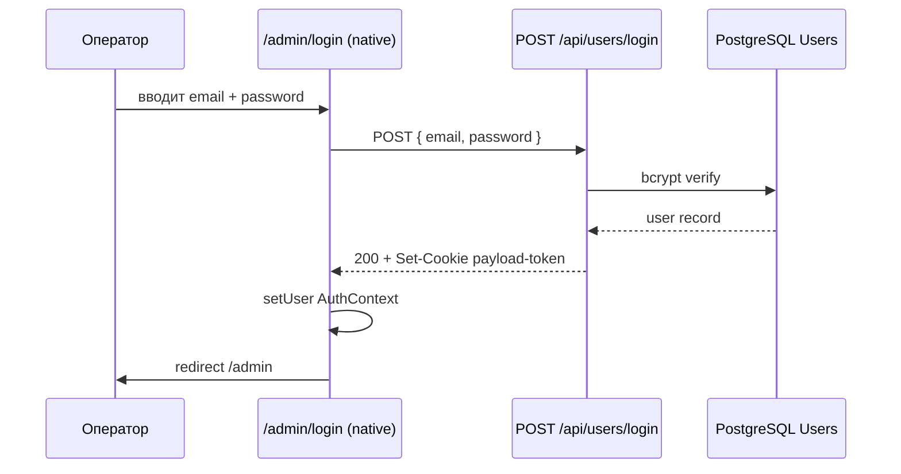

# sa-panel — Wave 2.A v2 · CSS-only Login UI customization (Approach E)

**Issue:** [PAN-15](https://linear.app/samohyn/issue/PAN-15) (re-implement) · parent [PAN-12](https://linear.app/samohyn/issue/PAN-12)
**Wave:** 2.A v2 (rewrite после regression sa-panel-wave2a.md v1)
**Source of truth:** [brand-guide.html §12.1](../../../design-system/brand-guide.html) · [ADR-0007](../../adr/ADR-0007-payload-login-customization.md) · [screen/admin-login-mockup.png](../../../screen/admin-login-mockup.png)
**Status:** `approved` (popanel implicit, через operator regression mandate 2026-04-29)
**Skills активированы:** `architecture-decision-records` (ссылка на ADR-0007), `product-capability` (capability map login)
**Author:** sa-panel
**Date:** 2026-04-29
**Supersedes:** [sa-panel-wave2a.md](sa-panel-wave2a.md) v1 (PAN-5 Cancelled — `views.login` API не существует в Payload 3.84)

---

## Контекст

PAN-5 Wave 2.A v1 закрылся как Cancelled — `admin.components.views.login` ассумпшен оказался неверным для Payload 3.84.1 (verified `node_modules/payload/dist/config/types.d.ts:746-756`). На проде `/admin/login` отдавал empty `template-minimal__wrap` (incident leadqa-RC-1 BLOCK 2026-04-28).

Operator 2026-04-29 запросил полный регресс с iron rule **«local verification ДО push»** (memory `feedback_po_iron_rule_local_verify_and_cross_agents.md`).

Tamd's research (PAN-13 done) → **ADR-0007** decided Approach E — **CSS-only через `custom.scss` + native slots** без view override.

## Капабилити (product-capability)

«Оператор открывает `/admin/login` → видит брендовую форму → вводит email+password → попадает в admin» — это **frequency: 1×день**, **impact: critical** (без login admin недоступен), **confidence: high** (текущий flow работает на native).

Что должно быть **видно оператору** на login screen (по brand-guide §12.1):

| Элемент | Источник | Mechanism |
|---|---|---|
| Brand lockup (Круг сезонов + ОБИХОД) | `BeforeLoginLockup.tsx` | `admin.components.beforeLogin` slot ✅ работает |
| Admin tagline «порядок под ключ · admin» | `BeforeLoginLockup.tsx` | внутри beforeLogin lockup ✅ работает |
| Email + Password fields | Payload native `<LoginField>` + `<PasswordField>` | native `LoginForm` (не override) |
| Янтарная primary button «Войти» | Payload native `<FormSubmit>` + наш CSS | CSS-уровень — overrides native |
| Link «Забыли пароль?» | Payload native | автогенерируется в `LoginForm` ✅ работает |
| Footer «© 2026 · Обиход» | `AfterLoginFooter.tsx` | `admin.components.afterLogin` slot ✅ работает |
| Light cream `#f7f5f0` background | brand vars в `custom.scss :root` | CSS-уровень — overrides Payload's dark theme detection |
| Form carд (white bg, padding 32, radius 10, border `#e6e1d6`) | new в `custom.scss` | CSS-уровень |
| Form max-width 320px | Payload native default | ✅ уже работает |

## ADR-0007 уровень кастомизации

| Подсистема | Уровень | Действие |
|---|---|---|
| Login UI customization | **Уровень 1** (CSS-only через `custom.scss`) | Это весь scope Wave 2.A v2. Никаких React-overrides. |
| Brand lockup / footer | **Уровень 2** (slots, уже работают) | `beforeLogin` / `afterLogin` через `admin.components.*` ✅ |
| Native auth flow | **Уровень 3 (НЕ трогаем)** | `useAuth().login` через native LoginForm ✅ |
| `views.login` view override | **❌ НЕ ИСПОЛЬЗУЕМ** | API не существует в Payload 3.84 (ADR-0007) |

---

## Scope IN

### V2.1 · Force light theme (override dark detection)

В `site/app/(payload)/custom.scss` блок `html[data-theme='dark']` — заменить dark vars на **light** vars (текущий код set'ит dark vars, что и приводит к dark theme на проде).

**Точный diff:**

```scss
/* BEFORE (current — приводит к dark theme на проде когда OS dark mode) */
html[data-theme='dark'] {
  --brand-obihod-ink: #f7f5f0;
  --brand-obihod-paper: #15140f;
  /* ...dark values... */
}

/* AFTER — force light даже когда Payload set'ит data-theme='dark' */
html[data-theme='dark'] {
  /* reason: brand-guide §12.1 admin = cream/light, dark theme out of scope.
     Operator preference единый light look. Если в будущем нужен dark toggle —
     отдельная US с переключателем. */
  --brand-obihod-ink: #1c1c1c;
  --brand-obihod-paper: #f7f5f0;
  --brand-obihod-paper-warm: #efebe0;
  --brand-obihod-card: #ffffff;
  --brand-obihod-line: #e6e1d6;
  --brand-obihod-muted: #6b6256;
  /* ...все light values, идентичные :root */
}
```

### V2.2 · Янтарный submit button через native selectors

В `site/app/(payload)/custom.scss` — **новый блок** в секцию LOGIN (после строки 365 примерно):

```scss
/* ────────────────────────────────────────────────────────────────────
 *  LOGIN SUBMIT BUTTON — янтарный (brand-guide §12.4.1)
 *  Native Payload submit имеет class только `form-submit` (НЕ btn--style-primary).
 *  Wave 1 SCSS целился неправильно — incident leadqa-RC-1 2026-04-28.
 *  Verified DOM на проде через Playwright DevTools 2026-04-29.
 * ──────────────────────────────────────────────────────────────────── */
.payload__app .login__form button[type='submit'],
.payload__app .login__form .form-submit {
  background-color: var(--brand-obihod-accent);
  color: var(--brand-obihod-ink);
  border-color: var(--brand-obihod-accent);
  border-radius: var(--brand-obihod-radius-sm);
  font-weight: 600;
  transition:
    background-color var(--brand-obihod-duration-fast) var(--brand-obihod-ease-standard),
    border-color var(--brand-obihod-duration-fast) var(--brand-obihod-ease-standard),
    transform 80ms var(--brand-obihod-ease-standard),
    box-shadow var(--brand-obihod-duration-fast) var(--brand-obihod-ease-standard);
}
.payload__app .login__form button[type='submit']:hover:not([disabled]),
.payload__app .login__form .form-submit:hover:not([disabled]) {
  background-color: var(--brand-obihod-accent-hover);
  border-color: var(--brand-obihod-accent-hover);
}
.payload__app .login__form button[type='submit']:active:not([disabled]),
.payload__app .login__form .form-submit:active:not([disabled]) {
  background-color: var(--brand-obihod-accent-ink);
  border-color: var(--brand-obihod-accent-ink);
  transform: translateY(1px);
}
.payload__app .login__form button[type='submit']:focus-visible,
.payload__app .login__form .form-submit:focus-visible {
  outline: none;
  box-shadow: var(--brand-obihod-shadow-focus-accent);
}
.payload__app .login__form button[type='submit'][disabled],
.payload__app .login__form .form-submit[disabled] {
  background-color: var(--brand-obihod-paper-warm);
  border-color: var(--brand-obihod-line);
  color: var(--brand-obihod-disabled-text);
  cursor: not-allowed;
}
```

### V2.3 · Login carд (white bg + padding + radius + border)

В `custom.scss` секции LOGIN (existing блок начиная со строки 308):

```scss
/* Existing блок дополнить: */
.payload__app form.login__form,
.payload__app .login form {
  background-color: var(--brand-obihod-card);  /* #ffffff */
  border: 1px solid var(--brand-obihod-line);
  border-radius: var(--brand-obihod-radius);   /* 10px */
  padding: 32px;
  box-shadow: 0 1px 2px rgba(0, 0, 0, 0.04);
  /* max-width 320px — native Payload default уже работает */
}
```

### V2.4 · Reduced motion (расширение existing)

```scss
@media (prefers-reduced-motion: reduce) {
  .payload__app .login__form button[type='submit']:active,
  .payload__app .login__form .form-submit:active {
    transform: none;
  }
}
```

### V2.6 · Lockup — real `horizontal-compact.svg` (operator pixel-perfect mandate 2026-04-29)

Existing `BeforeLoginLockup.tsx` использует inline self-drawn `SeasonsCircleMark` + отдельный text-wordmark. Mockup §12.1 требует **реальный** asset `agents/brand/logo/horizontal-compact.svg` (детальный знак с 4 проработанными квадрантами: ёлочка / снежинка-роза-ветров / план двора / контейнер) + wordmark «ОБИХОД» **внутри того же SVG**.

**Action:** заменить body `<BeforeLoginLockup>` на inline SVG из `agents/brand/logo/horizontal-compact.svg` (full content, viewBox `0 0 1280 480`, currentColor `#2d5a3d`), wrap в контейнер с `height: 56px; width: auto`. Tagline остаётся отдельной строкой ниже.

Reason inline: предотвратить static-asset pipeline issues + CORS (см. existing comment в файле). Размер SVG ~2KB — не критично для bundle.

### V2.7 · Login labels styling

```scss
.login__form label {
  display: block;
  font-size: 13px;
  font-weight: 500;
  letter-spacing: 0.02em;
  color: var(--brand-obihod-ink);
  margin-bottom: 6px;
}
```

### V2.8 · Login inputs — full style override (не только bg)

```scss
.login__form input {
  padding: 9px 12px;
  font-size: 14px;
  font-family: var(--font-body);
  color: var(--brand-obihod-ink);
  background-color: var(--brand-obihod-paper);
  border: 1px solid var(--brand-obihod-line);
  border-radius: var(--brand-obihod-radius-sm);
  width: 100%;
  box-sizing: border-box;
}
.login__form input:focus-visible {
  outline: 2px solid var(--brand-obihod-primary);
  outline-offset: -2px;
}
.login__form input:hover:not([disabled]):not(:focus) {
  border-color: var(--brand-obihod-line-hover);
}
```

### V2.9 · Submit button — width + padding + font (расширение V2.2)

```scss
.login__form .form-submit,
.login__form button[type='submit'] {
  width: 100%;
  padding: 11px;
  font-size: 14px;
  font-family: var(--font-body);
  /* background/color/etc. уже в V2.2 */
}
```

### V2.10 · Link «Забыли пароль?» styling

```scss
.login__form a {
  display: block;
  margin-top: 16px;
  font-size: 13px;
  color: var(--brand-obihod-primary);
  text-decoration: none;
  text-align: center;
}
.login__form a:hover {
  color: var(--brand-obihod-primary-ink);
  text-decoration: underline;
}
```

### V2.11 · Field spacing inside form

```scss
.login__form .field-type,
.login__form > div > div {
  margin-bottom: 16px;
}
.login__form .field-type:last-of-type {
  margin-bottom: 0;
}
```

### V2.5 · `payload.config.ts` cleanup

Confirm что `views.login` блок **отсутствует** (revert PR #83 уже сделал):

```typescript
admin: {
  components: {
    graphics: { Icon: '@/components/admin/BrandIcon' },
    beforeDashboard: ['@/components/admin/BeforeDashboardStartHere'],
    afterDashboard: ['@/components/admin/PageCatalogWidget'],
    beforeLogin: ['@/components/admin/BeforeLoginLockup'],
    afterLogin: ['@/components/admin/AfterLoginFooter'],
    // ✅ NO views.login — это критично, см. ADR-0007
  },
}
```

`AdminLogin.tsx` остаётся в `site/components/admin/` как dead-code для возможного использования в Wave 2.B (magic-link UI через intercepted route, отдельный ADR).

---

## Scope OUT (отдельные US/Wave)

- ❌ Magic link login UI (Wave 2.B PAN-11) — отдельный mechanism через intercepted route или providers wrapper, потребует нового ADR
- ❌ Dark mode toggle для admin — out of scope, brand-guide §12 = light only
- ❌ Mobile responsive login (≤640px) — Wave 6 mobile responsive
- ❌ Custom error variants UI — native Payload `<LoginForm>` handles error display, не override
- ❌ Replace «Забыли пароль?» link styling — native acceptable

---

## Acceptance Criteria

### A. Functional

- [ ] AC-1: `/admin/login` рендерит **полную форму** с email + password + submit (DOM verified, не пустой)
- [ ] AC-2: Login flow работает: email+password → click «Войти» → redirect на `/admin` (для existing user)
- [ ] AC-3: «Забыли пароль?» link работает — переход на `/admin/forgot`
- [ ] AC-4: Wrong credentials → native Payload error message visible
- [ ] AC-5: `/admin/` (без auth) → redirect на `/admin/login`

### B. Visual (vs brand-guide §12.1 mockup)

- [ ] AC-6: Background cream `#f7f5f0` (computed `--brand-obihod-paper`)
- [ ] AC-7: Form max-width 320px (computed `getComputedStyle(form).maxWidth === '320px'`)
- [ ] AC-8: Form background white `#ffffff` (computed `--brand-obihod-card`)
- [ ] AC-9: Form padding 32px
- [ ] AC-10: Form border-radius 10px (`var(--brand-obihod-radius)`)
- [ ] AC-11: Submit button **янтарный** `#e6a23c` (computed `getComputedStyle(submit).backgroundColor === 'rgb(230, 162, 60)'`)
- [ ] AC-12: Submit button hover → `#d99528` (transition 120ms)
- [ ] AC-13: Submit button focus-visible → ring shadow brand-зелёный
- [ ] AC-14: BrandLogo (Круг сезонов SVG + ОБИХОД wordmark) виден сверху над form
- [ ] AC-15: Tagline «порядок под ключ · admin» виден
- [ ] AC-16: Footer «© 2026 · Обиход» виден

### C. NFR

- [ ] AC-17: Lighthouse `/admin/login` Accessibility ≥95
- [ ] AC-18: a11y: form имеет proper labels (native Payload + ru locale ✓)
- [ ] AC-19: Keyboard-only flow: Tab → email → Tab → password → Tab → button → Enter submit работает
- [ ] AC-20: Reduced-motion (OS setting) — нет animations / transforms
- [ ] AC-21: focus-visible виден для всех interactive (Wave 1 SCSS уже покрыл)

### D. Process (Iron rule operator 2026-04-29)

- [ ] AC-22: **Local verification evidence** в PR (screenshot localhost:3000/admin/login или Playwright run output)
- [ ] AC-23: Playwright admin login spec из PAN-16 — все tests green локально (с Docker Postgres)
- [ ] AC-24: type-check + lint + format ✓ (do CI)
- [ ] AC-25: cr-panel review approved (a11y + ADR-0007 compliance — нет `views.login` block)
- [ ] AC-26: leadqa real browser smoke на проде после deploy — DOM matches AC + visual diff vs §12.1 mockup screenshot

### E. Pixel-perfect §12.1 (operator mandate 2026-04-29 «1 в 1»)

- [ ] AC-27: `BeforeLoginLockup` рендерит **real horizontal-compact.svg** (детальный знак, не самописный SeasonsCircleMark) — DOM содержит SVG `<text>ОБИХОД</text>` внутри
- [ ] AC-28: Labels computed font-size `13px` / font-weight `500` / color `rgb(28, 28, 28)`
- [ ] AC-29: Inputs computed padding `9px 12px` / font-size `14px` / bg `rgb(247, 245, 240)` / border `1px solid rgb(230, 225, 214)` / border-radius `6px`
- [ ] AC-30: Input focus computed `outline: 2px solid rgb(45, 90, 61)` (на focus state)
- [ ] AC-31: Submit button computed width `100%` (либо `320px - 64px padding = 256px` exact)
- [ ] AC-32: Link «Забыли пароль?» (если рендерится Payload) computed color `rgb(45, 90, 61)` / text-decoration `none`
- [ ] AC-33: Field margin-bottom `16px`
- [ ] AC-34: leadqa visual diff: side-by-side скриншот localhost:3000/admin/login vs brand-guide.html §12.1 mockup — pixel-perfect match (lockup, card, button, spacing)

---

## Dev breakdown

| Task | Owner | Объём | Dependency |
|---|---|---|---|
| `custom.scss` patch (force light + submit selector + carд) | fe-panel | 0.3 чд | none |
| Local Docker verification + screenshot | fe-panel (sole, не делегирую) | 0.1 чд | Docker Desktop running |
| Playwright admin login spec (PAN-16 parallel) | qa-panel | 0.3 чд | parallel с fe-panel |
| cr-panel review (Wave 1 SCSS regression check) | cr-panel | 0.1 чд | после fe-panel |
| `do` deploy.yml admin smoke step (PAN-17 parallel) | do | 0.3 чд | parallel |

**Итого Wave 2.A v2:** ~0.7 чд (vs original v1 estimate 0.5 чд, +0.2 на Playwright spec + local verification)

---

## Local verification checklist (Iron rule)

PR не апрувится без screenshot evidence или Playwright run output:

```bash
# 1. Docker Postgres up
cd /Users/a36/obikhod/site
pnpm db:up
# Wait until healthy

# 2. Migrations apply (auto в dev mode push:true)
pnpm dev &
DEV_PID=$!
sleep 10  # wait for Next.js startup

# 3. Open in real browser
open http://localhost:3000/admin/login

# 4. Verify через DevTools Console
# - getComputedStyle(document.querySelector('.login__form')).backgroundColor → rgb(255, 255, 255)
# - getComputedStyle(document.querySelector('.login__form .form-submit')).backgroundColor → rgb(230, 162, 60)
# - getComputedStyle(document.documentElement).getPropertyValue('--brand-obihod-paper').trim() → #f7f5f0

# 5. Screenshot
# Cmd+Shift+4 → screen/leadqa-PAN-15-local-verify.png

# 6. Run Playwright spec (если PAN-16 готов)
pnpm exec playwright test admin-login --project=chromium

# 7. Cleanup
kill $DEV_PID
pnpm db:down
```

---

## Open Questions (закрыты)

| Q | Решение | Источник |
|---|---|---|
| Force light для всего admin или только login? | Только login через `html[data-theme='dark']` override (применяется глобально, но визуально admin везде должен быть light по brand-guide §12) | popanel implicit, brand-guide §12 |
| `!important` policy в custom.scss | Разрешён в `login__form` блоке с `// reason: Payload's specificity` комментарием | ADR-0007 §Open Questions, popanel approve |
| i18n error messages | Native ru через `@payloadcms/translations` | Не override |
| ADR-0007 mechanism подтверждение | Approach E (CSS-only) | tamd PAN-13 done |

---

## UML Sequence (login flow — без изменений vs current)



Это **native Payload flow**, не наш custom. CSS только меняет визуал.

---

## Pinging

- `popanel` — final approve этого spec (через regression mandate operator 2026-04-29 — implicit approve если roadmap PAN-12 одобрен)
- `fe-panel` (PAN-15) — kickoff dev после моего spec close. **Local verification обязательна** перед PR push.
- `qa-panel` (PAN-16) — параллельно пишет Playwright admin login spec
- `do` (PAN-17) — параллельно hardening deploy.yml
- `cr-panel` — review при готовности fe-panel PR
- `leadqa` — real browser smoke ДО approve operator (memory `feedback_leadqa_must_browser_smoke_before_push.md`)

---

**Передаю → `fe-panel` (PAN-15)** для re-implement по Approach E.

---

## Hand-off log

| Timestamp | From | To | Что |
|---|---|---|---|
| 2026-04-29 | sa-panel | popanel | Spec v2 готов, regression rewrite после v1 cancelled |
| 2026-04-29 | popanel | sa-panel | Implicit approve через regression mandate оператора (memory `feedback_po_iron_rule_local_verify_and_cross_agents`) |
| 2026-04-30 | popanel | fe-panel | **W2.A v2 в dev (вариант B параллельно с W3 за быстрый wow для оператора).** ADR-0005+ADR-0007 Accepted, seed-admin merged (PR #99) — оба блокера сняты. Ветка: `feature/us-12-w2a-login-css` от `main` (НЕ от ветки W3 — конфликтов нет, разные feature surfaces). Iron rules: (1) skill-check `frontend-patterns` + `ui-styling` перед стартом + зафиксировать в коммите; (2) brand-guide §12.1 = single source UI; (3) ADR-0007 Approach E (CSS-only через `custom.scss` + native slots, БЕЗ React view override); (4) a11y WCAG 2.2 AA + reduced-motion; (5) **local verification ДО push обязательна** (memory `feedback_po_iron_rule_local_verify_and_cross_agents`) — Docker Postgres + dev server + real browser smoke на `/admin/login` + DevTools Console verify per AC §"Local verification" блок; (6) do-checks (type-check + lint + format:check) ДО PR. Состав: fe-panel (CSS) + qa-panel (Playwright admin login spec параллельно) + cr-panel (review). be-panel НЕ нужен (CSS-only, no schema changes). После dev → cr-panel review → leadqa real-browser smoke → PR в main. |
