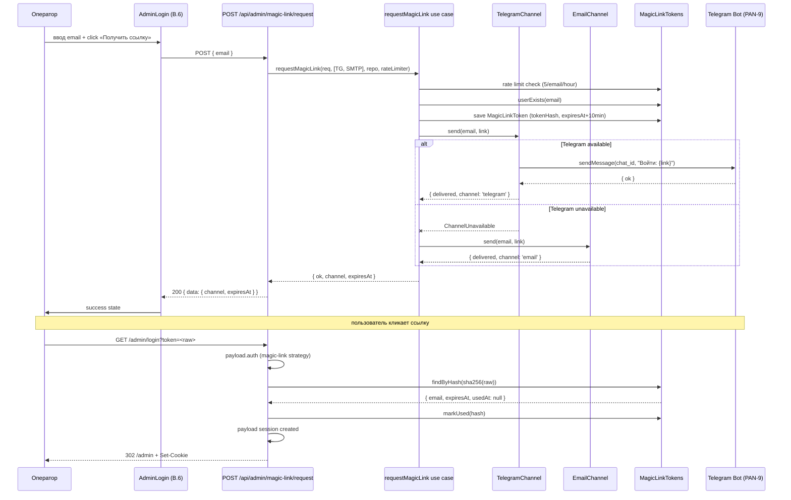

# sa-panel — Wave 2.B · Magic link auth flow (REST + Telegram + email fallback)

**Issue:** [PAN-11](https://linear.app/samohyn/issue/PAN-11)
**Wave:** 2.B (split from Wave 2 решением popanel 2026-04-28)
**Source of truth:** [brand-guide.html §12.1](../../../design-system/brand-guide.html) · [art-concept-v2.md §1](art-concept-v2.md) · [ADR-0005](../../adr/ADR-0005-admin-customization-strategy.md)
**Status:** `approved` (popanel 2026-04-28) · **blocked by [PAN-9](https://linear.app/samohyn/issue/PAN-9) Telegram + [PAN-10](https://linear.app/samohyn/issue/PAN-10) SMTP**
**Skills активированы:** `api-design` (REST endpoints), `hexagonal-architecture` (ports/adapters)
**Author:** sa-panel
**Date:** 2026-04-28

---

## Контекст

**Wave 2.A** ([PAN-5](https://linear.app/samohyn/issue/PAN-5)) добавляет красивый UI login screen, но оставляет native Payload email+password auth.

**Wave 2.B** заменяет email+password на **magic link через Telegram (primary) + email (fallback)**. Запускается **после** закрытия pre-tasks PAN-9 + PAN-10.

**Decisions popanel 2026-04-28** (закрыто):
- Email fallback keep (роуминг scenario)
- Retention `MagicLinkTokens` = 24h (152-ФЗ-friendly)
- Token в URL — acceptable compromise (302 redirect, 10 мин TTL × single-use = low risk)

## ADR-0005 уровень кастомизации

| Подсистема | Уровень |
|---|---|
| `MagicLinkTokens` collection | **Уровень 3** (новая Payload collection — это extension, не core auth replacement) |
| REST endpoints | **Уровень 3** (Next.js API routes) |
| Domain `lib/auth/magic-link/` | **Уровень 3** (новый код в `site/lib/`) |
| Adapters `lib/messengers/{telegram,email}.ts` | **Уровень 3** (новый код) |
| `AdminLogin.tsx` refactor (из Wave 2.A) | **Уровень 2** (replace password field на «Получить ссылку») |
| Native Payload auth core | **Уровень 3 (НЕ трогаем)** — Magic link использует `payload.login` без password (programmatic), session механика остаётся |

---

## Scope IN

### B.1 · Payload collection `MagicLinkTokens`

```typescript
// site/collections/MagicLinkTokens.ts
import type { CollectionConfig } from 'payload';

export const MagicLinkTokens: CollectionConfig = {
  slug: 'magic-link-tokens',
  admin: { hidden: true },
  access: {
    read: () => false,
    create: () => false,
    update: () => false,
    delete: () => false,
  },
  fields: [
    { name: 'tokenHash', type: 'text', required: true, index: true, unique: true },
    { name: 'email', type: 'email', required: true, index: true },
    { name: 'expiresAt', type: 'date', required: true, index: true },
    { name: 'usedAt', type: 'date' },
    { name: 'ipRequest', type: 'text' },
    { name: 'channelDelivered', type: 'select', options: ['telegram', 'email'] },
  ],
  hooks: {
    afterChange: [
      // Cleanup hook: 24h retention (decision Q3)
      async ({ req, doc }) => {
        if (doc.usedAt) {
          const cutoff = new Date(Date.now() - 24 * 60 * 60_000);
          await req.payload.delete({
            collection: 'magic-link-tokens',
            where: { usedAt: { less_than: cutoff } },
          });
        }
      },
    ],
  },
};
```

Migration: `pnpm payload migrate:create --name=wave2b-magic-link-tokens`

### B.2 · REST endpoints

#### `POST /api/admin/magic-link/request`

**Файл:** `site/app/(payload)/api/admin/magic-link/request/route.ts`

**Request:**
```json
{ "email": "grigorij@obikhod.ru" }
```

**Response 200 (success):**
```json
{
  "data": {
    "channel": "telegram",
    "expiresAt": "2026-04-28T12:30:00Z"
  }
}
```

**Errors** (см. api-design conventions):
- `404 user_not_found` — generic message (не выдаём существование email)
- `422 validation_error` — invalid email format
- `429 rate_limit_exceeded` — `Retry-After: 3600`

**Security:**
- Rate limit: 5/email/hour + 10/IP/hour (whichever first)
- Token = `crypto.randomBytes(32).toString('base64url')` (256 bit entropy)
- В БД хранится **SHA-256 hash**, не plaintext
- TTL: 10 мин
- Single-use

#### `GET /admin/login?token=<base64url>`

**Файл:** `site/app/(payload)/admin/login/route.ts` (override Payload native через intercept query param)

**Flow:**
1. Validate token: lookup by SHA-256 hash → check `expiresAt > now` AND `usedAt IS NULL`
2. Если invalid → `302 /admin/login?error=token_invalid`
3. Если valid:
   - `markUsed(hash)` — single-use enforce
   - `payload.login({ email, password: undefined })` — programmatic login through Payload native (требует custom auth strategy в `Users` collection — см. B.5)
   - Set-Cookie payload session
   - `302 /admin` — token исчезает из видимого URL (decision Q4)

### B.3 · Hexagonal architecture

**Domain** (`site/lib/auth/magic-link/`):

```typescript
// site/lib/auth/magic-link/domain.ts
export interface MagicLinkChannel {
  send(email: string, link: URL): Promise<{ delivered: true; channel: 'telegram' | 'email' }>;
  // throws ChannelUnavailable если канал недоступен
}

export class ChannelUnavailable extends Error {
  constructor(public channel: string, public reason: string) {
    super(`Channel ${channel} unavailable: ${reason}`);
  }
}

export interface MagicLinkRepository {
  save(token: { tokenHash: string; email: string; expiresAt: Date }): Promise<void>;
  findByHash(hash: string): Promise<{ email: string; expiresAt: Date; usedAt: Date | null } | null>;
  markUsed(hash: string): Promise<void>;
}

export interface RateLimiter {
  check(key: string, limit: number, windowSec: number): Promise<{ allowed: boolean; resetAt: Date }>;
}
```

**Use case** (`requestMagicLink.ts`):

```typescript
import crypto from 'node:crypto';

export async function requestMagicLink(
  req: { email: string; ip: string },
  channels: MagicLinkChannel[],  // [TelegramChannel, EmailChannel]
  repo: MagicLinkRepository,
  rateLimiter: RateLimiter,
  userExists: (email: string) => Promise<boolean>,
  baseUrl: string,
): Promise<
  | { ok: true; channel: 'telegram' | 'email'; expiresAt: Date }
  | { ok: false; error: 'rate_limit_exceeded' | 'user_not_found' | 'all_channels_unavailable' }
> {
  // 1. Rate limit
  const limited = await rateLimiter.check(`ml:email:${req.email}`, 5, 3600);
  if (!limited.allowed) return { ok: false, error: 'rate_limit_exceeded' };

  // 2. User existence check
  if (!(await userExists(req.email))) return { ok: false, error: 'user_not_found' };

  // 3. Generate token
  const raw = crypto.randomBytes(32).toString('base64url');
  const hash = crypto.createHash('sha256').update(raw).digest('hex');
  const expiresAt = new Date(Date.now() + 10 * 60_000);
  await repo.save({ tokenHash: hash, email: req.email, expiresAt });

  // 4. Try channels in order (Telegram first, email fallback)
  const link = new URL(`/admin/login?token=${raw}`, baseUrl);
  for (const channel of channels) {
    try {
      const result = await channel.send(req.email, link);
      return { ok: true, channel: result.channel, expiresAt };
    } catch (err) {
      if (err instanceof ChannelUnavailable) continue;
      throw err;
    }
  }
  return { ok: false, error: 'all_channels_unavailable' };
}
```

### B.4 · Adapters

**Telegram** (`site/lib/messengers/telegram.ts`):

```typescript
import type { MagicLinkChannel } from '@/lib/auth/magic-link/domain';
import { ChannelUnavailable } from '@/lib/auth/magic-link/domain';
import { sendMessage } from './telegram/sendMessage'; // из PAN-9

export class TelegramChannel implements MagicLinkChannel {
  constructor(
    private getOperatorChatId: (email: string) => Promise<string | null>,
  ) {}

  async send(email: string, link: URL) {
    const chatId = await this.getOperatorChatId(email);
    if (!chatId) throw new ChannelUnavailable('telegram', 'no chat_id for email');
    try {
      await sendMessage(chatId, `Войти в admin: ${link.toString()}\nСсылка работает 10 минут.`);
      return { delivered: true as const, channel: 'telegram' as const };
    } catch (err) {
      throw new ChannelUnavailable('telegram', String(err));
    }
  }
}
```

**Email** (`site/lib/messengers/email.ts`):

```typescript
import nodemailer from 'nodemailer';
import type { MagicLinkChannel } from '@/lib/auth/magic-link/domain';
import { ChannelUnavailable } from '@/lib/auth/magic-link/domain';

export class EmailChannel implements MagicLinkChannel {
  private transporter: nodemailer.Transporter;

  constructor() {
    this.transporter = nodemailer.createTransport({
      host: process.env.SMTP_HOST!,
      port: Number(process.env.SMTP_PORT ?? 587),
      secure: false, // STARTTLS
      auth: { user: process.env.SMTP_USER!, pass: process.env.SMTP_PASS! },
    });
  }

  async send(email: string, link: URL) {
    try {
      await this.transporter.sendMail({
        from: `${process.env.SMTP_FROM_NAME} <${process.env.SMTP_FROM_EMAIL}>`,
        to: email,
        subject: 'Вход в Обиход admin',
        text: `Войти: ${link.toString()}\nСсылка работает 10 минут.`,
        html: `<p>Войти: <a href="${link.toString()}">${link.toString()}</a></p><p>Ссылка работает 10 минут.</p>`,
      });
      return { delivered: true as const, channel: 'email' as const };
    } catch (err) {
      throw new ChannelUnavailable('email', String(err));
    }
  }
}
```

### B.5 · Custom auth strategy для programmatic login

**Файл:** `site/collections/Users.ts` patch

Добавить custom auth strategy чтобы `payload.login` мог создать session **без password** (для magic-link flow):

```typescript
import type { CollectionConfig } from 'payload';

export const Users: CollectionConfig = {
  slug: 'users',
  // ...
  auth: {
    strategies: [
      {
        name: 'magic-link',
        authenticate: async ({ payload, headers, query }) => {
          const token = (query as { token?: string })?.token;
          if (!token) return { user: null };

          const hash = crypto.createHash('sha256').update(token).digest('hex');
          const tokens = await payload.find({
            collection: 'magic-link-tokens',
            where: { tokenHash: { equals: hash } },
            limit: 1,
          });
          const record = tokens.docs[0];
          if (!record || record.usedAt || new Date(record.expiresAt) < new Date()) {
            return { user: null };
          }

          // Mark used (single-use enforce)
          await payload.update({
            collection: 'magic-link-tokens',
            id: record.id,
            data: { usedAt: new Date().toISOString() },
          });

          // Lookup user by email
          const users = await payload.find({
            collection: 'users',
            where: { email: { equals: record.email } },
            limit: 1,
          });
          return { user: users.docs[0] || null };
        },
      },
    ],
  },
  fields: [
    // existing...
    {
      name: 'telegramChatId',  // из PAN-9
      type: 'text',
      admin: { description: 'Chat ID Telegram бота для magic link login.' },
    },
  ],
};
```

### B.6 · `AdminLogin.tsx` refactor (из Wave 2.A)

Заменить email+password form на email-only:

```typescript
// site/components/admin/AdminLogin.tsx (refactor из Wave 2.A)
'use client';
import { useState, type FormEvent } from 'react';

export default function AdminLogin() {
  const [email, setEmail] = useState('');
  const [state, setState] = useState<'default' | 'loading' | 'success' | 'error'>('default');
  const [successInfo, setSuccessInfo] = useState<{ channel: 'telegram' | 'email' } | null>(null);
  const [errorCode, setErrorCode] = useState<string | null>(null);
  const [resendIn, setResendIn] = useState(60);

  const handleSubmit = async (e: FormEvent) => {
    e.preventDefault();
    setState('loading');
    setErrorCode(null);
    try {
      const res = await fetch('/api/admin/magic-link/request', {
        method: 'POST',
        headers: { 'Content-Type': 'application/json' },
        body: JSON.stringify({ email }),
      });
      const data = await res.json();
      if (!res.ok) {
        setState('error');
        setErrorCode(data.error?.code ?? 'unknown');
        return;
      }
      setState('success');
      setSuccessInfo({ channel: data.data.channel });
      // Start countdown for resend
      const interval = setInterval(() => {
        setResendIn((s) => (s > 0 ? s - 1 : 0));
      }, 1000);
      setTimeout(() => clearInterval(interval), 60_000);
    } catch {
      setState('error');
      setErrorCode('network');
    }
  };

  if (state === 'success' && successInfo) {
    return (
      <div className="login__form" aria-live="polite" role="status">
        {successInfo.channel === 'telegram' ? (
          <p>Ссылка отправлена в Telegram. Проверь @obikhod_admin_bot.</p>
        ) : (
          <p>Ссылка отправлена на email <code>{maskEmail(email)}</code>.</p>
        )}
        <button
          type="button"
          className="ad-link"
          disabled={resendIn > 0}
          onClick={() => { setState('default'); setResendIn(60); }}
        >
          {resendIn > 0 ? `Отправить ещё раз через ${resendIn} сек` : 'Отправить ещё раз'}
        </button>
      </div>
    );
  }

  return (
    <form onSubmit={handleSubmit} className="login__form" aria-label="Вход в админку">
      <div className="ad-field">
        <label htmlFor="email">Email</label>
        <input
          id="email"
          type="email"
          value={email}
          onChange={(e) => setEmail(e.target.value)}
          required
          autoComplete="email"
          disabled={state === 'loading'}
          aria-invalid={errorCode === 'invalid_email' ? 'true' : 'false'}
        />
      </div>

      {errorCode && (
        <div role="alert" aria-live="polite" className="ad-error">
          {errorCode === 'user_not_found' && 'Пользователь не найден или временно заблокирован.'}
          {errorCode === 'rate_limit_exceeded' && 'Слишком много попыток. Попробуй через час.'}
          {errorCode === 'all_channels_unavailable' && 'Не удалось отправить ссылку. Попробуй позже.'}
          {errorCode === 'network' && 'Не удалось отправить запрос. Проверь интернет.'}
          {!['user_not_found', 'rate_limit_exceeded', 'all_channels_unavailable', 'network'].includes(errorCode) &&
            'Что-то пошло не так. Попробуй ещё раз.'}
        </div>
      )}

      <button type="submit" className="btn--style-primary form-submit" disabled={state === 'loading' || !email}>
        {state === 'loading' ? 'Отправляем…' : 'Получить ссылку'}
      </button>
    </form>
  );
}

function maskEmail(email: string): string {
  const [name, domain] = email.split('@');
  return `${name.slice(0, 2)}**@${domain}`;
}
```

---

## Architecture (UML Sequence)



---

## Acceptance Criteria

- [x] `sa-panel-wave2b.md` написан и одобрен popanel
- [ ] **Pre-conditions closed:**
  - [ ] [PAN-9](https://linear.app/samohyn/issue/PAN-9) Telegram bot setup done
  - [ ] [PAN-10](https://linear.app/samohyn/issue/PAN-10) Beget SMTP setup done
- [ ] `MagicLinkTokens` collection создана + миграция applied
- [ ] `Users.telegramChatId` + custom auth strategy `magic-link`
- [ ] **REST endpoints:**
  - [ ] `POST /api/admin/magic-link/request` — следует api-design (status codes, error envelope)
  - [ ] `GET /admin/login?token=...` — 302 redirect + session set
- [ ] **Hexagonal:**
  - [ ] `MagicLinkChannel` port + 2 adapters (Telegram + Email)
  - [ ] Use case `requestMagicLink` независим от каналов и storage
- [ ] **Token security:**
  - [ ] 256-bit entropy (`crypto.randomBytes(32)`)
  - [ ] SHA-256 hash в БД (raw token не хранится)
  - [ ] TTL 10 мин enforced (server-side check, не клиент)
  - [ ] Single-use enforced
  - [ ] Rate limit 5/email/hour + 10/IP/hour
  - [ ] **Retention 24h** (decision Q3) через `afterChange` hook cleanup
- [ ] **AdminLogin refactor:**
  - [ ] Email-only flow (password убран)
  - [ ] Success state с channel-specific text
  - [ ] Resend countdown 60 сек
  - [ ] Все error states (см. FSM в B.6)
- [ ] **A11y WCAG 2.2 AA:**
  - [ ] aria-live на success/error region
  - [ ] aria-invalid на email
  - [ ] keyboard-only flow
  - [ ] reduced-motion guard
- [ ] **`cr-panel` approve** (a11y + **security review** — особенно token lifecycle, rate limit, custom auth strategy)
- [ ] **Playwright smoke:**
  - [ ] e2e: request → mock Telegram delivery → click link → admin session
  - [ ] expired token → 401 redirect with error
  - [ ] rate limit → 429 после 5 запросов
- [ ] **Integration tests** (Vitest):
  - [ ] `MagicLinkChannel` ports — Telegram + Email через mock
  - [ ] `requestMagicLink` use case с rate limiter / repository / channels stubs
- [ ] **ADR-0005 follow-ups:**
  - [ ] Уровень 3 для backend (НЕ трогаем Payload auth core)
  - [ ] Native Payload login через `payload.auth` strategy — это extension, не replacement
  - [ ] Rollback path: `views.login: '@/components/admin/AdminLogin'` → revert на email+password (Wave 2.A) ≤5 мин
- [ ] **Documentation:**
  - [ ] `site/lib/auth/magic-link/README.md` — как добавить новый канал
  - [ ] `site/collections/MagicLinkTokens.ts` JSDoc с retention policy

---

## Dev breakdown

| Task | Owner | Объём |
|---|---|---|
| `MagicLinkTokens` collection + миграция | `be-panel` + `dba` | 0.2 чд |
| Domain `site/lib/auth/magic-link/` (use case + ports) | `be-panel` | 0.3 чд |
| `TelegramChannel` adapter (использует PAN-9 helper) | `be-panel` | 0.1 чд |
| `EmailChannel` adapter (nodemailer + PAN-10 SMTP env) | `be-panel` | 0.2 чд |
| Custom auth strategy `magic-link` в `Users` | `be-panel` | 0.2 чд |
| REST endpoint `POST /api/admin/magic-link/request` | `be-panel` | 0.2 чд |
| Token validation in `GET /admin/login?token=...` | `be-panel` | 0.1 чд |
| Rate limiter (Payload-collection или Redis) | `be-panel` | 0.2 чд |
| `AdminLogin.tsx` refactor (email-only + FSM) | `fe-panel` | 0.4 чд |
| Integration tests (Vitest) | `be-panel` | 0.3 чд |
| Playwright e2e | `qa-panel` | 0.3 чд |

**Итого:** ~2.5 чд (estimate был 2 чд — занижено на 0.5 чд за интеграционные тесты)

---

## Pinging

- `popanel` — final approve после rewrite
- `tamd` — confirm Q4 (token in URL) compatibility с ADR-0005
- `be-panel` — kickoff dev ПОСЛЕ закрытия PAN-9 + PAN-10
- `qa-panel` — pre-flight: подготовить mock Telegram + email тестовые fixtures
