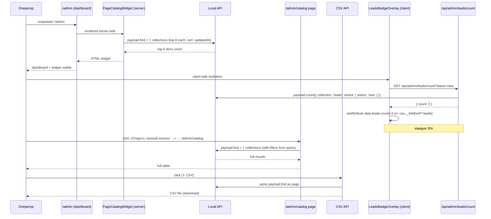

# sa-panel — Wave 3 · PageCatalog (отдельная страница + dashboard widget + CSV + Leads badge)

**Issue:** [PAN-6](https://linear.app/samohyn/issue/PAN-6)
**Wave:** 3 из roadmap [art-concept-v2.md §10](art-concept-v2.md)
**Source of truth:** [brand-guide.html §12.3](../../../design-system/brand-guide.html) · [art-concept-v2.md §3](art-concept-v2.md) · [ADR-0005](../../adr/ADR-0005-admin-customization-strategy.md)
**Status:** `approved` (popanel 2026-04-28, decisions ниже)
**Skills активированы:** `api-design` (REST CSV + Leads count endpoints), `product-capability` (capability map dashboard → catalog)
**Author:** sa-panel
**Date:** 2026-04-28

---

## Контекст текущего состояния

В `site/components/admin/PageCatalog.tsx` уже есть **server component через `payload.find` Local API** (Wave 1, OBI-29). Подключён в `payload.config.ts` `afterDashboard`. Делает aggregation 7 коллекций (Services, ServiceDistricts, Cases, Blog, B2BPages, Authors, Districts) с `limit: 50, sort: '-updatedAt', _status: 'published'`.

**Что уже работает:**
- Server component — нет HTTP overhead, прямой Payload Local API
- Empty state из `EmptyErrorStates.tsx`
- Иконки `→` edit-link с aria-label
- Стили через CSS variables (`--brand-obihod-*`)

**Что переделываем в Wave 3:**
1. **Сжать afterDashboard виджет** до top-6 last updated (сейчас показывает все 50 на коллекцию)
2. **Создать отдельную страницу** `/admin/catalog` с full table + фильтры + поиск + CSV
3. **Leads badge counter** в sidebar (новые заявки)

## ADR-0005 уровень кастомизации

| Подсистема | Уровень | Обоснование |
|---|---|---|
| `PageCatalogWidget` (top-6 для dashboard) | **Уровень 2** (React `admin.components.afterDashboard`) | Существующий paths замена — `afterDashboard: ['@/components/admin/PageCatalogWidget']` вместо `PageCatalog` |
| `PageCatalogTable` (full table) | **Уровень 2** (React shared component) | Извлекаем из текущего `PageCatalog.tsx`, переиспользуем в widget + page |
| `/admin/catalog` page | **Уровень 2** (Payload custom route) — `app/(payload)/admin/catalog/page.tsx` Next.js Route Segment | Native Next.js App Router внутри Payload route group работает (см. [site/AGENTS.md](../../../site/AGENTS.md) — это Next.js 16 особенность) |
| CSV export endpoint | **Уровень 3** (Next.js API route) — `app/(payload)/api/admin/page-catalog.csv/route.ts` | Server-side CSV generation с `Content-Disposition: attachment` |
| Leads badge counter (client polling) | **Уровень 2** + **Уровень 1** (mix) | Plan B: client-component overlay через `Nav` slot если доступен, иначе CSS injection (см. ADR-0005 §2 high-risk) |

---

## Scope IN

### 3.1 · Refactor `PageCatalog.tsx` → 2 компонента

**Из:**
```
site/components/admin/PageCatalog.tsx (300 строк, all-in-one)
```

**В:**
```
site/components/admin/PageCatalogTable.tsx       — shared table (все группы или filtered)
site/components/admin/PageCatalogWidget.tsx     — top-6 для dashboard
site/components/admin/PageCatalogPage.tsx       — full table + фильтры/поиск/CSV
site/components/admin/lib/pageCatalogQueries.ts — extracted loader (loadCatalog, loadTopN)
```

**`PageCatalogWidget` (для `afterDashboard`):**
- Top-6 last updated across all 7 collections (union, sort `-updatedAt`, limit 6)
- Header «Свежие изменения» + counter «6 из {total} стр.»
- Footer link «Открыть полный каталог →» → `/admin/catalog`
- Empty state — оставляем существующий (Wave 5 расширит)

**Dashboard layout:**
```
[BeforeDashboardStartHere]      ← greeting + tiles (Wave 1)
[Native Payload Dashboard]       ← native cards
[PageCatalogWidget]             ← top-6 + link
```

В `payload.config.ts`:
```typescript
afterDashboard: ['@/components/admin/PageCatalogWidget']  // было: PageCatalog
```

### 3.2 · `/admin/catalog` отдельная страница

**Route:** `site/app/(payload)/admin/catalog/page.tsx` (Next.js Route Segment в Payload route group)

**URL:** `https://obikhod.ru/admin/catalog`

**Anatomy** (по [art-concept-v2.md §3](art-concept-v2.md)):

```
┌─────────────────────────────────────────────────────────────┐
│  [Sidebar Payload]    [Top bar: 02·Контент / Каталог]       │
├─────────────────────────────────────────────────────────────┤
│                                                             │
│  Каталог опубликованных страниц            [Фильтр ▾] [⇩ CSV] │
│  ────────────────────────────────────────────────────────── │
│  [Поиск: URL или title____________________________]         │
│                                                             │
│  Раздел        URL                  Обновлено   Статус   →  │
│  Услуги (4)    /vyvoz-musora/       04-26       ✓ live   →  │
│                /arboristika/        04-25       ✓ live   →  │
│  ...                                                         │
└─────────────────────────────────────────────────────────────┘
```

**Фильтры:**
- **Раздел** dropdown (multi-select): Услуги / Sub-services / SD / Кейсы / Блог / B2B / Авторы / Районы / All (default)
- **Статус** dropdown (single): Live / Draft / All (default = Live)
- **Дата** — диапазон «Обновлено за: 7 дней / 30 дней / 90 дней / All time» (single)

**Поиск** — debounced 300ms, по `title`, `url`, `slug` (case-insensitive).

**CSV button** — янтарный secondary, при click → `GET /api/admin/page-catalog.csv?<filters>` — браузер скачивает.

**Pagination** — нет (53 записи сейчас, при programmatic SD scaling до 2000 — добавим offset pagination в Wave 7 polish, сейчас YAGNI).

**Permission gate:** только authenticated admin. `app/(payload)/admin/catalog/page.tsx` использует `payload.auth({ headers })` → если 401, redirect на login.

### 3.3 · CSV export endpoint

**Endpoint:** `GET /api/admin/page-catalog.csv`

**Query params:**
- `section` — comma-separated collection slugs (e.g. `services,blog`)
- `status` — `published` | `draft` | `all` (default `published`)
- `since` — ISO date (e.g. `2026-04-01`)
- `q` — search query

**Response:**
- `Content-Type: text/csv; charset=utf-8`
- `Content-Disposition: attachment; filename="page-catalog-2026-04-28.csv"`
- Body — UTF-8 BOM + CSV rows

**CSV format:**
```csv
"Раздел","Title","URL","Обновлено","Статус","Edit"
"Услуги","Вывоз мусора","/vyvoz-musora/","2026-04-26","Live","https://obikhod.ru/admin/collections/services/vyvoz-musora"
...
```

**Permission:** authenticated admin. Если 401 → JSON `{ error: { code: 'unauthorized' } }`.

### 3.4 · `/api/admin/page-catalog` REST endpoint (опционально)

**Решение:** **НЕ создаём отдельный REST endpoint**. Текущий `PageCatalogPage` server component делает прямой `payload.find` через Local API — это быстрее, проще, и не имеет HTTP overhead. Cache via `revalidate: 60` (Next.js Route Segment Config).

**Исключение** — если оператор / popanel запросит «открыть admin catalog в мобильном приложении» — тогда добавим REST. Сейчас YAGNI.

### 3.5 · Leads badge counter в sidebar (high-risk per ADR-0005)

**Cel:** на sidebar пункт `Lead'ы` показывается counter новых заявок (`status: 'new'`). Polling каждые 30 сек. По [brand-guide.html:2573](../../../design-system/brand-guide.html#L2573) — `<span class="ad-counter">12</span>`.

**3-plan стратегия (по ADR-0005 §2 + popanel review approve):**

#### Plan A — Native Payload Nav slot (preferred если работает)

Payload 3.83 имеет `admin.components.Nav` API. Проверяем:
- Возможность добавить `<NavItemBadge />` к `Lead'ы` пункту через `admin.components.Nav` override
- Если API позволяет — extending native, минимальный риск при апгрейде

**Acceptance:** sa-panel в dev-фазе пробует Plan A первым. **Если работает** — финальный путь. **Если нет** (Payload Nav слот не позволяет per-collection badge) — fallback на Plan B.

#### Plan B — Client overlay component через MutationObserver

```typescript
// site/components/admin/LeadsBadgeOverlay.tsx (client component)
'use client';
import { useEffect, useState } from 'react';

export function LeadsBadgeOverlay() {
  const [count, setCount] = useState<number | null>(null);

  useEffect(() => {
    let cancelled = false;

    const fetchCount = async () => {
      const res = await fetch('/api/admin/leads/count?status=new');
      if (cancelled) return;
      const { data } = await res.json();
      setCount(data.count);
    };

    fetchCount();
    const interval = setInterval(fetchCount, 30_000);

    // Inject badge into sidebar via DOM
    const observer = new MutationObserver(() => {
      const link = document.querySelector('a[href*="/admin/collections/leads"]');
      if (link && count !== null && count > 0) {
        link.setAttribute('data-leads-count', String(count));
      }
    });
    observer.observe(document.body, { childList: true, subtree: true });

    return () => {
      cancelled = true;
      clearInterval(interval);
      observer.disconnect();
    };
  }, [count]);

  return null; // только side effect
}
```

CSS (расширение `custom.scss`):
```scss
/* Sidebar Leads badge counter (Wave 3 fallback Plan B) */
.payload__app a[href*="/admin/collections/leads"][data-leads-count]::after {
  content: attr(data-leads-count);
  background-color: var(--brand-obihod-accent);
  color: var(--brand-obihod-ink);
  font-family: var(--font-mono);
  font-size: 11px;
  font-variant-numeric: tabular-nums;
  padding: 1px 7px;
  border-radius: 9px;
  margin-left: auto;
}
.payload__app a[href*="/admin/collections/leads"][data-leads-count]:where([data-leads-count="0"])::after {
  display: none;
}
```

Подключение через `admin.components.providers` (Payload custom provider, оборачивает admin app):
```typescript
// payload.config.ts
admin: {
  components: {
    providers: ['@/components/admin/LeadsBadgeProvider']
  }
}
```

`LeadsBadgeProvider` — серверный wrapper, рендерит `<LeadsBadgeOverlay />` (client) внутри.

#### Plan C — Graceful degradation

Если Plan A + Plan B оба не работают (Payload не позволяет provider, MutationObserver не находит sidebar) — **drop sidebar badge**, оставляем только в dashboard widget «Новые заявки: 3» (это уже есть из Wave 1).

**Acceptance test:**
- [ ] Хотя бы один из Plan A/B/C работает
- [ ] Plan A/B обновляется ≤30 сек после нового Lead
- [ ] Plan C имеет dashboard counter «Новые заявки: N» — он уже есть

### 3.6 · `/api/admin/leads/count` REST endpoint

**Endpoint:** `GET /api/admin/leads/count?status=new`

**Response 200:**
```json
{ "data": { "count": 3 } }
```

**Caching:** `Cache-Control: max-age=30, stale-while-revalidate=60` (server-side через Next.js `revalidate: 30`).

**Auth:** authenticated admin. 401 без auth.

---

## Scope OUT

- **Pagination в `/admin/catalog`** — добавим в Wave 7 polish если оператор запросит (сейчас 53 записей, мобильный scroll справляется)
- **WebSocket / Server-Sent Events для leads counter** — overkill для одного оператора, polling 30s достаточно
- **Multi-tenancy filters** (если у нас будет несколько B2B-юзеров) — out of scope, отдельная US 2027
- **Catalog для drafts/scheduled** — пока только published. Drafts видны через native Payload list view, отдельной таблицы не нужно

---

## Architecture (UML Sequence)



---

## Acceptance Criteria

- [ ] `sa-panel-wave3.md` одобрен `popanel`
- [ ] AC из Linear PAN-6 (8 пунктов)
- [ ] **Refactor existing `PageCatalog.tsx`:**
  - [ ] Extracted `PageCatalogTable.tsx` (shared)
  - [ ] New `PageCatalogWidget.tsx` (top-6 для dashboard)
  - [ ] New `PageCatalogPage.tsx` (full table)
  - [ ] `payload.config.ts` `afterDashboard` указывает на `PageCatalogWidget`, не `PageCatalog`
  - [ ] Существующий PageCatalog deleted (no dual code)
- [ ] **`/admin/catalog` page:**
  - [ ] Route `app/(payload)/admin/catalog/page.tsx` создан
  - [ ] Authenticated only (redirect /admin/login если 401)
  - [ ] Фильтры (Раздел / Статус / Дата) работают
  - [ ] Поиск по title + url + slug debounced 300ms
  - [ ] Сортировка по умолчанию `-updatedAt`
  - [ ] Соответствие §12.3 (визуал ревью `ux-panel`)
- [ ] **CSV export:**
  - [ ] `GET /api/admin/page-catalog.csv` работает
  - [ ] UTF-8 BOM + правильный encoding (русский в Excel)
  - [ ] Filename `page-catalog-YYYY-MM-DD.csv`
  - [ ] Filters из query string применяются
  - [ ] Authenticated only (401 без auth)
- [ ] **Leads badge counter:**
  - [ ] Plan A или B или C работает (один из трёх — graceful degradation)
  - [ ] Если Plan A/B — обновление ≤30s
  - [ ] Polling 30s (через `setInterval` или React Query refetch interval)
  - [ ] `/api/admin/leads/count?status=new` endpoint cached 30s
  - [ ] При 0 новых — badge скрыт
- [ ] **ADR-0005 follow-ups:**
  - [ ] Уровень 2 React для components, Уровень 3 для CSV endpoint
  - [ ] No `!important` без `// reason: ...` комментария
  - [ ] `:where()` обёртка для `data-leads-count` селекторов в custom.scss
  - [ ] TypeScript types из `payload`, не из `@payloadcms/ui`
- [ ] **Performance:**
  - [ ] Dashboard widget render ≤200ms (Lighthouse measure)
  - [ ] `/admin/catalog` page LCP ≤2.5s (53+ rows)
  - [ ] CSV generation ≤500ms для 53 строк
- [ ] **A11y WCAG 2.2 AA:**
  - [ ] CSV button — `aria-label="Скачать каталог в CSV"`
  - [ ] Filter dropdowns — keyboard-accessible
  - [ ] Search input — `aria-label="Поиск по каталогу"`
  - [ ] Badge — `aria-live="polite"` на overlay
- [ ] **`cr-panel` approve**
- [ ] **Playwright smoke** (Wave 7):
  - [ ] Dashboard → widget visible → click «полный каталог» → page loads
  - [ ] Filter «Раздел: Услуги» → table updates
  - [ ] CSV download → file headers correct
  - [ ] Leads badge: создать lead со status=new → через 35s badge=1

---

## Resolved by popanel 2026-04-28

| Q | Решение | Действие в spec |
|---|---|---|
| Q1 Plan A/B/C для Leads badge | ✅ **Sequential попытка** (Plan A → Plan B → Plan C) | §3.5 описывает chain с proper fallback |
| Q2 URL `/admin/catalog` | ✅ APPROVE — короче, single-user | §3.2 fixed на `/admin/catalog` |
| Q3 CSV button | ✅ Как в mockup §12.3 (вверху таблицы) | §3.3 fixed |
| Q4 Empty state widget | ✅ Keep existing (Wave 1) | §3.1 references `EmptyState` from Wave 1 |

---

## Dev breakdown

| Task | Owner | Объём |
|---|---|---|
| Refactor `PageCatalog.tsx` → 3 компонента + lib | `fe-panel` | 0.3 чд |
| `PageCatalogWidget` top-6 (server component) | `fe-panel` | 0.1 чд |
| `PageCatalogPage` (server) + Next.js Route Segment | `fe-panel` | 0.3 чд |
| Filter / search UI (client component island) | `fe-panel` | 0.3 чд |
| `/api/admin/page-catalog.csv` endpoint | `be-panel` | 0.2 чд |
| `/api/admin/leads/count` endpoint | `be-panel` | 0.1 чд |
| `LeadsBadgeOverlay` (Plan A try → Plan B fallback) | `fe-panel` | 0.3 чд |
| `LeadsBadgeProvider` подключение в `payload.config.ts` | `fe-panel` | 0.05 чд |
| custom.scss extension для badge selectors | `fe-panel` | 0.05 чд |
| Integration tests (Vitest) для CSV + count endpoints | `be-panel` | 0.2 чд |
| Playwright smoke (catalog flow + badge) | `qa-panel` | 0.2 чд |

**Итого:** ~2 чд (изначально 1.5 чд занижено — добавил 3-plan badge fallback + a11y).

---

## Pinging

- `popanel` — Q1/Q2/Q3 approve
- `tamd` — review Plan A/B/C decision tree, особенно ADR-0005 high-risk badge counter
