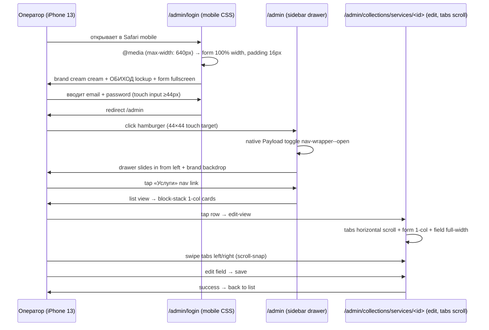

# sa-panel — Wave 6 · Mobile responsive admin (CSS-only @media queries)

**Issue:** PAN-7 (Wave 6 из roadmap)
**Wave:** 6 из roadmap [art-concept-v2.md §8](art-concept-v2.md)
**Source of truth:** [brand-guide.html §12](../../../design-system/brand-guide.html) · [art-concept-v2.md §8](art-concept-v2.md) · [ADR-0005](../../adr/ADR-0005-admin-customization-strategy.md) · [ADR-0010](../../adr/ADR-0010-payload-views-list-customization.md)
**Status:** `draft` (sa-panel 2026-04-30, popanel review pending)
**Skills активированы:** `product-capability` (mobile capability map), `accessibility` (touch targets WCAG 2.5.5), `e2e-testing` (Playwright mobile-chrome)
**Author:** sa-panel (impersonated by popanel в auto-mode сессии)
**Date:** 2026-04-30

---

## Контекст

US-12 на 2026-04-30 практически закрыт desktop-режим: W1 палитра + W2.A v2 login + W3 catalog/leads-badge + W4 tabs + W5p1 components — все в проде. Остаётся **Wave 6 Mobile** + W7 Polish/Playwright/a11y.

**Реальность оператора (`art-concept-v2 §8`):** ходит в admin с телефона редко, но иногда — принять заявку из дома. Минимально-приемлемая мобильная версия не должна выглядеть «admin не работает на телефоне» (анти-паттерн «непрофессионально», `art-concept-v2 §12`).

**Текущее состояние мобильной поддержки:**
- `site/app/(payload)/custom.scss` (560+ строк) — desktop-only стили; единственный `@media` блок — `prefers-reduced-motion: reduce`. **Нет ни одного responsive @media query** для viewport sizes.
- Native Payload 3.84 имеет частичную built-in мобильную поддержку (sidebar hamburger через `< 1024px` breakpoint, list-view scroll), но без брендовой адаптации это default Payload-стиль.

**Что W6 даёт оператору:** возможность открыть `/admin/login` → залогиниться → принять заявку (Lead) → опубликовать черновик с iPhone 13 Pro / Pixel / Galaxy без UX-разочарования.

---

## Капабилити (product-capability)

| Capability | Frequency | Impact | Confidence | Effort |
|---|---|---|---|---|
| Login на мобильном | 1×неделя (rare, edge case) | medium (без login admin недоступен) | high (CSS-only safe) | 0.1 чд |
| Sidebar drawer на мобильном | 1×день при mobile use | high (без него нет навигации) | high (Payload native partially supports) | 0.3 чд |
| List view → 1-column cards | 1×день при mobile use | medium (читаемость) | medium (CSS только может) | 0.3 чд |
| Edit view tabs horizontal scroll | 1×день при mobile use | high (форма редактируется) | medium (требует verify Payload tabs DOM) | 0.3 чд |
| PageCatalog widget accordion | 1×день при mobile use | low (catalog можно открыть desktop) | high | 0.1 чд |
| Bulk-action disabled | 1×месяц | low | high | 0.05 чд |

**Total: ~1.2 чд CSS + Playwright mobile-chrome smoke + manual real-device test**

---

## ADR-0005/0010 уровень кастомизации

| Подсистема | Уровень | Обоснование |
|---|---|---|
| Mobile responsive media queries | **Уровень 1** (CSS-only через `custom.scss`) | По ADR-0010 — override custom views отвергнут (cost/benefit плохой); CSS-only через `@media` подходит для viewport adaptation |
| Login fullscreen mobile | **Уровень 1** (CSS) | Расширение existing `.login__form` блока |
| Sidebar drawer trigger | **Native Payload** + CSS tweaks | Payload 3.84 имеет mobile hamburger built-in (`.payload__app .nav__mobile-toggle`); только усиливаем visibility/touch targets через CSS |
| List view 1-column cards | **Уровень 1** (CSS) | Преобразование `.collection-list__row` через `display: grid; grid-template-columns: 1fr` или table-row → block |
| Tabs horizontal scroll | **Уровень 1** (CSS) | `overflow-x: auto` + `scroll-snap-type` на `.tabs-field__tabs-list` |
| PageCatalog widget accordion | **Уровень 1** (CSS) — `:has()` selector для visual-only collapse | Без JS: scroll-snap или `<details>` если нужен real toggle (но widget — server component, без client state) |
| Bulk-action disabled | **Уровень 1** (CSS `display: none` на ≤640px) | Простое скрытие; native логика остаётся desktop |

**Override list/edit view через `views.list.Component` или custom mobile view — отвергаем** (ADR-0010 lessons).

---

## Scope IN

### 6.1 · Breakpoints

```scss
// Tablet — sidebar collapsed по умолчанию, top bar полный
@media (max-width: 1024px) { /* tablet+mobile common rules */ }

// Mobile — single-column, drawer sidebar, hamburger
@media (max-width: 640px) { /* mobile-only overrides */ }
```

**Test viewports** (Playwright projects + manual):
- 360px (Galaxy S старые / iPhone SE)
- 414px (iPhone 13/14 Pro Max)
- 768px (iPad portrait)
- 1024px (iPad landscape — boundary case)
- 1440px (desktop baseline — НЕ ломаем)

### 6.2 · Login на мобильном (≤640px)

```scss
@media (max-width: 640px) {
  .login {
    /* Page bg остаётся cream */
    padding: 16px 16px 32px;
    min-height: 100vh;
    /* Vertical center остаётся через native flex */
  }

  .login__form {
    max-width: 100% !important; /* override 320px desktop default */
    padding: 24px 20px; /* было 32px — экономим viewport */
  }

  /* Lockup (BeforeLoginLockup SVG) — остаётся 56px height, но margin сокращаем */
  .template-minimal__wrap [data-brand-lockup] {
    margin-bottom: 24px; /* было 40px */
  }

  /* Footer (AfterLoginFooter) — остаётся, font-size меньше */
  .template-minimal__wrap [data-brand-footer] {
    font-size: 11px;
  }
}
```

**AC:** Login на iPhone 13 viewport — форма touchable (input height ≥44px touch target), submit button width 100%, lockup visible сверху, footer внизу не overlap'ит submit при keyboard open.

### 6.3 · Sidebar drawer (≤1024px)

Payload 3.84 имеет native `.nav__mobile-toggle` button + `.nav` translate'ит off-screen на мобильных. Наша задача — **усилить visibility + touch targets + brand styling**:

```scss
@media (max-width: 1024px) {
  /* Hamburger button — touch target 44×44 (WCAG 2.5.5) */
  .payload__app .nav-toggler,
  .payload__app .nav__mobile-toggle {
    min-width: 44px;
    min-height: 44px;
    color: var(--brand-obihod-ink);
    background: var(--brand-obihod-card);
    border: 1px solid var(--brand-obihod-line);
    border-radius: var(--brand-obihod-radius-sm);
  }
  .payload__app .nav-toggler:active,
  .payload__app .nav__mobile-toggle:active {
    background: var(--brand-obihod-paper);
  }

  /* Sidebar drawer — slides in from left */
  .payload__app .nav-wrapper,
  .payload__app .template-default__wrap > aside {
    box-shadow: 4px 0 16px rgba(0, 0, 0, 0.12);
  }

  /* Backdrop — затемнение основной области когда drawer open.
   * Payload native может не выставлять backdrop — добавим если есть state class. */
  .payload__app[data-nav-open='true']::after,
  .payload__app .nav-wrapper--open + main::before {
    content: '';
    position: fixed;
    inset: 0;
    background: rgba(28, 28, 28, 0.4);
    z-index: 50;
  }
}
```

**Action для fe-panel pre-flight:** в первый день dev — Playwright debug `await page.goto('/admin')` на 414px viewport, dump DOM для `.nav-toggler` / `.nav-wrapper` / `[data-nav-open]` чтобы verify exact селекторы Payload 3.84. Если они отличаются от перечисленных выше — обновить spec в Hand-off log.

### 6.4 · List view → 1-column cards (≤640px)

Native Payload list-view рендерит `<table>` с many колонками. На 360px viewport это unreadable. Стратегия — **CSS-only transformation table → block stack**:

```scss
@media (max-width: 640px) {
  .payload__app .collection-list__table,
  .payload__app .collection-list__row {
    display: block;
  }

  .payload__app .collection-list__table thead {
    display: none; /* column headers скрываем на мобильном */
  }

  .payload__app .collection-list__row {
    background: var(--brand-obihod-card);
    border: 1px solid var(--brand-obihod-line);
    border-radius: var(--brand-obihod-radius);
    padding: 12px 16px;
    margin-bottom: 8px;
  }

  .payload__app .collection-list__cell {
    display: flex;
    justify-content: space-between;
    align-items: baseline;
    padding: 4px 0;
    border-bottom: 1px solid var(--brand-obihod-paper-warm);
  }
  .payload__app .collection-list__cell:last-of-type {
    border-bottom: none;
  }

  /* data-label через CSS attr() (Payload может не set'ить) — fallback опц.
   * Если Payload не выставляет data-label="<column-name>" — fe-panel debug DOM
   * + либо native :first-child selector для primary cell, либо leave как table-with-overflow */
  .payload__app .collection-list__cell[data-label]::before {
    content: attr(data-label);
    font-family: var(--font-mono);
    font-size: 10px;
    text-transform: uppercase;
    color: var(--brand-obihod-muted);
    margin-right: 12px;
  }
}
```

**Fallback если Payload не выставляет data-label:** оставляем table с `overflow-x: auto` + horizontal scroll. Это меньше beautiful, но работает. Решение в dev-фазе после DOM debug.

### 6.5 · Edit view tabs horizontal scroll (≤640px)

```scss
@media (max-width: 640px) {
  /* Tabs row — horizontal scroll вместо wrap */
  .payload__app .tabs-field__tabs-list {
    overflow-x: auto;
    overflow-y: hidden;
    -webkit-overflow-scrolling: touch;
    scroll-snap-type: x proximity;
    flex-wrap: nowrap;
    /* Hide scrollbar, оставляем только swipe */
    scrollbar-width: none;
  }
  .payload__app .tabs-field__tabs-list::-webkit-scrollbar {
    display: none;
  }

  .payload__app .tabs-field__tab-button {
    scroll-snap-align: start;
    min-width: max-content; /* prevents text-truncate */
    padding: 10px 14px; /* touch target ≥44px height */
  }

  /* Edit form — single column */
  .payload__app .render-fields {
    grid-template-columns: 1fr; /* override Payload 2-3 column grid */
  }

  /* Field width — full */
  .payload__app .field-type {
    width: 100%;
  }
}
```

**AC:** На 360px iPhone viewport — оператор может прокручивать tabs вправо/влево свайпом, заполнить form field по одному, нажать submit без horizontal scroll всей страницы.

### 6.6 · PageCatalog widget accordion (≤640px)

PageCatalog widget рендерит 7 коллекций × top-6 items inline. На 360px это ~60+ rows = очень длинный scroll. Стратегия — **скрыть detail rows через CSS, показывать только секцию-заголовок + item count**:

```scss
@media (max-width: 640px) {
  /* PageCatalogWidget contained в `<section>` с aria-label */
  [aria-label='Каталог опубликованных страниц'] table tbody tr {
    /* Только первая row каждой группы (с counter) видна.
     * Rows без sectionLabel (idx > 0) скрываем. */
  }

  /* Альтернатива: native scroll внутри widget с max-height */
  [aria-label='Каталог опубликованных страниц'] {
    max-height: 320px;
    overflow-y: auto;
  }

  /* Header «Открыть полный каталог →» — call-to-action на /admin/catalog */
  [aria-label='Каталог опубликованных страниц'] footer a {
    display: block;
    padding: 12px;
    text-align: center;
    background: var(--brand-obihod-paper);
    border-radius: var(--brand-obihod-radius-sm);
  }
}
```

**Decision (popanel review pending):** Scrollable widget — простое решение. Real accordion (collapse секций) требует client-side toggle, что выходит за CSS-only scope. Рекомендую scrollable.

### 6.7 · Bulk-action bar — disabled на ≤640px

```scss
@media (max-width: 640px) {
  .payload__app .collection-list__row-checkbox,
  .payload__app .bulk-actions {
    display: none;
  }
}
```

Оператор на мобильном не делает bulk-publish (он — single-doc workflow). Скрытие чекбоксов + bulk action bar упрощает UI.

### 6.8 · Touch targets WCAG 2.5.5 (a11y)

Все interactive elements на мобильном ≥44×44 CSS px (WCAG 2.5.5 AA):
- Buttons (`.btn--style-primary`, `.btn--style-secondary`)
- Tab buttons (`.tabs-field__tab-button`)
- Sidebar nav links (`.nav__link`)
- Hamburger toggle
- Inputs (`min-height: 44px`)
- Form submit
- Login link «Забыли пароль?»

```scss
@media (max-width: 1024px) {
  .payload__app button,
  .payload__app .btn,
  .payload__app .nav__link,
  .payload__app .tabs-field__tab-button,
  .login__form button[type='submit'],
  .login__form a {
    min-height: 44px;
  }
  .payload__app input,
  .payload__app textarea {
    min-height: 44px;
  }
}
```

### 6.9 · Playwright mobile-chrome project

`site/playwright.config.ts` уже имеет `mobile-chrome` project. Расширить тесты:

```typescript
// site/tests/e2e/admin-mobile.spec.ts (NEW)
test.describe('US-12 W6 — Admin mobile responsive', () => {
  test('login form fullwidth на 360px', async ({ page }) => {
    await page.setViewportSize({ width: 360, height: 800 })
    await page.goto('/admin/login')
    const formMaxWidth = await page.locator('.login__form').evaluate(el => getComputedStyle(el).maxWidth)
    expect(formMaxWidth).toBe('100%') // или '360px' если parent constraint
  })

  test('hamburger nav-toggler ≥44px', async ({ page }) => {
    // login flow → /admin
    // assert nav-toggler width/height ≥44
  })

  test('tabs horizontal scroll на 360px (Services edit)', async ({ page }) => {
    // open Services edit-view
    // verify .tabs-field__tabs-list overflow-x === 'auto'
  })

  test('list view becomes block-stack ≤640px', async ({ page }) => {
    // open /admin/collections/services list
    // verify .collection-list__row display === 'block' (или fallback table-overflow)
  })

  test('touch targets ≥44px (WCAG 2.5.5)', async ({ page }) => {
    // sample interactive elements, verify offsetHeight ≥ 44
  })
})
```

---

## Scope OUT

- **Custom mobile views через `views.list.Component`** — отвергнуто ADR-0010 (cost/benefit плохой).
- **Native mobile app** — out of scope, оператор пользуется через web browser.
- **PWA / install prompt** — out of scope, отдельная US если оператор запросит.
- **Offline-first / service worker** — out of scope.
- **Bulk-action на мобильном** — не делаем (см. 6.7).
- **Advanced gesture controls** (swipe-to-publish, swipe-to-delete) — out of scope.
- **Mobile-specific keyboard shortcuts** — out of scope.

---

## Architecture

```
site/app/(payload)/custom.scss
  + блок «MOBILE RESPONSIVE (Wave 6 · PAN-7)» в конце файла
  + ~150 строк CSS (6 sections × @media + touch targets)

site/tests/e2e/admin-mobile.spec.ts (NEW)
  + 5+ tests на 360/414/768 viewports
  + использует existing storage state (W7 spec предполагает)

site/playwright.config.ts
  + verify что 'mobile-chrome' project active в admin-mobile.spec.ts
```

**Зависимости:**
- W6 не блокирует другие waves (CSS additions без conflicts)
- W6 параллелен с W7 dev (W7 покрывает desktop + a11y, W6 = mobile)
- W6 после W6 dev → W7 включает mobile в visual compliance check

---

## Acceptance Criteria

### A. Spec process
- [ ] `sa-panel-wave6.md` одобрен `popanel`
- [ ] qa-panel pre-flight DOM debug (verify Payload 3.84 mobile selectors actual)
- [ ] cr-panel review плана

### B. CSS implementation
- [ ] `custom.scss` блок «MOBILE RESPONSIVE» добавлен (≤200 строк)
- [ ] Breakpoints `@media (max-width: 1024px)` + `@media (max-width: 640px)` корректны
- [ ] Login fullscreen на ≤640px — form max-width 100%, padding 16px
- [ ] Sidebar hamburger touch target ≥44px
- [ ] List view → block-stack ИЛИ horizontal-scroll fallback (решено в dev)
- [ ] Tabs horizontal scroll с touch swipe + scroll-snap
- [ ] PageCatalog widget — scrollable max-height 320px
- [ ] Bulk-action disabled на ≤640px
- [ ] Touch targets ≥44×44 (input, button, link, tab)

### C. Manual real-device smoke
- [ ] iPhone 13 (390×844) — login → dashboard → /admin/catalog → Services edit (или operator's actual phone)
- [ ] Pixel 7 / Galaxy S22 (412×915) — same flow
- [ ] iPad portrait (768×1024) — sidebar collapsed, top bar полный
- [ ] iPad landscape (1024×1366) — boundary case, native desktop behavior возвращается
- [ ] Desktop 1440 — **ZERO regressions** (proof: visual diff)

### D. Playwright mobile-chrome
- [ ] `admin-mobile.spec.ts` создан с 5+ tests
- [ ] CI workflow `Build · Playwright E2E` зелёный с `mobile-chrome` project
- [ ] Visual smoke screenshot для 360/414/768 viewports

### E. a11y WCAG 2.2 AA
- [ ] Touch target 2.5.5 на всех interactive elements (минимум 44×44)
- [ ] Keyboard navigation работает (на телефоне с Bluetooth keyboard)
- [ ] axe-core (W7 integration): на mobile viewports zero violations
- [ ] Reduced-motion: tabs scroll без smooth-scroll если `prefers-reduced-motion`

### F. NFR
- [ ] LCP `/admin/login` на mobile ≤2.5s (Lighthouse mobile)
- [ ] CLS ≤0.1 (no layout shift during initial render)
- [ ] No horizontal scroll на 360px (проверить overflow-x: hidden на body на mobile)

### G. ADR-0005 follow-ups
- [ ] CSS не downshift'ит specificity критично (cr-panel review)
- [ ] No `!important` без `// reason: ...` комментария (sweep)
- [ ] Comment-anchors на §brand-guide.html / art-concept-v2 §8 для всех blocks

---

## Dev breakdown

| Task | Owner | Объём | Dependency |
|---|---|---|---|
| qa-panel pre-flight: DOM debug Payload mobile selectors на 360/414/768 | qa-panel | 0.1 чд | local Docker + iPhone DevTools |
| `custom.scss` mobile block (6 sections) | fe-panel | 0.5 чд | qa-panel debug results |
| Touch targets 44×44 (8 components) | fe-panel | 0.1 чд | parallel |
| `admin-mobile.spec.ts` × 5+ tests | qa-panel | 0.3 чд | после fe-panel commit |
| Manual real-device smoke (operator's iPhone) | leadqa | 0.2 чд | после dev complete |
| cr-panel review + visual diff против desktop baseline | cr-panel | 0.1 чд | после qa-panel pass |

**Итого:** ~1.3 чд (vs original 1.5 чд estimate в backlog).

---

## Open Questions (для popanel review)

| Q | Описание | Sa-panel рекомендация |
|---|---|---|
| Q1 | List view → block-stack vs horizontal-scroll fallback | **Try block-stack первым.** Если Payload не выставляет `data-label` attribute — fallback на `overflow-x: auto` table |
| Q2 | PageCatalog widget — scrollable vs `<details>` accordion | **Scrollable.** Real accordion требует client-side toggle (`<details>` или React state); CSS-only ограничен. YAGNI accordion для widget |
| Q3 | Tablet (768-1024px) — hybrid или mobile mode? | **Hybrid:** sidebar collapsed по умолчанию (как mobile), но top bar полный (как desktop). Tabs остаются wrap (не scroll) |
| Q4 | Real-device smoke — operator's iPhone обязательно или Playwright достаточно? | **Operator's iPhone обязательно.** Playwright mobile-chrome — emulation, не real touch/keyboard/system fonts. `leadqa` real-device smoke в DoD |
| Q5 | Что делать если CSS-only недостаточно для какого-то flow (например drag-drop sortable не работает на touch)? | **Document as known limitation.** Sort через drag-drop в admin desktop-only; mobile использует up/down arrows если есть в Payload native |

---

## UML Mobile flow



---

## Pinging

- `popanel` — final approve этого spec → status `draft → approved`
- `qa-panel` — pre-flight DOM debug (kickoff после approve)
- `fe-panel` (PAN-7) — kickoff dev после qa-panel debug results in Hand-off log
- `cr-panel` — review при готовности fe-panel PR
- `leadqa` — real-device smoke на operator's iPhone (ironс правило memory `feedback_leadqa_must_browser_smoke_before_push`)
- `art` (через popanel) — visual approve мобильных скриншотов vs §12 mockup spirit (нет mobile mockup в brand-guide currently — sa-panel импровизирует, art может потребовать update)

---

**Передаю → `popanel` для approve, затем `qa-panel` для pre-flight DOM debug.**
