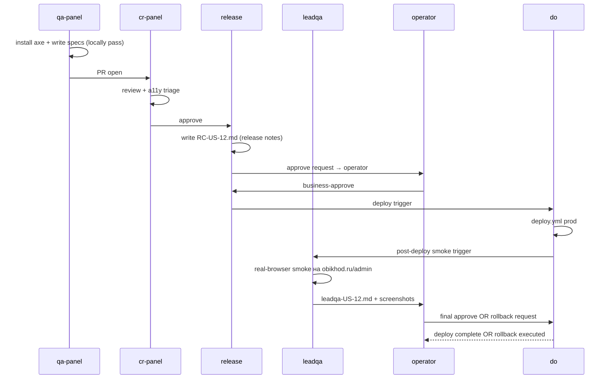

# sa-panel — Wave 7 · Polish + a11y WCAG 2.2 AA + Playwright admin-design-compliance

**Issue:** PAN-8 (release-gate Wave 7)
**Wave:** 7 из roadmap [art-concept-v2.md §10](art-concept-v2.md) — финальный polish + a11y release-gate
**Source of truth:** [brand-guide.html §12](../../../design-system/brand-guide.html) (целиком, audit) · [art-concept-v2.md §11](art-concept-v2.md) · [ADR-0005](../../adr/ADR-0005-admin-customization-strategy.md) · [ADR-0007](../../adr/ADR-0007-payload-login-customization.md)
**Status:** `draft` (sa-panel 2026-04-30, popanel review pending)
**Skills активированы:** `e2e-testing` (Playwright patterns), `accessibility` (WCAG 2.2 AA + axe-core), `verification-loop` (release gate)
**Author:** sa-panel
**Date:** 2026-04-30

---

## Контекст

US-12 admin redesign на 2026-04-30 на 70% в проде (W1 + W2.A + W3 partial + W4 structural — все merged). Остаются части W5 part 2 (registration), W6 mobile, и **W7** — этот документ. W7 — release-gate спека: фиксирует что именно проверяется ДО merge финального RC и сколько работы нужно qa-panel + cr-panel.

**Что уже есть в `site/tests/e2e/`:**
- `admin-smoke.spec.ts` (49 строк, 3 tests) — HTTP availability + redirect + :root tokens regression.
- `admin-design-compliance.spec.ts` (165 строк, 3 tests) — palette + radius + lockup + widget.
- `admin-login.spec.ts` (262 строки, 13+ tests) — PAN-16 full login UI compliance (включая AC-27/28/29 pixel-perfect).

**Что W7 добавляет:**
1. **a11y WCAG 2.2 AA** — axe-core/playwright проверки на ключевых admin routes (Login, Dashboard, Catalog, Edit-view коллекции).
2. **Polish smoke** — Playwright tests для функциональностей W3/W4/W5 которых ещё нет в spec'ах (catalog filters если будут, leads badge counter, tabs validation indicator).
3. **Reduced-motion smoke** — verify `@media (prefers-reduced-motion: reduce)` отключает transforms/animations.
4. **Release readiness checklist** — финальный pre-deploy gate для do + leadqa.

---

## ADR-0005 уровень кастомизации

| Подсистема | Уровень | Обоснование |
|---|---|---|
| Playwright tests | **Уровень 0** (test infrastructure) | Не трогает Payload core; тесты в `site/tests/e2e/` |
| `@axe-core/playwright` integration | **Уровень 0** (dev-dep) | npm package, runtime dependency 0 |
| Polish CSS правки (если найдены) | **Уровень 1** (custom.scss) | Ad-hoc fix-ups в существующем файле |
| Release readiness checklist | **Документ** (не код) | release-notes/RC-N.md + leadqa-N.md |

---

## Scope IN

### 7.1 · `@axe-core/playwright` integration

**Установка:**
```bash
pnpm add -D @axe-core/playwright
```

**Шаблон проверки (per route):**
```typescript
import AxeBuilder from '@axe-core/playwright'

test('a11y WCAG 2.2 AA — /admin/login без violations', async ({ page }) => {
  await page.goto('/admin/login', { waitUntil: 'networkidle' })
  const results = await new AxeBuilder({ page })
    .withTags(['wcag2a', 'wcag2aa', 'wcag21a', 'wcag21aa', 'wcag22aa'])
    .analyze()
  expect(results.violations).toEqual([])
})
```

**Routes для покрытия:**
1. `/admin/login` — login screen
2. `/admin/` — dashboard (BeforeDashboardStartHere + statcards + tiles + PageCatalogWidget)
3. `/admin/catalog` — full catalog page (W3)
4. `/admin/collections/services` — list-view (любая коллекция, дефолтный layout)
5. `/admin/collections/services/<id>` — edit-view (Tabs field active)
6. Опц. `/admin/forbidden`, `/admin/not-found` — boundary states (если path triggerable)

**Authenticated tests:** используем `pnpm seed:admin` fixture (memory `project_us8_no_amocrm_mvp` + handoff). Storage state в `tests/e2e/.auth/admin.json` (.gitignore).

### 7.2 · Polish smoke tests (расширение existing)

**Добавить в `admin-design-compliance.spec.ts`:**

```typescript
test('Wave 4 (PAN-3): Tabs visible в edit-view Services', async ({ page }) => {
  // login flow → /admin/collections/services/<id>/
  // verify .tabs-field__tab-button counter ≥ 4 (Services has 6)
  // verify первый tab aria-selected="true"
})

test('Wave 4 (PAN-3): has-error indicator на tab при validation failure', async ({ page }) => {
  // open Services edit, force metaTitle > 60 chars (validation)
  // click submit → expect first SEO-tab .has-error::after content '•'
})

test('Wave 3 (PAN-6): Leads badge counter в sidebar при N>0', async ({ page }) => {
  // create test-lead via REST POST /api/leads/
  // navigate /admin
  // verify a.nav__link[href*="/admin/collections/leads"]
  //   .data-leads-count attribute === '1'
  //   computed ::after content === '"1"', backgroundColor янтарный
  // cleanup: DELETE /api/leads/<id>
})

test('Wave 3 (PAN-6): /admin/catalog рендерит full table + CSV link', async ({ page }) => {
  // navigate /admin/catalog
  // verify h1 === 'Каталог опубликованных страниц'
  // verify a[href*="page-catalog/csv"][download] visible
  // verify breadcrumb "02 · КОНТЕНТ / КАТАЛОГ"
})

test('Wave 5 (PAN-4): SkeletonTable брэнд-pulse animation', async ({ page }) => {
  // SkeletonTable rendered (синтетически, через test fixture или dedicated route)
  // verify .brand-skeleton__bar computed animation-name === 'brand-skeleton-pulse'
})

test('Wave 5 (PAN-4): EmptyCollection generic + Leads positive empty', async ({ page }) => {
  // в БД pусто для leads → navigate /admin/collections/leads
  // verify «Все заявки обработаны» текст visible (если W5 part 2 merged)
})
```

### 7.3 · Reduced-motion smoke

```typescript
test('a11y: prefers-reduced-motion отключает transforms', async ({ page, context }) => {
  await context.emulateMedia({ reducedMotion: 'reduce' })
  await page.goto('/admin/login', { waitUntil: 'networkidle' })

  // active state submit button — transform: none
  await page.locator('.login__form button[type=submit]').click({ force: true, noWaitAfter: true })
  const transform = await page
    .locator('.login__form button[type=submit]')
    .evaluate((el) => getComputedStyle(el, ':active').transform)
  expect(transform).toBe('none')

  // skeleton bars — animation: none (если SkeletonTable visible)
  // tabs transition — duration 0.01ms !important
})
```

### 7.4 · Polish checklist (visual + functional sweep)

`leadqa` real-browser smoke за этим chunk'ом до approve operator. Чек-лист в `leadqa-RC-N.md`:

**Visual compliance vs brand-guide §12:**
- [ ] Палитра: primary янтарный `#e6a23c`, focus brand-зелёный `#2d5a3d`, sidebar 3px accent
- [ ] Типографика: Golos Text body / JetBrains Mono numbers (tabular-nums)
- [ ] Status pills 4 типа (success / warning / error / default) — see Services edit
- [ ] Login carд 320px white bg radius 10
- [ ] Lockup ОБИХОД real horizontal-compact.svg на login + dashboard
- [ ] Tabs во всех 10 коллекциях, default tab aria-selected
- [ ] PageCatalogWidget на /admin (top-6 last updated)
- [ ] /admin/catalog — page header + CSV button + table

**Functional compliance:**
- [ ] Login email+password → redirect /admin
- [ ] Logout → redirect /admin/login
- [ ] Forgot password link работает
- [ ] Create + Edit + Delete через UI каждой из 10 коллекций (smoke)
- [ ] CSV download работает (UTF-8 BOM, русский в Excel читаемо)
- [ ] Leads badge появляется при N>0, исчезает при N=0
- [ ] Validation error → красная точка на tab

**a11y manual checks (дополнительно к axe):**
- [ ] Keyboard-only flow: Tab navigation login → dashboard → catalog → collection edit (без потери focus)
- [ ] Skip-link / landmark roles присутствуют (header/main/aside/footer)
- [ ] Цветовой контраст AA (особенно янтарный на cream) — DevTools inspector
- [ ] Reduced motion (system preference) — нет animations

**Performance smoke:**
- [ ] Lighthouse `/admin/login` Accessibility ≥95
- [ ] LCP `/admin/catalog` ≤2.5s (53 rows)
- [ ] CSV generation ≤500ms

### 7.5 · Release readiness gate

**`do` deploy.yml дополняется** (если ещё нет):
- post-deploy smoke: `curl /admin/login` HTTP 200 + DOM check `.login__form button[type=submit]`
- Sentry init verified (если W5 part 2 merged Sentry guard работает)

**`leadqa` обязательная real-browser smoke на проде** (memory `feedback_leadqa_must_browser_smoke_before_push`) — чек-лист 7.4 + screenshot evidence в `team/release-notes/leadqa-US-12.md`.

**`do` НЕ деплоит без approve оператора** (ironс правило #6 в CLAUDE.md). Sequence: `release` (RC-N.md) → `leadqa` (leadqa-N.md) → operator approve → `do` deploy → leadqa post-deploy smoke → operator final approve.

---

## Scope OUT

- **Visual regression suite** (screenshot diff с baselines) — out of scope, требует separate infrastructure (Playwright snapshot tests + storage). Если оператор запросит — отдельная US позже.
- **Cross-browser admin testing** — Playwright config sup'ит chromium/firefox/webkit, но в admin требуется только chromium (оператор-один, Mac/Linux). Если меняется — отдельное решение.
- **Load testing admin** — overkill для одного оператора.
- **Sentry full integration** — conditional guard уже в error.tsx; full setup blocked by `do` (отдельная инфра-задача).
- **i18n тесты** (en/ru переключение) — out of scope, оператор только ru.

---

## Architecture

```
site/tests/e2e/
├── admin-smoke.spec.ts                    (existing, 3 tests, расширяется minimal)
├── admin-design-compliance.spec.ts        (existing, расширяется на W3/W4/W5 polish smoke)
├── admin-login.spec.ts                    (existing, full PAN-16 coverage)
├── admin-a11y.spec.ts                     (NEW — axe-core per-route)
└── admin-reduced-motion.spec.ts           (NEW — prefers-reduced-motion smoke)

package.json:
  + "@axe-core/playwright": "^4.x"

site/tests/e2e/.auth/                      (NEW dir, .gitignore)
└── admin.json                             (storage state authenticated session)

team/release-notes/RC-US-12.md             (NEW — release candidate отчёт)
team/release-notes/leadqa-US-12.md         (NEW — leadqa verification отчёт)
```

**Зависимости:**
- W7 blocks release финал US-12 (без RC + leadqa nothing deploys).
- W7 не зависит от W5 part 2 / W6 (если они закрыты — добавить smoke; если нет — skip with `test.skip(true, 'W5p2/W6 not merged')`).
- W7 параллелен с cw `admin.description` audit (independent).

---

## Acceptance Criteria

### A. Spec process
- [ ] `sa-panel-wave7.md` одобрен `popanel`
- [ ] qa-panel прочитал spec, написал implementation plan
- [ ] cr-panel review плана

### B. axe-core integration
- [ ] `@axe-core/playwright` установлен через `pnpm add -D`
- [ ] `admin-a11y.spec.ts` создан, покрывает 5+ routes
- [ ] WCAG 2.2 AA tags: wcag2a/2aa/21a/21aa/22aa
- [ ] Все routes — zero violations либо documented exceptions с rationale

### C. Polish smoke
- [ ] Tabs visibility test для Services edit-view
- [ ] Tabs has-error indicator test (validation failure → красная точка)
- [ ] Leads badge counter test (создать lead → reload → badge `1`, удалить → badge gone)
- [ ] /admin/catalog page test (h1 + CSV link + breadcrumb)
- [ ] SkeletonTable pulse animation test (если W5 part 2 merged)

### D. Reduced-motion
- [ ] `admin-reduced-motion.spec.ts` создан
- [ ] Submit button :active transform: none
- [ ] Skeleton pulse animation: none
- [ ] Tabs transitions: 0.01ms duration

### E. CI green
- [ ] `pnpm exec playwright test admin-* --project=chromium` зелёный локально (Docker Postgres + seed:admin fixture)
- [ ] CI workflow `Build · Playwright E2E` зелёный на feature branch
- [ ] Lighthouse a11y score `/admin/login` ≥95

### F. Release readiness
- [ ] `team/release-notes/RC-US-12.md` написан release-роль
- [ ] `team/release-notes/leadqa-US-12.md` — real-browser smoke на проде (после deploy) с screenshot evidence
- [ ] Operator final approve в response на leadqa отчёт

### G. ADR-0005 follow-ups
- [ ] CSS protection sweep — :where() обёртка не downshift'ит specificity критично (cr-panel review)
- [ ] No `!important` без `// reason: ...` комментария (sweep custom.scss)
- [ ] Comment-anchors на §brand-guide.html sections для всех custom blocks

---

## Dev breakdown

| Task | Owner | Объём |
|---|---|---|
| `pnpm add -D @axe-core/playwright` + axe setup в playwright.config.ts | qa-panel | 0.1 чд |
| `admin-a11y.spec.ts` × 5 routes | qa-panel | 0.3 чд |
| Расширение `admin-design-compliance.spec.ts` (W3/W4/W5 smoke) | qa-panel | 0.2 чд |
| `admin-reduced-motion.spec.ts` | qa-panel | 0.1 чд |
| Authentication fixture + storage state | qa-panel | 0.1 чд |
| Release readiness checklist + RC + leadqa templates | release + leadqa | 0.2 чд |
| cr-panel review + a11y violations triage | cr-panel | 0.2 чд |

**Итого:** ~1.2 чд (vs original 1 чд — +0.2 на authentication fixture, нужен с появления seed-admin).

---

## Open Questions (для popanel)

| Q | Описание | Sa-panel рекомендация |
|---|---|---|
| Q1 | Visual regression (screenshot baselines) — в этом scope или отдельная US? | **Drop в этом scope.** Otdельная US позже если будет частая регрессия. |
| Q2 | a11y violation policy — fail CI или warning? | **Fail CI** — strict. Если violation в native Payload — суп через `axe.disableRules([...])` с rationale в комментарии. |
| Q3 | Storage state strategy — global setup или per-test login? | **Global setup** — быстрее, авторизация 1 раз. Storage state в `.auth/admin.json` через `globalSetup`. |
| Q4 | Lighthouse integration в CI — оставить existing `lighthouserc.js` или дополнить admin routes? | **Дополнить admin routes** — login + dashboard + catalog. Performance budget уточнить с `do`. |

---

## UML Sequence (release flow)



---

## Pinging

- `popanel` — final approve этого spec → status `approved`
- `qa-panel` — kickoff dev после моего spec close. Local-verify обязательна (Iron rule).
- `cr-panel` — review при готовности qa-panel PR
- `release` — pre-flight RC writeup template после первого smoke green
- `leadqa` — real-browser smoke template + memory `feedback_leadqa_must_browser_smoke_before_push`
- `do` — deploy.yml post-deploy smoke step (опционально, не блокер W7)

---

**Передаю → `popanel` для approve, затем `qa-panel` для kickoff dev.**
