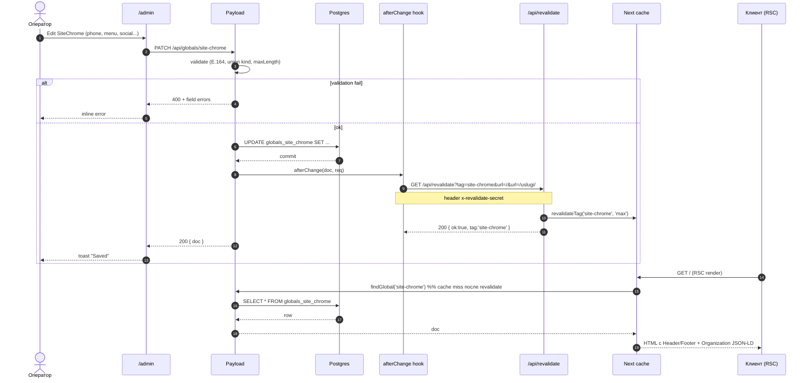
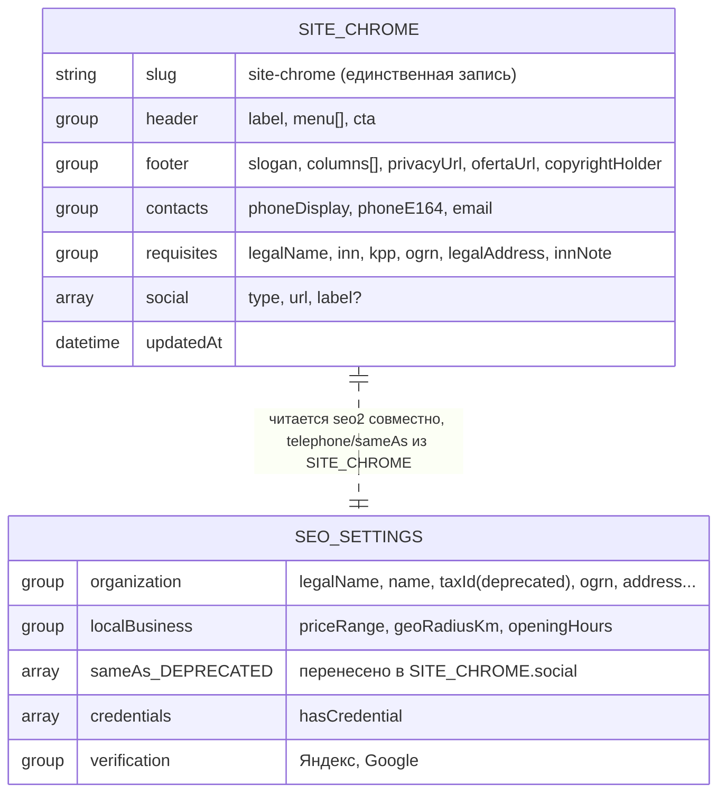

# US-2: CMS-global `SiteChrome` для Header/Footer — System Analysis

**Автор:** sa
**Статус:** approved (оператор, 2026-04-23) → pending po
**Входы:** ./intake.md, ./ba.md (approved оператором 2026-04-23)
**Дата:** 2026-04-23
**Linear:** OBI-TBD · labels: `Feature`, `P0`, `cross`, `phase:sa`, `role:sa`, `Payload`, `CMS`
**Привязка:** CLAUDE.md § Immutable, PROJECT_CONTEXT §3, roadmap неделя 1–2 (pre-launch pack с US-1).

> Контракт с `be3/be4` + `fe1/fe2` + `seo2`: всё, что здесь записано — обязательно
> к реализации без возврата к `ba` и оператору. Все архитектурные развилки закрыты
> ниже (§5, §11, §12).

---

## 1. User Stories

### US-2.1 — Оператор правит рамку сайта без релиза

**Как** оператор Обихода, **я хочу** редактировать телефон, меню, соцсети, реквизиты,
копирайт через `/admin`, **чтобы** не ждать PR и деплоя по каждой правке.

**AC:**

- **AC-1.1** *Given* оператор авторизован в `/admin` как `admin`, *When* он открывает
  раздел `Globals → Site Chrome`, *Then* видит 5 секций-табов: `header`, `footer`,
  `contacts`, `requisites`, `social` с русскими подписями.
- **AC-1.2** *Given* оператор сохраняет изменение поля `contacts.phoneDisplay` и
  `contacts.phoneE164` одновременно, *When* открывает главную prod в новой вкладке
  и делает hard-reload не раньше, чем через 5 сек, *Then* новый телефон виден в
  Header и Footer **за ≤ 60 сек** от нажатия `Save` (покрывает REQ-2.1).
- **AC-1.3** *Given* `phoneE164` не соответствует regex `^\+7\d{10}$`, *When*
  оператор жмёт `Save`, *Then* Payload возвращает inline-ошибку поля и не
  сохраняет документ.

### US-2.2 — Оператор управляет соцсетями через drag-and-drop

**Как** оператор, **я хочу** упорядочивать карточки соцсетей перетаскиванием,
**чтобы** контролировать, какая иконка первой в футере, без правки кода.

**AC:**

- **AC-2.1** *Given* в `social[]` 4 элемента с `type`: `telegram`, `max`, `whatsapp`,
  `vk`, *When* оператор перетаскивает `max` на первое место и жмёт `Save`, *Then*
  после revalidation Footer рендерит иконки в порядке `max → telegram → whatsapp → vk`.
- **AC-2.2** *Given* оператор выбирает `type` из enum, *When* открывает select,
  *Then* видит ровно 7 значений: `telegram`, `max`, `whatsapp`, `vk`, `youtube`,
  `yandex-zen`, `other`; другие значения ввести невозможно.

### US-2.3 — Меню под union (anchor / route / external) с корректным рендером

**Как** разработчик/оператор, **я хочу** хранить пункты меню в типобезопасном union,
**чтобы** `fe` рендерил anchor как `#…`, route — через `<Link>`, external — через
`<a target="_blank" rel="noopener noreferrer">`.

**AC:**

- **AC-3.1** *Given* пункт меню `{ kind: 'anchor', anchor: 'services', label: 'Услуги' }`,
  *When* Header рендерится на главной `/`, *Then* ссылка — `<a href="#services">Услуги</a>`
  (обычный `<a>`, без Next.js `<Link>`).
- **AC-3.2** *Given* пункт меню `{ kind: 'route', route: '/uslugi/', label: 'Услуги' }`,
  *When* Header рендерится на любой странице, *Then* ссылка — Next.js `<Link href="/uslugi/">`
  (client-side navigation, prefetch по дефолту).
- **AC-3.3** *Given* пункт меню `{ kind: 'external', url: 'https://t.me/obihod', label: 'Telegram' }`,
  *When* Footer рендерится, *Then* ссылка — `<a href="https://t.me/obihod" target="_blank" rel="noopener noreferrer">`.
- **AC-3.4** *Given* оператор выбрал `kind: 'route'` и в поле `route` ввёл
  `uslugi/` (без ведущего `/`), *When* жмёт `Save`, *Then* Payload валидирует —
  ошибка поля «route должен начинаться с /» и документ не сохраняется.
- **AC-3.5** *Given* `kind: 'external'` и `url = "javascript:alert(1)"`, *When*
  `Save`, *Then* валидация падает — допустимы только `http(s)://…`.

### US-2.4 — Мягкая деградация при пустом / битом global

**Как** посетитель сайта, **я хочу** видеть рабочую главную даже если админка
сломана или global пустой, **чтобы** не упереться в белый экран.

**AC:**

- **AC-4.1** *Given* в БД нет записи `site-chrome` (первый релиз, seed не прогнали),
  *When* клиент открывает `/`, *Then* HTTP 200, Header показывает бренд `Обиход` +
  минимальное меню из fallback-константы `DEFAULT_SITE_CHROME`; Footer — дефолтный
  слоган + копирайт `© <текущий год> Обиход` (без реквизитов).
- **AC-4.2** *Given* `payloadClient().findGlobal(...)` кидает исключение,
  *When* RSC Header/Footer рендерятся, *Then* страница возвращает 200, в логи
  уходит `error` уровня `warn`, UI рендерится с дефолтами (покрывает REQ-2.2).
- **AC-4.3** *Given* global существует, но `social[]` пустой, *When* Footer
  рендерится, *Then* блок соцсетей не рендерится (нет пустого `<ul>`), страница
  не падает, Payload-admin показывает warning про «missing critical channels».

### US-2.5 — SEO читает телефон и соцсети из SiteChrome

**Как** `seo2` / `Яндекс Вебмастер`, **я хочу**, чтобы `Organization` JSON-LD
брал `telephone` и `sameAs` из единого источника, **чтобы** UI и разметка не
расходились.

**AC:**

- **AC-5.1** *Given* `SiteChrome.contacts.phoneE164 = "+79851705111"` и
  `SiteChrome.social = [{type:'telegram', url:'https://t.me/obihod'}]`, *When*
  открываю `view-source:/`, *Then* в JSON-LD `Organization.telephone === "+79851705111"`
  и `Organization.sameAs === ["https://t.me/obihod"]`.
- **AC-5.2** *Given* оператор меняет `phoneE164` в `/admin`, *When* на prod
  проходят ≤ 60 сек, *Then* `view-source:/` отражает новый телефон **и в UI, и в
  JSON-LD одновременно** (никакого рассинхрона с `SeoSettings`).
- **AC-5.3** *Given* `SiteChrome.requisites.inn = "7847729123"`, *When*
  `Organization` JSON-LD генерируется, *Then* поле `taxID` равно `"7847729123"`
  (источник правды — `SiteChrome`, не `SeoSettings`).

### US-2.6 — Инвариант каналов коммуникации

**Как** проект Обиход, **я хочу**, чтобы на каждой публичной странице в Footer
присутствовали Telegram + MAX + WhatsApp + телефон, **чтобы** не нарушать
Immutable из CLAUDE.md.

**AC:**

- **AC-6.1** *Given* `social[]` содержит все 4 типа `telegram`, `max`, `whatsapp`
  и `contacts.phoneE164` заполнен, *When* страница рендерится, *Then* Footer
  показывает все 4 кликабельных контакта; E2E Playwright находит их по
  `data-channel="telegram|max|whatsapp|phone"`.
- **AC-6.2** *Given* в `social[]` отсутствует `max`, *When* оператор открывает
  `SiteChrome` в `/admin`, *Then* в админке показывается **warning** (не
  блокирующая ошибка) «отсутствует канал MAX — инвариант проекта». Сохранение
  разрешено.

### US-2.7 — Access и безопасность

**AC:**

- **AC-7.1** *Given* анонимный клиент, *When* Next RSC вызывает
  `findGlobal({slug:'site-chrome'})`, *Then* возвращает поля (так как
  `read: () => true`).
- **AC-7.2** *Given* авторизованный пользователь роли `manager` (не `admin`),
  *When* шлёт PATCH на `/api/globals/site-chrome`, *Then* Payload возвращает 403.
- **AC-7.3** *Given* аноним шлёт PATCH на `/api/globals/site-chrome`, *Then*
  Payload возвращает 401.

### US-2.8 — Revalidation на afterChange

**AC:**

- **AC-8.1** *Given* оператор правит любое поле `SiteChrome` и жмёт `Save`,
  *When* Payload завершает транзакцию, *Then* `afterChange` hook вызывает
  `revalidateTag('site-chrome')` + `revalidatePath('/', 'layout')`; в логах —
  строка `[site-chrome] revalidated at <ISO>`.
- **AC-8.2** *Given* hook выполняется, *When* клиент открывает любую страницу
  (главная, `/uslugi/`, `/arboristika/ramenskoe/`), *Then* следующий RSC-рендер
  читает global заново (cache miss по тегу).

### US-2.9 — Нулевой захардкоженный контент

**AC:**

- **AC-9.1** *When* `rg -nE '(\+7|tel:|t\.me/|wa\.me/|vk\.com|youtube|max\.ru)'
  site/components/marketing/Header.tsx site/components/marketing/Footer.tsx` —
  *Then* **0 совпадений** (кроме, возможно, комментария-якоря `// fallback ok`).
- **AC-9.2** *When* `rg -n '#services|#calc|#how|#cases|#subscription|#faq'
  site/components/marketing/Header.tsx site/components/marketing/Footer.tsx` —
  *Then* **0 совпадений** в JSX. Все anchor'ы приходят из global.

### US-2.10 — Копирайт: год автоматом + ссылки из global

**AC:**

- **AC-10.1** *Given* `footer.privacyUrl = "/politika-konfidentsialnosti/"`,
  `footer.ofertaUrl = "/oferta/"`, *When* Footer рендерится 2026-04-23, *Then*
  видна строка `© 2026 Обиход · Политика конфиденциальности · Публичная оферта`
  (год — `new Date().getFullYear()`).
- **AC-10.2** *Given* наступил 2027 год, *When* перерендер, *Then* строка
  автоматически читается как `© 2027 …` без правок кода/global (значение года
  не хранится).
- **AC-10.3** *When* inspect Footer на проде, *Then* в копирайтной строке **нет**
  дублирования ИНН (он только в блоке реквизитов выше).

### US-2.11 — Max-length поля и отсутствие поломки макета

**AC:**

- **AC-11.1** *Given* оператор ввёл в `header.menu[].label` строку 25 символов,
  *When* `Save`, *Then* Payload возвращает ошибку валидации `maxLength: 20`
  (покрывает REQ-2.4).
- **AC-11.2** *Given* `footer.slogan` = 200 символов (лимит), *When* рендер на
  mobile (iPhone 12 viewport), *Then* слоган не выходит за границы контейнера
  (проверяется визуальным e2e).

### US-2.12 — Миграция seed-значений

**AC:**

- **AC-12.1** *Given* свежая БД без `site-chrome`, *When* CI/оператор запускает
  `pnpm run seed:site-chrome` (скрипт `site/scripts/seed-site-chrome.ts`), *Then*
  создаётся global с seed-значениями из REQ-5.1: телефон `+7 (985) 170-51-11`,
  6 пунктов меню-anchor, CTA «Замер бесплатно», 3 футер-колонки (Услуги /
  Компания / Контакты), ИНН `7847729123`, URL политики и оферты.
- **AC-12.2** *Given* seed уже выполнен, *When* повторный запуск, *Then*
  идемпотентно — обновляет, не создаёт дубли (global по дизайну единственный).

### US-2.13 — Warning по отсутствующим критичным каналам

**AC:**

- **AC-13.1** *Given* пустой `contacts.phoneE164`, *When* оператор открывает
  `SiteChrome` в `/admin`, *Then* сверху секции `contacts` видит жёлтый
  admin-banner «⚠ Не заполнен телефон — инвариант проекта требует живой
  телефон на каждой странице».
- **AC-13.2** *Given* в `social[]` нет `whatsapp`, *When* open `/admin`, *Then*
  admin-banner в секции `social`: «⚠ Нет канала WhatsApp — инвариант проекта».
  Сохранение **не блокируется**.

### US-2.14 — Out-of-scope подтверждён

**AC:**

- **AC-14.1** *When* открываю `SiteChrome` в `/admin`, *Then* не существует
  секций/полей под: sitewide-баннер, region switcher, мобильный бургер-меню,
  альтернативный логотип.

### US-2.15 — Кеш RSC и стратегия инвалидирования

**AC:**

- **AC-15.1** *Given* реализован `unstable_cache(fn, keys, {tags:['site-chrome']})`
  вокруг чтения global, *When* внутри одного запроса Header и Footer вызывают
  `getSiteChrome()` параллельно, *Then* БД дёргается ровно 1 раз (проверяется
  query-логом Postgres в dev).
- **AC-15.2** *Given* `afterChange` hook отправляет GET на
  `/api/revalidate?tag=site-chrome`, *When* секрет `x-revalidate-secret`
  совпадает, *Then* ответ 200 `{ok:true, tag:'site-chrome', …}` и следующий
  запрос к `/` получает свежий рендер.

---

## 2. Use Cases

### UC-1: Правка телефона оператором

| Шаг | Actor | System | Data |
|-----|-------|--------|------|
| 1 | Логинится в `/admin` | Показывает дашборд с `Globals → Site Chrome` | — |
| 2 | Открывает `Site Chrome` → tab `contacts` | Показывает текущие `phoneDisplay`, `phoneE164`, `email` | `SiteChrome.contacts.*` |
| 3 | Меняет `phoneDisplay` и `phoneE164` | Валидирует E.164 regex | inline-валидация |
| 4 | Жмёт `Save` | Запись в Postgres + `afterChange` hook | tx commit |
| 5 | — | Hook шлёт `GET /api/revalidate?tag=site-chrome&url=/&url=/uslugi/` с `x-revalidate-secret` | fetch |
| 6 | Открывает `/` в новой вкладке | RSC cache miss → fetch из global → рендер | Header + Footer обновились |

### UC-2: Добавление новой соцсети (MAX)

| Шаг | Actor | System | Data |
|-----|-------|--------|------|
| 1 | Открывает `Site Chrome` → tab `social` | Видит массив из N карточек | — |
| 2 | Жмёт `+ Add` | Новая пустая карточка | draft row |
| 3 | Выбирает `type=max`, вводит `url=https://max.ru/obihod` | Валидация URL | — |
| 4 | Перетаскивает карточку на позицию 2 | Обновляет порядок | — |
| 5 | `Save` | Запись + hook revalidate | — |
| 6 | На prod Footer показывает MAX-иконку на позиции 2 | ≤ 60 сек | — |

### UC-3: Первый запуск prod без seed (edge case)

| Шаг | Actor | System | Data |
|-----|-------|--------|------|
| 1 | Посетитель открывает `/` | RSC вызывает `getSiteChrome()` | — |
| 2 | — | `findGlobal` возвращает `null` / `{}` | — |
| 3 | — | Helper подставляет `DEFAULT_SITE_CHROME` константу | fallback |
| 4 | — | Header/Footer рендерятся с дефолтами (бренд + копирайт + текущий год) | 200 OK |
| 5 | Оператор запускает `pnpm run seed:site-chrome` | Global создан | — |
| 6 | Hook `afterChange` вызывается → revalidate | Следующий запрос — из global | — |

---

## 3. Sequence (mermaid)



---

## 4. Data / ERD (mermaid)



> **Relations:** Payload globals не имеют FK; связь концептуальная — `seo2` читает
> `telephone` + `sameAs` из `SiteChrome`, прочие SEO-поля — из `SeoSettings`.

### Data dictionary

| Путь | Тип | Обяз. | Default | Лимит | Описание |
|---|---|---|---|---|---|
| `header.menu[].kind` | select | yes | `anchor` | enum(3) | anchor / route / external |
| `header.menu[].label` | text | yes | — | ≤ 20 | Текст пункта |
| `header.menu[].anchor` | text | cond* | — | ≤ 40 | Якорь без `#`, regex `^[a-z0-9\-]+$` |
| `header.menu[].route` | text | cond* | — | ≤ 120 | Путь, regex `^/[^\s]*$` |
| `header.menu[].url` | text | cond* | — | ≤ 500 | `^https?://` |
| `header.cta.label` | text | no | «Замер бесплатно» | ≤ 24 | — |
| `header.cta.kind/anchor/route/url` | union | no | `{kind:'anchor', anchor:'calc'}` | — | Та же union-валидация |
| `footer.slogan` | textarea | no | — | ≤ 200 | Может содержать `&nbsp;` |
| `footer.columns[].title` | text | yes | — | ≤ 24 | — |
| `footer.columns[].items[]` | union menu | yes | — | ≤ 8 items | Та же структура, что `header.menu[]` |
| `footer.privacyUrl` | text | no | `/politika-konfidentsialnosti/` | ≤ 200 | — |
| `footer.ofertaUrl` | text | no | `/oferta/` | ≤ 200 | — |
| `footer.copyrightHolder` | text | no | `Обиход` | ≤ 60 | Подставляется в `© YYYY <holder>` |
| `contacts.phoneDisplay` | text | yes | `+7 (985) 170-51-11` | ≤ 20 | Показ в UI |
| `contacts.phoneE164` | text | yes | `+79851705111` | ≤ 16 | `^\+7\d{10}$` — для `tel:` и JSON-LD |
| `contacts.email` | text | no | — | ≤ 120 | `/^\S+@\S+\.\S+$/` |
| `requisites.legalName` | text | no | — | ≤ 120 | «ООО Обиход-МО» после регистрации |
| `requisites.inn` | text | yes | `7847729123` | ≤ 12 | `^\d{10,12}$` + admin-подпись про временный |
| `requisites.kpp` | text | no | — | ≤ 9 | — |
| `requisites.ogrn` | text | no | — | ≤ 15 | — |
| `requisites.legalAddress` | textarea | no | — | ≤ 200 | — |
| `social[].type` | select | yes | — | enum(7) | telegram\|max\|whatsapp\|vk\|youtube\|yandex-zen\|other |
| `social[].url` | text | yes | — | ≤ 500 | `^https?://` (для `telegram` допустить `^(https?://t\.me/\|tg://)`) |
| `social[].label` | text | no | — | ≤ 40 | Опционально; если пусто — подпись по `type` |

`cond*` — обязательность зависит от `kind` (валидатор ниже).

---

## 5. Payload-схема `SiteChrome` — TS-сниппет (контракт для be3/be4)

> **Файл:** `site/globals/SiteChrome.ts`. Регистрация в
> `site/payload.config.ts` — добавить в массив `globals` после `SeoSettings`.

```ts
import type { GlobalConfig, Validate } from 'payload'

// ---------- shared validators ----------
const E164_RE = /^\+7\d{10}$/
const HTTP_RE = /^https?:\/\//i
const ROUTE_RE = /^\/[^\s]*$/
const ANCHOR_RE = /^[a-z0-9-]+$/
const INN_RE = /^\d{10,12}$/

const validateMenuItem: Validate = (_value, { data, siblingData }) => {
  const item = siblingData as {
    kind?: 'anchor' | 'route' | 'external'
    anchor?: string
    route?: string
    url?: string
  }
  if (!item?.kind) return 'kind обязателен'
  if (item.kind === 'anchor') {
    if (!item.anchor) return 'Для kind=anchor заполните поле anchor (без #)'
    if (!ANCHOR_RE.test(item.anchor)) return 'anchor должен быть kebab-case без #'
  }
  if (item.kind === 'route') {
    if (!item.route) return 'Для kind=route заполните путь'
    if (!ROUTE_RE.test(item.route)) return 'route должен начинаться с /'
  }
  if (item.kind === 'external') {
    if (!item.url) return 'Для kind=external заполните url'
    if (!HTTP_RE.test(item.url)) return 'Допустимы только http(s):// URL'
  }
  return true
}

const validateSocialUrl: Validate = (value, { siblingData }) => {
  const { type } = siblingData as { type?: string }
  if (typeof value !== 'string' || !value) return 'URL обязателен'
  if (type === 'telegram' && /^(tg:\/\/|https:\/\/t\.me\/)/i.test(value)) return true
  if (!HTTP_RE.test(value)) return 'Допустимы только http(s):// URL'
  return true
}

// ---------- reusable menu item field factory ----------
const menuItemField = () =>
  ({
    name: 'menu',
    type: 'array',
    labels: { singular: 'Пункт', plural: 'Пункты' },
    admin: { description: 'anchor → #..., route → <Link>, external → новая вкладка' },
    fields: [
      {
        name: 'kind',
        type: 'select',
        required: true,
        defaultValue: 'anchor',
        options: [
          { label: 'Якорь на этой странице (#)', value: 'anchor' },
          { label: 'Внутренний путь (/)', value: 'route' },
          { label: 'Внешняя ссылка (https://)', value: 'external' },
        ],
      },
      { name: 'label', type: 'text', required: true, maxLength: 20 },
      {
        name: 'anchor',
        type: 'text',
        maxLength: 40,
        admin: {
          description: 'Без символа #. Только lowercase, цифры, дефис.',
          condition: (_d, s) => s?.kind === 'anchor',
        },
        validate: validateMenuItem,
      },
      {
        name: 'route',
        type: 'text',
        maxLength: 120,
        admin: {
          description: 'Начинается с /. Пример: /uslugi/',
          condition: (_d, s) => s?.kind === 'route',
        },
        validate: validateMenuItem,
      },
      {
        name: 'url',
        type: 'text',
        maxLength: 500,
        admin: {
          description: 'Полный URL со схемой https://',
          condition: (_d, s) => s?.kind === 'external',
        },
        validate: validateMenuItem,
      },
    ],
  }) as const

// ---------- GLOBAL ----------
export const SiteChrome: GlobalConfig = {
  slug: 'site-chrome',
  label: 'Site Chrome (Header / Footer)',
  admin: {
    description: 'Всё, что про «рамку сайта»: шапка, футер, контакты, реквизиты, соцсети.',
    group: 'Контент',
  },
  access: {
    read: () => true,
    update: ({ req: { user } }) => Boolean(user && (user as any).role === 'admin'),
  },
  hooks: {
    afterChange: [
      async ({ req }) => {
        const siteUrl = process.env.NEXT_PUBLIC_SITE_URL ?? 'https://obikhod.ru'
        const secret = process.env.REVALIDATE_SECRET
        if (!secret) {
          req.payload.logger.warn('[site-chrome] REVALIDATE_SECRET пустой, skip')
          return
        }
        const urls = ['/', '/uslugi/', '/raiony/']
        const qs = new URLSearchParams()
        qs.set('tag', 'site-chrome')
        urls.forEach((u) => qs.append('url', u))
        try {
          const r = await fetch(`${siteUrl}/api/revalidate?${qs}`, {
            headers: { 'x-revalidate-secret': secret },
            cache: 'no-store',
          })
          req.payload.logger.info(
            `[site-chrome] revalidated status=${r.status} at ${new Date().toISOString()}`,
          )
        } catch (e) {
          req.payload.logger.error(
            `[site-chrome] revalidate failed: ${(e as Error).message}`,
          )
        }
      },
    ],
  },
  fields: [
    {
      type: 'tabs',
      tabs: [
        // -------- HEADER --------
        {
          label: 'Header',
          fields: [
            menuItemField(),
            {
              name: 'cta',
              type: 'group',
              label: 'CTA-кнопка в шапке',
              fields: [
                { name: 'label', type: 'text', maxLength: 24, defaultValue: 'Замер бесплатно' },
                {
                  name: 'kind',
                  type: 'select',
                  defaultValue: 'anchor',
                  options: [
                    { label: 'Якорь (#)', value: 'anchor' },
                    { label: 'Путь (/)', value: 'route' },
                    { label: 'URL', value: 'external' },
                  ],
                },
                {
                  name: 'anchor',
                  type: 'text',
                  maxLength: 40,
                  defaultValue: 'calc',
                  admin: { condition: (_d, s) => s?.kind === 'anchor' },
                  validate: validateMenuItem,
                },
                {
                  name: 'route',
                  type: 'text',
                  maxLength: 120,
                  admin: { condition: (_d, s) => s?.kind === 'route' },
                  validate: validateMenuItem,
                },
                {
                  name: 'url',
                  type: 'text',
                  maxLength: 500,
                  admin: { condition: (_d, s) => s?.kind === 'external' },
                  validate: validateMenuItem,
                },
              ],
            },
          ],
        },
        // -------- FOOTER --------
        {
          label: 'Footer',
          fields: [
            { name: 'slogan', type: 'textarea', maxLength: 200 },
            {
              name: 'columns',
              type: 'array',
              labels: { singular: 'Колонка', plural: 'Колонки' },
              maxRows: 4,
              fields: [
                { name: 'title', type: 'text', required: true, maxLength: 24 },
                { ...menuItemField(), name: 'items' },
              ],
            },
            {
              name: 'privacyUrl',
              type: 'text',
              defaultValue: '/politika-konfidentsialnosti/',
              maxLength: 200,
            },
            { name: 'ofertaUrl', type: 'text', defaultValue: '/oferta/', maxLength: 200 },
            { name: 'copyrightHolder', type: 'text', defaultValue: 'Обиход', maxLength: 60 },
          ],
        },
        // -------- CONTACTS --------
        {
          label: 'Контакты',
          description: 'Телефон и e-mail. Инвариант: телефон обязателен.',
          fields: [
            {
              name: 'phoneDisplay',
              type: 'text',
              required: true,
              maxLength: 20,
              defaultValue: '+7 (985) 170-51-11',
              admin: { description: 'Как видит человек, например +7 (985) 170-51-11' },
            },
            {
              name: 'phoneE164',
              type: 'text',
              required: true,
              maxLength: 16,
              defaultValue: '+79851705111',
              admin: { description: 'Для tel: и JSON-LD. Формат E.164: +7XXXXXXXXXX' },
              validate: (v: unknown) =>
                typeof v === 'string' && E164_RE.test(v)
                  ? true
                  : 'Формат E.164: +7XXXXXXXXXX (11 цифр)',
            },
            {
              name: 'email',
              type: 'email',
              maxLength: 120,
              admin: { description: 'Опционально. Если заполнен — рендерится в футере' },
            },
          ],
        },
        // -------- REQUISITES --------
        {
          label: 'Реквизиты',
          description: 'Для B2B и JSON-LD. Заполнить после регистрации юрлица.',
          fields: [
            {
              name: 'legalName',
              type: 'text',
              maxLength: 120,
              admin: { description: 'Например «ООО «Обиход-МО»» — заполнить после регистрации' },
            },
            {
              name: 'inn',
              type: 'text',
              required: true,
              maxLength: 12,
              defaultValue: '7847729123',
              admin: {
                description:
                  '⚠ Временный ИНН (СПб). Заменить после регистрации юрлица Обиход в МО.',
              },
              validate: (v: unknown) =>
                typeof v === 'string' && INN_RE.test(v) ? true : 'ИНН — 10 или 12 цифр',
            },
            {
              name: 'kpp',
              type: 'text',
              maxLength: 9,
              admin: { description: 'Заполнить после регистрации юрлица' },
            },
            {
              name: 'ogrn',
              type: 'text',
              maxLength: 15,
              admin: { description: 'Заполнить после регистрации юрлица' },
            },
            {
              name: 'legalAddress',
              type: 'textarea',
              maxLength: 200,
              admin: { description: 'Юридический адрес. Заполнить после регистрации юрлица' },
            },
          ],
        },
        // -------- SOCIAL --------
        {
          label: 'Соцсети и мессенджеры',
          description:
            'Порядок управляется drag-and-drop. Инвариант: Telegram + MAX + WhatsApp обязательны.',
          fields: [
            {
              name: 'social',
              type: 'array',
              labels: { singular: 'Канал', plural: 'Каналы' },
              fields: [
                {
                  name: 'type',
                  type: 'select',
                  required: true,
                  options: [
                    { label: 'Telegram', value: 'telegram' },
                    { label: 'MAX (VK)', value: 'max' },
                    { label: 'WhatsApp', value: 'whatsapp' },
                    { label: 'ВКонтакте', value: 'vk' },
                    { label: 'YouTube', value: 'youtube' },
                    { label: 'Яндекс.Дзен', value: 'yandex-zen' },
                    { label: 'Другое', value: 'other' },
                  ],
                },
                {
                  name: 'url',
                  type: 'text',
                  required: true,
                  maxLength: 500,
                  validate: validateSocialUrl,
                },
                {
                  name: 'label',
                  type: 'text',
                  maxLength: 40,
                  admin: { description: 'Опционально. Если пусто — подпись по типу.' },
                },
              ],
            },
          ],
        },
      ],
    },
  ],
}
```

**Регистрация** (be3/be4 правит `site/payload.config.ts`):

```ts
import { SiteChrome } from './globals/SiteChrome'
// ...
globals: [SeoSettings, SiteChrome],
```

---

## 6. Схема `Header.tsx` / `Footer.tsx` после рефакторинга (контракт для fe1/fe2)

### 6.1. Чтение global — единая точка

Новый файл `site/lib/cms/siteChrome.ts`:

```ts
import { unstable_cache } from 'next/cache'
import type { SiteChrome as SiteChromeDoc } from '@/payload-types'
import { payloadClient } from '@/lib/payload'

export const DEFAULT_SITE_CHROME: SiteChromeDoc = {
  // минимальный fallback, рендерится если БД пустая / findGlobal падает
  header: { menu: [], cta: { label: 'Оставить заявку', kind: 'anchor', anchor: 'calc' } },
  footer: {
    slogan: 'Порядок под ключ по Москве и Московской области.',
    columns: [],
    privacyUrl: '/politika-konfidentsialnosti/',
    ofertaUrl: '/oferta/',
    copyrightHolder: 'Обиход',
  },
  contacts: { phoneDisplay: '', phoneE164: '', email: '' },
  requisites: {},
  social: [],
} as unknown as SiteChromeDoc

export const getSiteChrome = unstable_cache(
  async (): Promise<SiteChromeDoc> => {
    try {
      const payload = await payloadClient()
      const doc = await payload.findGlobal({ slug: 'site-chrome' })
      if (!doc) return DEFAULT_SITE_CHROME
      return doc as unknown as SiteChromeDoc
    } catch (e) {
      // не падаем: логируем и отдаём дефолт
      console.warn('[site-chrome] findGlobal failed:', (e as Error).message)
      return DEFAULT_SITE_CHROME
    }
  },
  ['site-chrome'],
  { revalidate: 86400, tags: ['site-chrome'] },
)
```

> Паттерн совпадает с `getSeoSettings` в `site/lib/seo/queries.ts` — consistency с
> уже работающим кодом. `unstable_cache` мемоизирует внутри запроса и держит
> tag-инвалидацию. Try/catch — мягкая деградация (AC-4.2).

### 6.2. `MenuLink.tsx` — общий рендер union-пункта

Новый файл `site/components/marketing/_shared/MenuLink.tsx`:

```tsx
import Link from 'next/link'
import type { ReactNode } from 'react'

type MenuItem =
  | { kind: 'anchor'; anchor: string; label: string }
  | { kind: 'route'; route: string; label: string }
  | { kind: 'external'; url: string; label: string }

export function MenuLink({
  item,
  className,
  children,
  dataChannel,
}: {
  item: MenuItem
  className?: string
  children?: ReactNode
  dataChannel?: string
}) {
  const content = children ?? item.label
  if (item.kind === 'anchor') {
    return (
      <a href={`#${item.anchor}`} className={className} data-channel={dataChannel}>
        {content}
      </a>
    )
  }
  if (item.kind === 'route') {
    return (
      <Link href={item.route} className={className} data-channel={dataChannel}>
        {content}
      </Link>
    )
  }
  return (
    <a
      href={item.url}
      target="_blank"
      rel="noopener noreferrer"
      className={className}
      data-channel={dataChannel}
    >
      {content}
    </a>
  )
}
```

### 6.3. `Header.tsx` (server component)

```tsx
import Link from 'next/link'
import { LogoMark } from './_shared/LogoMark'
import { MenuLink } from './_shared/MenuLink'
import { getSiteChrome } from '@/lib/cms/siteChrome'

export async function Header() {
  const chrome = await getSiteChrome()
  const { menu = [], cta } = chrome.header ?? {}
  const { phoneDisplay, phoneE164 } = chrome.contacts ?? {}

  return (
    <nav className="nav">
      <div className="nav-inner">
        <Link href="/" className="nav-logo" style={{ color: 'var(--c-primary)' }}>
          <LogoMark size={36} animated />
          <span className="nav-logo-word" style={{ color: 'var(--c-ink)' }}>
            Обиход<sup className="nav-reg">®</sup>
          </span>
        </Link>
        <div className="nav-links">
          {menu.map((item, i) => (
            <MenuLink key={i} item={item as never} />
          ))}
        </div>
        <div className="nav-right">
          {phoneE164 && phoneDisplay && (
            <a href={`tel:${phoneE164}`} className="nav-phone" data-channel="phone">
              {phoneDisplay}
            </a>
          )}
          {cta?.label && (
            <MenuLink
              item={cta as never}
              className="btn btn-primary"
              dataChannel="cta-header"
            >
              {cta.label}
            </MenuLink>
          )}
        </div>
      </div>
    </nav>
  )
}
```

### 6.4. `Footer.tsx` (server component)

Ключевые моменты:

- Итерируем `chrome.footer.columns[]`; бренд-колонка + слоган — первая.
- Блок соцсетей рендерится в колонке «Контакты» (или отдельной) — каждая соцсеть
  через `MenuLink` с `item = { kind: 'external', url, label: socialLabel(type) }`.
- Строка копирайта: `© {new Date().getFullYear()} {copyrightHolder} · <Link privacy> · <Link oferta>`.
- Телефон + email — отдельными пунктами в колонке «Контакты».
- Блок реквизитов (если `inn`/`legalName` заполнены) — отдельной строкой над копирайтом.
- **НЕ** рендерим ИНН в строке копирайта.

```tsx
import Link from 'next/link'
import { LogoMark } from './_shared/LogoMark'
import { MenuLink } from './_shared/MenuLink'
import { getSiteChrome } from '@/lib/cms/siteChrome'

const SOCIAL_LABEL: Record<string, string> = {
  telegram: 'Telegram',
  max: 'MAX',
  whatsapp: 'WhatsApp',
  vk: 'ВКонтакте',
  youtube: 'YouTube',
  'yandex-zen': 'Яндекс.Дзен',
  other: 'Ссылка',
}

export async function Footer() {
  const chrome = await getSiteChrome()
  const { slogan, columns = [], privacyUrl, ofertaUrl, copyrightHolder } = chrome.footer ?? {}
  const { phoneDisplay, phoneE164, email } = chrome.contacts ?? {}
  const { legalName, inn, kpp, ogrn, legalAddress } = chrome.requisites ?? {}
  const social = chrome.social ?? []
  const year = new Date().getFullYear()

  return (
    <footer className="foot">
      <div className="wrap">
        <div className="foot-grid">
          <div className="foot-brand">
            <div className="nav-logo" style={{ color: 'var(--c-accent)' }}>
              <LogoMark size={40} />
              <span className="nav-logo-word">Обиход</span>
            </div>
            {slogan && <div className="foot-slogan">{slogan}</div>}
          </div>

          {columns.map((col, ci) => (
            <div key={ci} className="foot-col">
              <h4>{col.title}</h4>
              <ul>
                {(col.items ?? []).map((item, ii) => (
                  <li key={ii}>
                    <MenuLink item={item as never} />
                  </li>
                ))}
              </ul>
            </div>
          ))}

          <div className="foot-col">
            <h4>Связь</h4>
            <ul>
              {phoneE164 && phoneDisplay && (
                <li>
                  <a href={`tel:${phoneE164}`} data-channel="phone">
                    {phoneDisplay}
                  </a>
                </li>
              )}
              {email && (
                <li>
                  <a href={`mailto:${email}`}>{email}</a>
                </li>
              )}
              {social.map((s, i) => (
                <li key={i}>
                  <MenuLink
                    item={{ kind: 'external', url: s.url!, label: s.label || SOCIAL_LABEL[s.type!] }}
                    dataChannel={s.type ?? undefined}
                  />
                </li>
              ))}
            </ul>
          </div>
        </div>

        {(legalName || inn || legalAddress) && (
          <div className="foot-reqs">
            {[legalName, inn && `ИНН ${inn}`, kpp && `КПП ${kpp}`, ogrn && `ОГРН ${ogrn}`, legalAddress]
              .filter(Boolean)
              .join(' · ')}
          </div>
        )}

        <div className="foot-bottom">
          <div>
            © {year} {copyrightHolder ?? 'Обиход'}
          </div>
          <div style={{ display: 'flex', gap: '20px', flexWrap: 'wrap' }}>
            {privacyUrl && <Link href={privacyUrl}>Политика конфиденциальности</Link>}
            {ofertaUrl && <Link href={ofertaUrl}>Публичная оферта</Link>}
          </div>
        </div>
      </div>
    </footer>
  )
}
```

### 6.5. Layout integration

- `site/app/(marketing)/layout.tsx` — заменить `<Header />` → `<Header />` (осталось
  имя, но компонент теперь `async`; Next 16 RSC поддерживает async server
  components без изменений).
- Fallback'и уже внутри компонентов; `Suspense` не требуется (RSC синхронно
  дожидается `getSiteChrome()`, кеш — по тегу).
- Анонсировать `data-channel` атрибуты — чтобы `qa1/qa2` и Playwright проверяли
  инвариант REQ-1.7 (AC-6.1).

---

## 7. Интеграция с SEO (контракт для seo2)

В `site/lib/seo/jsonld.ts` функция `organizationSchema()` сейчас хардкодит
`taxID: '7847729123'`, `sameAs: []`, `telephone: '+7 (000) 000-00-00'`. После
US-2 сигнатура меняется:

```ts
export function organizationSchema(chrome?: Pick<SiteChromeDoc,
  'contacts' | 'requisites' | 'social'>): OrganizationSchema { ... }
```

и берёт:

- `telephone` ← `chrome.contacts.phoneE164`
- `taxID` ← `chrome.requisites.inn`
- `legalName` ← `chrome.requisites.legalName || 'Общество с ограниченной ответственностью «Обиход»'`
- `address.addressRegion / addressLocality / streetAddress / postalCode` ← парсим
  `chrome.requisites.legalAddress` (если заполнен) **или** оставляем из
  `SeoSettings.organization.*`. Поля адреса **остаются в `SeoSettings`** (см. §11).
- `sameAs` ← `chrome.social.map(s => s.url)`

`localBusinessSchema()` — та же правка для `telephone`. `site/app/layout.tsx`:

```tsx
import { getSiteChrome } from '@/lib/cms/siteChrome'
import { getSeoSettings } from '@/lib/seo/queries'

export default async function RootLayout(...) {
  const [chrome, seo] = await Promise.all([getSiteChrome(), getSeoSettings()])
  return (
    <html ...>
      <body ...>
        <JsonLd schema={[
          organizationSchema(chrome, seo),
          websiteSchema(),
          localBusinessSchema(chrome),
        ]} />
        {children}
      </body>
    </html>
  )
}
```

**AC-5.1 / AC-5.2 / AC-5.3** закрываются именно этой интеграцией.

---

## 8. Seed-скрипт (контракт для be3/be4)

`site/scripts/seed-site-chrome.ts` — идемпотентный:

```ts
import { getPayload } from 'payload'
import config from '../payload.config'

const SEED = {
  header: {
    menu: [
      { kind: 'anchor', anchor: 'services', label: 'Услуги' },
      { kind: 'anchor', anchor: 'calc', label: 'Калькулятор' },
      { kind: 'anchor', anchor: 'how', label: 'Как это работает' },
      { kind: 'anchor', anchor: 'cases', label: 'Кейсы' },
      { kind: 'anchor', anchor: 'subscription', label: 'Абонемент' },
      { kind: 'anchor', anchor: 'faq', label: 'FAQ' },
    ],
    cta: { label: 'Замер бесплатно', kind: 'anchor', anchor: 'calc' },
  },
  footer: {
    slogan:
      'Один подрядчик на весь год: спил, снег, демонтаж, вывоз. Работаем в Московской области, радиус 120 км от МКАД.',
    columns: [
      {
        title: 'Услуги',
        items: [
          { kind: 'anchor', anchor: 'services', label: 'Спил деревьев' },
          { kind: 'anchor', anchor: 'services', label: 'Уборка снега' },
          { kind: 'anchor', anchor: 'services', label: 'Демонтаж и снос' },
          { kind: 'anchor', anchor: 'services', label: 'Вывоз мусора' },
          { kind: 'anchor', anchor: 'subscription', label: 'Абонементы' },
        ],
      },
      {
        title: 'Компания',
        items: [
          { kind: 'anchor', anchor: 'team', label: 'О нас' },
          { kind: 'anchor', anchor: 'team', label: 'Команда' },
          { kind: 'anchor', anchor: 'cases', label: 'Кейсы' },
          { kind: 'anchor', anchor: 'faq', label: 'FAQ' },
          { kind: 'anchor', anchor: 'contact', label: 'Контакты' },
        ],
      },
    ],
    privacyUrl: '/politika-konfidentsialnosti/',
    ofertaUrl: '/oferta/',
    copyrightHolder: 'Обиход',
  },
  contacts: {
    phoneDisplay: '+7 (985) 170-51-11',
    phoneE164: '+79851705111',
    email: 'hello@obihod.ru',
  },
  requisites: {
    legalName: '',
    inn: '7847729123',
    kpp: '',
    ogrn: '',
    legalAddress: '',
  },
  social: [
    { type: 'telegram', url: 'https://t.me/obihod' },
    { type: 'max', url: 'https://max.ru/obihod' },
    { type: 'whatsapp', url: 'https://wa.me/79851705111' },
    { type: 'vk', url: 'https://vk.com/obihod' },
  ],
} as const

async function main() {
  const payload = await getPayload({ config })
  await payload.updateGlobal({ slug: 'site-chrome', data: SEED })
  console.log('✓ site-chrome seeded')
  process.exit(0)
}

main().catch((e) => {
  console.error(e)
  process.exit(1)
})
```

Запуск — `pnpm tsx scripts/seed-site-chrome.ts`. TOV-ревью seed'ов (слоган,
подписи пунктов) — `cw` + `art` параллельно до релиза.

---

## 9. Warnings в админке (REQ-1.7 / AC-13.x)

Реализация: кастомный admin view/banner — Payload 3 позволяет два пути:

1. **Beta-подход — использовать поле-валидатор, возвращающий `true` при
   warning-е.** Payload не поддерживает «неблокирующие» validate напрямую, но
   admin умеет показывать описание через `admin.description`, динамически
   вычисленное.
2. **Рекомендуемый подход — server-side `beforeValidate` hook, который
   возвращает данные без изменений, но пишет в `payload.logger.warn` и в
   ответ кладёт поле `warnings: string[]` (custom property в `admin.components`).**
   На UI — компонент `components/AdminBanner.tsx` читает из `useDocumentInfo()`
   последний результат и рендерит жёлтый `<div role="status">`.

Для MVP достаточно **варианта 1 + `admin.description` с жёлтой меткой**
через `admin.components.Description` (RSC/Client component в Payload
admin). Конкретная реализация — зона `be3/be4` + `ui`. **В этой спеке важен
контракт: warning НЕ блокирует save (AC-6.2, AC-13.2), error блокирует (AC-11.1).**

---

## 10. NFR

### 10.1. Performance

- `getSiteChrome()` — один БД-query на запрос через `unstable_cache`. TTFB +0
  мс после первого рендера (tag cache). Revalidation ≤ 60 сек (REQ-2.1).
- Размер global в памяти — < 10 КБ; сериализация в HTML — включена в layout.

### 10.2. A11y (WCAG 2.2 AA)

- Все `<a>` и `<Link>` имеют видимый фокус (унаследован из глобальных стилей).
- Иконки соцсетей снабжены текстовой подписью (`label` или `SOCIAL_LABEL[type]`),
  нет aria-hidden без alternative text.
- `<nav>` имеет `aria-label="Основная навигация"` (Header) и `aria-label="Футер"`
  (Footer) — правку внести fe1/fe2.
- Меню доступно с клавиатуры: нативные `<a>`, Tab-порядок сохранён.
- `target="_blank"` всегда с `rel="noopener noreferrer"` (AC-3.3) — защита от
  `window.opener` attack и обязательная a11y-практика.

### 10.3. SEO

- `Organization.telephone` / `sameAs` — из `SiteChrome` (AC-5.1 / AC-5.2).
- Yandex-приоритет: подписи соцсетей на русском (`SOCIAL_LABEL`).
- `data-channel` атрибуты на контактах — служебные, не влияют на ранжирование.

### 10.4. Browsers

- Из `site/playwright.config.ts`: chromium + mobile-chrome + iOS Safari 15+.
- `<Link>` Next 16 App Router — native prefetch, без polyfill.

### 10.5. Security

- `read: () => true` — публично, никаких секретов в global.
- `update` — только `user.role === 'admin'` (AC-7.2 / AC-7.3).
- Валидация URL: `^https?://` + whitelist `tg://` для Telegram — защита от
  `javascript:`, `data:` (AC-3.5).
- `/api/revalidate` уже защищён `x-revalidate-secret` (см.
  `site/app/api/revalidate/route.ts`) — hook передаёт его из env.

### 10.6. Observability

События для `aemd`:

| Событие | Когда | Поля |
|---|---|---|
| `site_chrome_saved` | Payload afterChange | `userId`, `changedFields[]`, `durationMs` |
| `site_chrome_revalidate_failed` | Hook catch | `error`, `status` |
| `site_chrome_fallback_used` | RSC fallback | `reason` (`null-doc` / `exception`), `route` |

Реализация — отдельный тикет `aemd` (не в этой US, но событийный контракт
зафиксирован здесь).

### 10.7. i18n

Не требуется — сайт только `ru-RU`.

### 10.8. Max-length (финализированные лимиты)

| Поле | maxLength |
|---|---|
| `header.menu[].label` | 20 |
| `header.cta.label` | 24 |
| `footer.slogan` | 200 |
| `footer.columns[].title` | 24 |
| `footer.columns[].items[].label` | 20 |
| `footer.copyrightHolder` | 60 |
| `contacts.phoneDisplay` | 20 |
| `contacts.phoneE164` | 16 |
| `contacts.email` | 120 |
| `requisites.legalName` | 120 |
| `requisites.legalAddress` | 200 |
| `requisites.inn` | 12 |
| `social[].url` | 500 |
| `social[].label` | 40 |

Все числа зафиксированы `sa`; `ui` имеет право оспорить при верстке — через `po`.

---

## 11. Миграция дублей `SeoSettings` ↔ `SiteChrome` (ADR-уровень)

### Контекст

`SeoSettings.organization` содержит `telephone`, `legalName`, `taxId`, адрес;
`SeoSettings.sameAs` — массив URL'ов. После US-2 появляются дубли в
`SiteChrome.contacts.phoneE164`, `SiteChrome.requisites.*`, `SiteChrome.social[].url`.
Это прямой риск R6 из `ba.md`.

### Варианты

**Вариант A. Оставить дубли, обе стороны редактируются независимо.**
- Плюсы: нулевые изменения в `SeoSettings`, нет миграции.
- Минусы: **гарантированный рассинхрон** UI и JSON-LD на первой же правке,
  нарушение GOAL-4 из ba.md, противоречит рекомендации ba по REQ-4.1.

**Вариант B. Убрать `organization.telephone` и `sameAs` из `SeoSettings`,
источник правды — `SiteChrome`.**
- Плюсы: один источник для двух самых «живых» полей; JSON-LD физически
  невозможно рассинхронизировать; минус 2 поля в `SeoSettings` → проще
  редактирование.
- Минусы: нужна data-migration (copy-if-missing → drop column) в Payload-global,
  минорно рискованно на пустой prod-БД; останется разделение «SEO-реквизиты в
  `SeoSettings.organization` — контактные реквизиты в `SiteChrome.requisites`» —
  чуть нелогично.

**Вариант C. Computed read-through: `SeoSettings.organization.telephone` и
`sameAs` становятся виртуальными, резолвятся из `SiteChrome` на чтение через
`beforeChange`/`afterRead` хуки.**
- Плюсы: обратная совместимость для любого consumer'а `SeoSettings`.
- Минусы: сложнее в поддержке, «магия» в админке (поля показываются readonly,
  значение берётся из другого global), рискует запутать оператора; нет
  выигрыша по сравнению с B при текущем размере code-base.

### Рекомендация SA

**Вариант B** — убрать дубли из `SeoSettings`, сделать `SiteChrome` источником
правды для `telephone` и `sameAs`. Плюс: довольно реквизитов (ИНН / legalName /
legalAddress) перенести в `SiteChrome.requisites` **в этой же US** — чтобы у B2B
был единый экран.

Итоговое распределение после US-2:

| Поле | SiteChrome | SeoSettings |
|---|---|---|
| `phoneE164` / `phoneDisplay` | **✓ источник** | — |
| `social[]` → `sameAs` | **✓ источник** | — |
| `inn` / `taxId` | **✓ источник** | — (удалить `organization.taxId`) |
| `legalName` | **✓ источник** | — (удалить `organization.legalName`) |
| `legalAddress` | **✓ источник** | — (удалить `organization.streetAddress/addressRegion/addressLocality/postalCode`) |
| `localBusiness.priceRange / geoRadiusKm / openingHours` | — | **✓ остаётся** |
| `hasCredential[]` (СРО, Росприроднадзор) | — | **✓ остаётся** |
| `verification` (Яндекс/Google) | — | **✓ остаётся** |
| `defaultOgImage`, `robotsAdditional`, `indexNowKey`, `organizationSchemaOverride` | — | **✓ остаётся** |

**Миграция (для `dba` + `be3/be4`):**

1. Шаг 1 (в этом релизе). Ввести `SiteChrome` с полями. Скопировать значения из
   `SeoSettings.organization.telephone|taxId|legalName|*Address*` и
   `SeoSettings.sameAs[]` в `SiteChrome` через seed-скрипт (idempotent).
2. Шаг 2 (в этом же релизе). Обновить `lib/seo/jsonld.ts` — читать из
   `SiteChrome`.
3. Шаг 3 (в этом же релизе). Удалить соответствующие поля из `SeoSettings.ts`.
   Payload с `push: true` (см. `payload.config.ts`) удалит колонки автоматически.
   На prod — `dba` делает `pg_dump` перед релизом (BC защита).

**Маркировать в `ADR-0003-site-chrome-is-source-of-truth-for-contacts.md`** —
адресат `tamd`. По WORKFLOW §4 RACI фаза 5 принадлежит `tamd`.

---

## 12. Edge cases

- **E-1.** `findGlobal` вернул `null` (БД пустая) → `DEFAULT_SITE_CHROME` (AC-4.1).
- **E-2.** `payloadClient` кидает (Postgres down, кривая конфигурация) →
  try/catch в `getSiteChrome`, лог `warn`, дефолт (AC-4.2).
- **E-3.** `social[]` содержит `type='other'` с битым URL (оператор опечатался) →
  валидация `^https?://` ловит на save. Если всё-таки прошло (seed-bypass) →
  MenuLink рендерит как внешнюю ссылку, браузер отобразит broken icon.
- **E-4.** Пустой `menu[]` → Header без nav-links-блока, страница не падает
  (рендерится пустой `<div>`, CSS holds layout).
- **E-5.** `phoneE164` не соответствует regex (например, старый формат) →
  валидация при save (AC-1.3); на чтении — мы ему доверяем.
- **E-6.** Очень длинный `footer.slogan` (200 симв) на mobile → визуальный
  regress-тест на iPhone 12 viewport (AC-11.2).
- **E-7.** Конкурентная правка (2 админа) → Payload уже имеет optimistic
  concurrency через `updatedAt`, последний выигрывает; предупреждение уже
  в стандартной админке.
- **E-8.** Revalidate вызвался, но Beget nginx держит кеш → `Cache-Control`
  в layout уже `s-maxage=60, stale-while-revalidate` (проверить); если нет —
  задача `do` в фазе 11. **Добавить в open questions.**
- **E-9.** `REVALIDATE_SECRET` не задан на prod → hook логирует warn, save
  проходит, но страницы висят на старом кеше до 24ч (TTL `unstable_cache`).
  Митигация: добавить в чеклист `do` перед релизом.
- **E-10.** Оператор удалил `max` из `social[]`, осталось 3 канала → admin
  banner warning; страница работает, но инвариант нарушен. Escalate к `po`.

---

## 13. Out of scope (подтверждение ba.md §6)

- Site-wide баннер, region switcher, бургер-меню, смена лого, отдельные
  коллекции `FAQ`/`Prices`, 2 раздельных global `Header`+`Footer`, валидация
  существования `route`, A/B-тест CTA в Header.
- Реализация warning-баннера как отдельного admin-plugin (MVP — `admin.description`
  + подсказки).
- Миграция `localBusiness.openingHours` / `hasCredential` в `SiteChrome` — они
  остаются в `SeoSettings` (см. §11).

---

## 14. Definition of Done (для задачи целиком)

- [ ] `site/globals/SiteChrome.ts` создан, зарегистрирован в `payload.config.ts`.
- [ ] `site/lib/cms/siteChrome.ts` — `getSiteChrome()` + `DEFAULT_SITE_CHROME`.
- [ ] `site/components/marketing/_shared/MenuLink.tsx` создан.
- [ ] `site/components/marketing/Header.tsx` + `Footer.tsx` — async RSC, читают
      из `getSiteChrome()`, 0 литералов (grep-проверка AC-9.x).
- [ ] `site/lib/seo/jsonld.ts` — `organizationSchema` / `localBusinessSchema`
      принимают `chrome` и читают оттуда `telephone` + `taxID` + `sameAs`.
- [ ] `site/app/layout.tsx` — `await Promise.all([getSiteChrome(), getSeoSettings()])`,
      JSON-LD собирается из обеих.
- [ ] `site/scripts/seed-site-chrome.ts` — идемпотентный seed.
- [ ] `site/globals/SeoSettings.ts` — удалены `organization.telephone`,
      `organization.taxId`, `organization.legalName`, адресные поля,
      `sameAs[]` (см. §11). DBA одобрил миграцию на prod.
- [ ] `afterChange` hook вызывает `/api/revalidate?tag=site-chrome&url=/&url=/uslugi/&url=/raiony/`.
- [ ] Warning-банеры в admin для отсутствующих каналов.
- [ ] Все 28+ AC пройдены QA (`qa1` или `qa2`).
- [ ] Playwright E2E: UC-1, UC-2, UC-3 + AC-6.1 (4 `data-channel`).
- [ ] `pnpm run type-check`, `lint`, `format:check` — зелёные.
- [ ] `cr` (`fe` + `be`) дал approve.
- [ ] `seo2` подтвердил JSON-LD на живом проде.
- [ ] `out` дал approve — соответствие `ba.md`.
- [ ] Release note `team/release-notes/US-2-cms-header-footer-globals.md`
      написан `po`.

---

## 15. Трассировка REQ → AC

| REQ (ba.md) | AC (sa.md) |
|---|---|
| REQ-1.1 (один global, 5 секций) | AC-1.1 |
| REQ-1.2 (phoneDisplay + phoneE164) | AC-1.2, AC-1.3, AC-5.1, AC-5.2 |
| REQ-1.3 (social array + enum + DnD) | AC-2.1, AC-2.2, AC-6.1, AC-5.1 |
| REQ-1.4 (menu union: anchor/route/external) | AC-3.1, AC-3.2, AC-3.3, AC-3.4, AC-3.5 |
| REQ-1.5 (requisites: временный ИНН, пустые поля) | AC-5.3, AC-12.1, AC-13.1 |
| REQ-1.6 (copyright: год авто + ссылки) | AC-10.1, AC-10.2, AC-10.3 |
| REQ-1.7 (каналы Telegram/MAX/WhatsApp/phone обязательно видны) | AC-6.1, AC-6.2, AC-13.1, AC-13.2 |
| REQ-2.1 (revalidation ≤ 60 сек) | AC-1.2, AC-8.1, AC-8.2, AC-15.2 |
| REQ-2.2 (мягкая деградация) | AC-4.1, AC-4.2, AC-4.3 |
| REQ-2.3 (access: read public, update admin) | AC-7.1, AC-7.2, AC-7.3 |
| REQ-2.4 (max-length) | AC-11.1, AC-11.2 |
| REQ-4.1 (SEO читает из SiteChrome, не SeoSettings) | AC-5.1, AC-5.2, AC-5.3 |
| REQ-5.1 (seed) | AC-12.1, AC-12.2 |
| REQ-6.1 (out of scope) | AC-14.1 |

28 AC распределены по 14 REQ — контракт замкнут.

---

## 16. Open questions

### К `tamd` (фаза 5 — architecture gate)

- [ ] **TAMD-Q1.** Оформить ADR-0003 по §11 (SiteChrome как источник правды для
      telephone/taxId/legalName/sameAs). Рекомендация SA: нужен (меняется
      граница ответственности между двумя globals, long-term impact на seo2).
- [ ] **TAMD-Q2.** Next 16 Turbopack + `unstable_cache` с tag — подтвердить, что
      `revalidateTag('site-chrome', 'max')` в текущей сборке работает стабильно
      (проверено на `services` в PR #… — подтвердить словом).
- [ ] **TAMD-Q3.** Beget nginx-прокси: настроен ли `proxy_cache_revalidate` и
      `Cache-Control: s-maxage=60`? Если нет — задача для `do`, поставить в
      бэклог пост-релиза.

### К `dba` (параллельно фазе 4)

- [ ] **DBA-Q1.** Подтвердить, что миграция «удалить `organization.taxId`,
      `organization.telephone`, `organization.legalName`, `organization.streetAddress`,
      `organization.postalCode`, `organization.addressRegion`, `organization.addressLocality`,
      `sameAs[]` из `SeoSettings`» безопасна при `push: true` (см. §11 шаг 3).
      На prod БД пустая — риск минимален, но нужен `pg_dump` перед релизом.
- [ ] **DBA-Q2.** Индексы на `globals_site_chrome` не нужны (одна запись).
      Подтвердить.

### К `seo2`

- [ ] **SEO-Q1.** `organizationSchema()` signature change — `seo2` согласен,
      что принимаем `chrome` аргументом? Альтернатива — внутри
      `organizationSchema()` самому звать `getSiteChrome()`, но тогда теряем
      чистоту функции (side effect).
- [ ] **SEO-Q2.** `parent` JSON-LD на programmatic-страницах (`/raiony/<slug>/`)
      — наследует ли telephone от root'а (`@id: /#org`) или надо отдельно
      передавать в `localBusinessSchema(district)`? (Сейчас — отдельно, нужно
      синхронизовать.)

### К `po`

- [ ] **PO-Q1.** Подтвердить, что warning-банер в admin можно реализовать
      через `admin.description` + кастомный React-компонент (Payload 3 Admin
      UI) в рамках P0, без выделения в отдельный тикет. Альтернатива — поставить
      feature-банер в бэклог, оставить только валидацию формата.
- [ ] **PO-Q2.** Параллель `be3/be4` + `fe1/fe2`: разрешить старт `fe` после
      мержа PR'а с `site/globals/SiteChrome.ts` + сгенерированных
      `payload-types.ts`, не дожидаясь seed'а и hook'а.
- [ ] **PO-Q3.** Включить в US **аннулирование дублей в `SeoSettings`** (§11
      шаг 3) или вынести в отдельный follow-up US? Рекомендация SA — в эту же
      US, иначе смысл REQ-4.1 размыт.

---

## 17. PO Review (заполняет po)

- Дата ревью: —
- Замечания: —
- Статус: pending po
