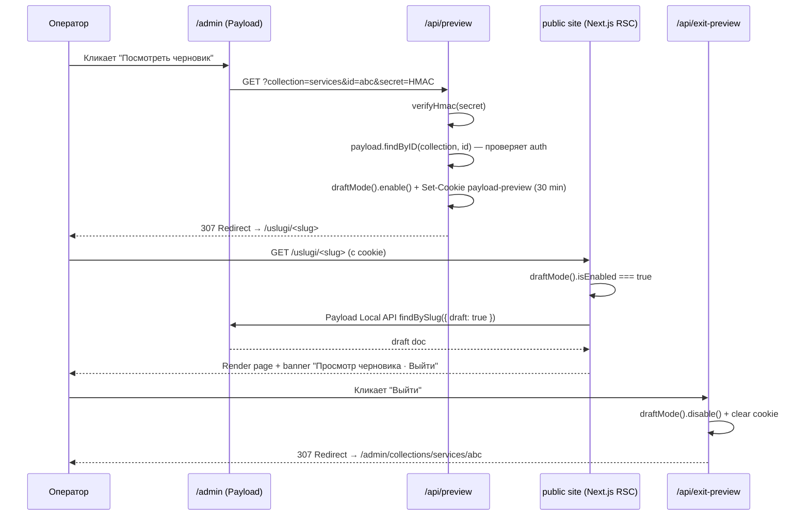

# US-3: Понятная админка — System Analysis (волна 1)

**Автор:** sa
**Статус:** draft / pending PO
**Входы:** [./intake.md](./intake.md), [./ba.md](./ba.md) (§PO Review — разбивка на волны),
[./cw-admin-descriptions-dictionary.md](./cw-admin-descriptions-dictionary.md),
[./re-guidance-audit.md](./re-guidance-audit.md),
[../../adr/ADR-0003-blocks-pattern-preliminary.md](../../adr/ADR-0003-blocks-pattern-preliminary.md)
**Дата:** 2026-04-24
**Scope:** Волна 1 (Must + дешёвые Should из §PO Review). Волны 2-3 — отдельные sa-дельты.

---

## 0. Краеугольные решения (summary для po)

1. **Блочная модель — Payload 3 `blocks` field** (финальное для волны 1 по рекомендации
   ADR-0003). 15 типов блоков, все — декларативные `Block`-определения в `site/blocks/`.
2. **Preview — Payload 3 `livePreview` + `/api/preview` + `/api/exit-preview`, token
   в подписанной `payload-preview` cookie.** Отдельная вкладка, не iframe-embed
   (меньше RSC/hydration рисков).
3. **`admin.description` — plain-строка по умолчанию** (cw-словарь). JSX-компонент
   `<LinkToGuide guide="..." />` допустим **только** для REQ-1.3 inline-help блока
   в collection-edit view (SA-Q5).
4. **Publish-gate — `beforeValidate` hook + стандартный Payload error-banner**
   (SA-Q9, подтверждение рекомендации BA). Один `buildPublishGate(collection)`
   хелпер на все публичные коллекции, правила декларативные.
5. **Палитра «Add Block» — один custom-override** компонента Payload `BlocksField`
   (митигация UI-Q3/ADR-0003 §4 «Отрицательные»). Единичный, не 10+ subcomponents.
6. **Миграция — zero-downtime.** `blocks` добавляется как **optional** поле в каждую
   коллекцию; существующие поля (`intro`, `body`, `leadParagraph` и т.д.) остаются
   до US-5 миграционного скрипта. Старый рендер продолжает работать.

---

## 1. User Stories

### US-3.1 — Dashboard «Начало работы» (REQ-1.1)

**Как** оператор, **я хочу** на старте `/admin` видеть 6 ссылок-сценариев с коротким
пояснением, **чтобы** за ≤ 10 сек понимать, куда кликать.

**AC:**
- AC-3.1.1: **Given** оператор аутентифицирован и открывает `/admin` **When** загружена страница Dashboard **Then** в зоне `beforeDashboard` отрисован блок «Начало работы» с заголовком, 6 карточками-сценариями и ссылкой «Все инструкции →».
- AC-3.1.2: **Given** блок «Начало работы» виден **When** оператор кликает карточку «Добавить район» **Then** происходит навигация на `/admin/collections/service-districts/create` (deep-link).
- AC-3.1.3: **Given** блок «Начало работы» виден **When** оператор кликает «Как собрать страницу из блоков» **Then** происходит навигация на `/admin/docs/build-page` (custom view REQ-1.4).
- AC-3.1.4: **Given** ширина экрана desktop ≥ 1280px **When** блок отрендерен **Then** карточки выстроены сеткой 3 × 2 с min-height 96px каждая, иконка Lucide слева, заголовок 14px, описание 12px — соответствует макету `ui`.
- AC-3.1.5: **Given** блок отрендерен **When** Lighthouse Accessibility аудит **Then** контраст текст/фон ≥ 4.5:1, каждая карточка — `<a>` с доступной `aria-label`, фокус-рамка видна.
- AC-3.1.6: **Given** оператор не залогинен **When** запрос `/admin` **Then** Payload показывает стандартный login, блок не рендерится.
- AC-3.1.7: 6 карточек — точный список (замороженный `cw`): `Добавить район` → `/admin/collections/service-districts/create`; `Обновить цену` → `/admin/collections/services`; `Опубликовать кейс` → `/admin/collections/cases/create`; `Заменить hero-баннер` → `/admin/globals/site-chrome#tab-hero`; `Разместить акцию` → `/admin/collections/promotions/create` (или `/admin/docs/add-promotion` — fallback до US-5); `Собрать страницу из блоков` → `/admin/docs/build-page`.

### US-3.2 — `admin.description` на всех полях (REQ-1.2, REQ-5.2, REQ-5.3)

**Как** оператор, **я хочу** под каждым полем видеть подпись «что сюда писать и зачем»,
**чтобы** не гадать смысл.

**AC:**
- AC-3.2.1: **Given** оператор открывает edit view любой коллекции из {Services, ServiceDistricts, Districts, Cases, Blog, B2BPages, Persons, Redirects, Media, Leads, Users} или global из {SiteChrome, SeoSettings, Promotions} **Then** под каждым не-служебным полем присутствует непустая `admin.description` (plain-string, ≤ 200 символов).
- AC-3.2.2: **Given** поле входит в white-list §5.5 cw-словаря (`id`, `createdAt`, `updatedAt`, `publishedAt`, `_status`, `_versions*`, `loginAttempts`, `lockUntil`, `hash`, `salt`, `resetPasswordToken`, `resetPasswordExpiration`, `amoCrmId`, `callTrackingId`, `syncedAt`, `estimateDraftJson`) **Then** `admin.description` опускается (описывать служебное — не нужно).
- AC-3.2.3: **Given** поле помечено `required: true` в схеме **Then** Payload выводит маркер-звёздочку в UI; после применения REQ-4.1 `custom.scss` звёздочка остаётся видимой (verified `qa2` в волне 2).
- AC-3.2.4: **Given** поле имеет условную обязательность (`beforeValidate`-гейт на ServiceDistricts `miniCase` / `localFaq ≥ 2`) **Then** `admin.description` явно содержит формулировку «Нужно для публикации» + условие (пример: «Нужно для публикации. Без кейса страница не выходит в индекс»).
- AC-3.2.5: **Given** 100% полей US-3-мерж **When** grep всех `site/collections/*.ts`, `site/globals/*.ts`, `site/blocks/*.ts` на anti-TOV из cw-словаря §4 **Then** grep возвращает 0 совпадений.
- AC-3.2.6: PO-правило по §PO Review: к релизу волны 1 допускается 10-15% полей с TODO-stub `admin: { description: 'TODO: cw' }` (не пустой, но помечен), финализируется `cw` в волне 2-3.

### US-3.3 — Inline-help в edit view публичных коллекций (REQ-1.3)

**Как** оператор, **я хочу** на странице редактирования публичной коллекции видеть
короткий блок «Как пользоваться этой страницей» со ссылкой на гайд, **чтобы** помощь
была под рукой в момент правки.

**AC:**
- AC-3.3.1: **Given** оператор открывает edit view любой из {Services, ServiceDistricts, Cases, Blog, B2BPages, Districts} **Then** над формой (slot `admin.components.edit.beforeDocumentControls`) отрендерен inline-help блок: `<InlineHelp title="Как пользоваться" body="..." guide="services-update-price" />` с 2-4 строками контекста и ссылкой на `/admin/docs/:guide`.
- AC-3.3.2: Inline-help **не** показывается на Media, Leads, Redirects, Users, Persons, Promotions (ко второму — отдельный inline-help в US-5).
- AC-3.3.3: Текст inline-help берётся из `cw` — REQ-5.2 тон, ≤ 200 символов.
- AC-3.3.4: **Given** оператор нажимает Dismiss (крестик) на inline-help **Then** блок скрывается до конца сессии (в US-3 без persistence в User — `sessionStorage` ключ `obi:inline-help-dismissed:<collection>`).
- AC-3.3.5: Компонент `InlineHelp` — один на все коллекции, принимает пропсы `{ title, body, guide, slug }`. Регистрируется в `importMap.js` один раз (минимизация veto-поверхности).

### US-3.4 — Страница «Все инструкции» (REQ-1.4, REQ-1.5)

**Как** оператор, **я хочу** открыть из sidebar пункт «Инструкции» и найти там все 6 гайдов,
**чтобы** не искать документацию в репо.

**AC:**
- AC-3.4.1: **Given** оператор в админке **When** смотрит sidebar **Then** **над** группой «01 · Заявки» присутствует пункт «00 · Инструкции» с иконкой `BookOpen`, ведущий на `/admin/docs`.
- AC-3.4.2: **Given** оператор открывает `/admin/docs` **Then** Payload рендерит custom view `GuidesIndex` со списком 6 гайдов (карточная сетка 2 × 3): название, первые 2 строки описания, ссылка «Читать →».
- AC-3.4.3: **Given** оператор открывает `/admin/docs/:slug` (например, `/admin/docs/services-update-price`) **Then** Payload рендерит custom view `GuidePage` с MDX-контентом из `site/app/(payload)/admin/docs/_guides/:slug.mdx`.
- AC-3.4.4: Если slug гайда не найден **Then** показывается 404-view с ссылкой обратно на `/admin/docs`.
- AC-3.4.5: Custom-view регистрируется через Payload 3 `admin.components.views.<key>.Component` + `admin.components.views.<key>.path`. Views: `guidesIndex` (path `/docs`), `guidePage` (path `/docs/:slug`).
- AC-3.4.6: Layout — стандартный Payload admin (sidebar + top-bar), внутри — `<article>` с max-width 760px, typography из `custom.scss` REQ-4.1. RSC-safe: MDX рендерится server-side; интерактивные блоки (копирование команды, accordion) — отдельные `'use client'`-компоненты с aliased import.
- AC-3.4.7: MDX-контент не попадает в публичный bundle сайта (`/docs` route под группой `(payload)`, отдельная от `(public)`).

### US-3.5 — Preview публичных коллекций (REQ-3.1, REQ-3.2)

**Как** оператор, **я хочу** до публикации открыть preview страницы, **чтобы** увидеть,
как это будет выглядеть.

**AC:**
- AC-3.5.1: **Given** оператор на edit view {Services, ServiceDistricts, Cases, Blog, B2BPages} **Then** в `admin.components.edit.PublishButton` slot (слева от Publish) видна кнопка «Посмотреть черновик» (для draft) или «Открыть на сайте» (для published).
- AC-3.5.2: **Given** оператор кликает «Посмотреть черновик» **When** документ имеет `_status === 'draft'` **Then** открывается новая вкладка на `/api/preview?collection=<slug>&id=<id>&secret=<token>`.
- AC-3.5.3: Handler `/api/preview` валидирует подписанный `token` (HMAC-SHA256 от `${id}:${collection}:${exp}` с секретом `PREVIEW_SECRET`), ставит `draftMode().enable()`, устанавливает cookie `payload-preview` (HttpOnly, Secure в prod, SameSite=Lax, exp = 30 мин), редиректит на публичный URL коллекции: `computeUrl(collection, doc)` (например, `/uslugi/<slug>` для Services, `/uslugi/<service>/<district>/` для ServiceDistricts).
- AC-3.5.4: **Given** публичная страница рендерится **When** `draftMode().isEnabled === true` **Then** запросы к Payload идут с `{ draft: true }`, в шапку страницы добавляется банер «Просмотр черновика · [Выйти]» → `/api/exit-preview`.
- AC-3.5.5: Handler `/api/exit-preview` вызывает `draftMode().disable()`, чистит cookie `payload-preview`, редиректит на `/admin/collections/<coll>/<id>`.
- AC-3.5.6: **Given** оператор в preview-вкладке **When** закрывает её без exit-preview **Then** cookie истекает через 30 мин, публичный сайт для других пользователей на prod не затронут (cookie scoped на браузер/сессию оператора).
- AC-3.5.7: **Given** token истёк или не валиден **Then** `/api/preview` возвращает 401, draftMode не активируется.
- AC-3.5.8: Preview — **только desktop** (по BA-ограничению); mobile не тестируется.
- AC-3.5.9: Preview-открытие **не вызывает** hooks `afterChange` / revalidate — оно read-only для draft doc.

### US-3.6 — Блочный редактор: reorder + library + inline-help (REQ-6.1, REQ-6.2, REQ-6.4)

**Как** оператор, **я хочу** собрать страницу из блоков drag-drop-ом, выбирая тип из
каталога с описаниями, **чтобы** не звать разработчика.

**AC:**
- AC-3.6.1: **Given** открыт edit view Services / ServiceDistricts / Cases / Blog / B2BPages **Then** в форме присутствует поле `blocks[]` (тип `blocks`, см. §3 data contracts), отображается Payload native-редактор с drag-handle на каждой строке, кнопкой «Add Block» и collapsed-by-default карточками.
- AC-3.6.2: **Given** оператор тянет блок drag-drop **When** отпускает над другой позицией **Then** порядок меняется, UI откликается ≤ 100ms, на Save новый порядок сохраняется.
- AC-3.6.3: **Given** оператор нажимает «Add Block» **Then** открывается палитра (override компонент `AddBlockPalette`, `site/components/admin/AddBlockPalette.tsx`): карточная сетка 2-3 кол, каждая карточка = иконка Lucide + русский `label` блока + 1-2 строки `description` (из `Block.labels.plural` и `Block.admin.description`).
- AC-3.6.4: В палитре **показаны только** типы блоков, разрешённые для текущей коллекции (см. матрица §4). Фильтрация — декларативно в Block-конфиге через `blocks: allowedBlocks.filter(b => matrix[collection].includes(b.slug))`.
- AC-3.6.5: **Given** оператор кликает карточку блока **Then** в позиции (текущий индекс + 1) вставляется блок с дефолтными значениями и `enabled: true`; форма не прокручивается вверх.
- AC-3.6.6: В развёрнутом виде блока над его полями отрисован inline-help `<BlockHelp description="..." schemaOrg="..." />` (REQ-6.4): 1-3 строки + если блок даёт schema.org разметку — метка «SEO: FAQPage» / «SEO: ItemList» / и т.д. из матрицы SEO2-Q1 (см. §4.2).
- AC-3.6.7: `admin.description` на всех полях каждого блока — ≥ 95% покрытие (white-list из AC-3.2.2).
- AC-3.6.8: Keyboard-a11y (BA-рекомендация из REQ-6.1 open question): **Must для волны 1** — `Tab` фокусирует drag-handle, `Space` захватывает, стрелки меняют позицию, `Space` отпускает. Native Payload `blocks` поддерживает это через `@dnd-kit/accessibility`; `qa2` верифицирует.

### US-3.7 — Publish-gate с читаемой ошибкой (REQ-6.5)

**Как** оператор, **я хочу** при попытке опубликовать увидеть понятное сообщение, если
блочная структура не валидна, **чтобы** самому починить без разработчика.

**AC:**
- AC-3.7.1: **Given** оператор нажимает Publish на коллекции с `blocks[]` **When** набор блоков нарушает правило из §5 publish-gate **Then** публикация прерывается, Payload показывает error-banner вверху формы с текстом из словаря §5.2 + ссылкой «Как собрать страницу из блоков» → `/admin/docs/build-page`.
- AC-3.7.2: Сообщение об ошибке содержит: (а) **что нарушено** — короткая формулировка, (б) **что сделать** — конкретный шаг, (в) **куда посмотреть** — ссылка на гайд №6.
- AC-3.7.3: Ошибка реализована через `beforeValidate` hook + `throw new Error(message)`. Текст на русском, TOV-compliant.
- AC-3.7.4: **Given** оператор сохраняет **как draft** (Save Draft, не Publish) **Then** publish-gate **не срабатывает** — черновики могут быть невалидными.
- AC-3.7.5: **Given** оператор исправил ошибку и нажал Publish **Then** publish проходит, `publishStatus = 'published'`, revalidate-tag для публичного роута триггерится.
- AC-3.7.6: Publish-gate работает **в связке** с существующим `requireGatesForPublish` на ServiceDistricts (miniCase + ≥ 2 localFaq). Два хука вместе: сначала ServiceDistricts-specific, потом `buildPublishGate()` общий.

---

## 2. NFR

### 2.1 Производительность админки

| Метрика | Цель | Замер |
|---|---|---|
| TTI edit view на публичной коллекции с 10 блоками (collapsed) | ≤ 2.5 сек на localhost dev, ≤ 4 сек на prod | `qa2` Lighthouse в волне 2 как release-gate (R10 из ba.md) |
| Latency autosave на Services с 10 блоками | ≤ 1 сек p95 | PoC-3 из ADR-0003 + `qa2` |
| Drag-drop FPS на 15 блоках collapsed | ≥ 60 fps | Chrome DevTools Performance, `qa2` |
| `/api/preview` cold response | ≤ 800ms | k6 / artillery smoke, 10 RPS |
| Admin bundle size delta (US-3 мерж) | ≤ +50 KB gzip | `next build --analyze` в CI, фиксируется baseline'ом в волне 0 |
| Dashboard-tile first render | ≤ 500ms p95 | same |

### 2.2 Accessibility (WCAG 2.2 AA, desktop only)

- Контраст текст/фон ≥ 4.5:1 на всех кастомных компонентах (Dashboard-tile, InlineHelp, AddBlockPalette, BlockHelp, GuidesIndex, GuidePage, PreviewButton).
- Фокус-рамка видна на всех интерактивных элементах (link, button, drag-handle) ≥ 2px outline с контрастом ≥ 3:1.
- Drag-drop блоков — keyboard-accessible (AC-3.6.8).
- Все `` в гайдах и палитре — с `alt`.
- Заголовки MDX-гайдов — валидная иерархия `h1 → h2 → h3`.
- ARIA: `aria-label` на навигационных карточках Dashboard-tile; `role="region"` на inline-help; `aria-expanded` на collapsible-блоках.
- **Mobile-viewport NFR отсутствует** (BA out of scope).

### 2.3 Совместимость

- Браузеры: актуальные Chromium / Firefox / Safari (desktop). Стек Payload 3 гарантирует этот baseline.
- Node 22, pnpm 10.33 (prod-stack).
- Payload 3.83.x (фикс для pnpm lockfile).
- Next.js 16 App Router — все custom-компоненты используют **aliased imports** (`@/components/admin/...`) по правилам Payload 3 importMap.

### 2.4 importMap.js совместимость

- Все новые компоненты, регистрируемые в `payload.config.ts` (графика, views, edit-slots, `BlocksField` override, InlineHelp, Dashboard-tile), **ДОЛЖНЫ** быть добавлены в `site/app/(payload)/admin/importMap.js` через `pnpm generate:importmap`.
- Инвариант: `predeploy` в `deploy.yml` регенерирует importMap перед `next build` (REQ-2.3, уже частично сделано learnings 2026-04-23). Волна 3 формализует как контракт.
- Новые компоненты — **`'use client'`** в файле (Payload admin = client-side rendering bundle).
- Payload 3 не умеет находить компоненты по неразрешённому aliased-пути в dev без регенерации importMap — это подтверждено операционно (incident 2026-04-23). После PoC-5 ADR-0003 `Block`-определения **не требуют** importMap-правки (только пользовательские `admin.components.*`).

### 2.5 Безопасность

- **Preview secret:** `PREVIEW_SECRET` — env var, 32+ байта random, не в git. Token = `HMAC-SHA256(id + ':' + collection + ':' + exp, PREVIEW_SECRET)`, где `exp = now + 30 min`. Token **однократный** по факту срока жизни; множественные open — допустимы пока exp не истёк.
- **Preview cookie:** `HttpOnly`, `Secure` (prod), `SameSite=Lax`, `Path=/`, `Max-Age=1800` (30 мин).
- **draftMode leakage:** `/api/preview` доступен **только** аутентифицированному Payload-юзеру (проверка `req.user` через `getPayload()`/Payload Local API). Неавторизованный GET → 401.
- **MDX гайды:** render server-side через `@next/mdx` или `contentlayer` — **без** MDX-expressions, пользовательского input, eval. MDX-файлы в репо, не в БД.
- **Блочный редактор XSS:** все richText-поля блоков — Lexical с стандартной sanitize (Payload 3 default). Пользовательский HTML **не** допускается; блоки рендерятся на фронте через controlled React-компоненты.
- **Rate limit preview:** не требуется (admin-only).
- **TOV-линтер (опционально, волна 3):** BA RISK-PO-5 допускает ручное ревью `cw`, автоматизацию **не вводим в US-3** без отдельного ADR.

### 2.6 Observability

События для `aemd`-слоя (пишем в лог через `console.log` с префиксом `[admin:]`, пассивно; формальный event-bus — backlog US-N):
- `admin.dashboard.tile_clicked { tile_id, user_id }` — из Dashboard-tile
- `admin.docs.guide_opened { slug, user_id }` — из GuidePage
- `admin.preview.opened { collection, id, user_id, status }`
- `admin.preview.exited { collection, id, user_id, duration_ms }`
- `admin.publish_gate.rejected { collection, id, rule_id, user_id }` — для замера частоты блокировок

---

## 3. Data contracts — библиотека блоков (15 типов)

Декларируется в `site/blocks/<name>.ts`, каждый экспортирует `Block`-объект из Payload 3.
Поля TS-типизируются автоматически через `payload-types.ts`.

Общие инварианты каждого Block:
- `slug: kebab-case`, совпадает с именем файла без расширения.
- `labels: { singular, plural }` — русские.
- `admin.description` — 1-2 строки «зачем блок и когда использовать» (используется в AddBlockPalette и BlockHelp).
- `admin.initCollapsed: true` (митигация R10 из ba.md).
- **Каждый** блок имеет поле `enabled: checkbox, defaultValue: true` — для REQ-6.3 hide-toggle (даже в волне 1, чтобы схема не менялась при переходе в волну 2).
- **Каждый** блок имеет поле `anchor: text (optional)` — якорь для TOC/SEO-вёрстки.
- `required: true` у поля — маркер-звёздочка видна (AC-3.2.3).

### 3.1 `hero`

```ts
{
  slug: 'hero',
  labels: { singular: 'Hero', plural: 'Hero-блоки' },
  admin: { description: 'Первый экран: заголовок, подзаголовок, CTA, фон. Один на страницу.', initCollapsed: true },
  fields: [
    { name: 'enabled', type: 'checkbox', defaultValue: true, admin: { description: 'Выключите, чтобы скрыть на публичной странице.' } },
    { name: 'anchor', type: 'text', admin: { description: 'Якорь URL, например hero. Необязательно.' } },
    { name: 'heading', type: 'text', required: true, maxLength: 120, admin: { description: 'Главный заголовок страницы. До 120 символов.' } },
    { name: 'subheading', type: 'textarea', maxLength: 240, admin: { description: 'Подзаголовок, 1-2 предложения. До 240 символов.' } },
    { name: 'primaryCta', type: 'group', fields: [
      { name: 'label', type: 'text', maxLength: 40 },
      { name: 'href', type: 'text' },
      { name: 'variant', type: 'select', options: ['primary', 'ghost'], defaultValue: 'primary' },
    ] },
    { name: 'secondaryCta', type: 'group', fields: [
      { name: 'label', type: 'text', maxLength: 40 },
      { name: 'href', type: 'text' },
    ] },
    { name: 'backgroundMedia', type: 'upload', relationTo: 'media', admin: { description: 'Фоновое фото или видео. 1920×1080, ≤ 2 МБ.' } },
    { name: 'overlayOpacity', type: 'number', min: 0, max: 100, defaultValue: 40, admin: { description: 'Тёмная затенённость фона, 0-100%.' } },
  ]
}
```

### 3.2 `text-content`

SEO-длинный контент с Lexical richText.

```ts
{
  slug: 'text-content',
  labels: { singular: 'Текст-контент', plural: 'Текст-контент' },
  admin: { description: 'Основной SEO-контент с заголовками и списками. Используется для длинных объяснений.', initCollapsed: true },
  fields: [
    { name: 'enabled', type: 'checkbox', defaultValue: true },
    { name: 'anchor', type: 'text' },
    { name: 'eyebrow', type: 'text', maxLength: 60, admin: { description: 'Мини-подпись над заголовком (опц.).' } },
    { name: 'heading', type: 'text', maxLength: 140, admin: { description: 'Заголовок секции, h2 на странице.' } },
    { name: 'body', type: 'richText', required: true, admin: { description: 'Основной текст. ≥ 300 слов для публикации посадочной.' } },
    { name: 'columns', type: 'select', options: ['1', '2'], defaultValue: '1', admin: { description: '1 — одна колонка, 2 — две.' } },
  ]
}
```

### 3.3 `lead-form`

```ts
{
  slug: 'lead-form',
  labels: { singular: 'Форма заявки', plural: 'Формы заявки' },
  admin: { description: 'Стандартная форма лида → amoCRM. Имя, телефон, объект. SEO: нет.', initCollapsed: true },
  fields: [
    { name: 'enabled', type: 'checkbox', defaultValue: true },
    { name: 'anchor', type: 'text' },
    { name: 'heading', type: 'text', maxLength: 120 },
    { name: 'subheading', type: 'textarea', maxLength: 240 },
    { name: 'serviceHint', type: 'relationship', relationTo: 'services', admin: { description: 'Услуга по умолчанию в форме.' } },
    { name: 'districtHint', type: 'relationship', relationTo: 'districts' },
    { name: 'successMessage', type: 'text', maxLength: 200, defaultValue: 'Спасибо, перезвоним за 15 минут.' },
    { name: 'consentText', type: 'textarea', maxLength: 400, admin: { description: 'Согласие на обработку ПДн. Юр.фикс — согласуйте с юристом.' } },
  ]
}
```

### 3.4 `photo-estimate-form`

```ts
{
  slug: 'photo-estimate-form',
  labels: { singular: 'Форма «фото → смета»', plural: 'Формы «фото → смета»' },
  admin: { description: 'Форма с аплоадом 1-6 фото объекта. AI-смета за 10 минут. Главный USP.', initCollapsed: true },
  fields: [
    { name: 'enabled', type: 'checkbox', defaultValue: true },
    { name: 'anchor', type: 'text' },
    { name: 'heading', type: 'text', maxLength: 120 },
    { name: 'serviceHint', type: 'relationship', relationTo: 'services' },
    { name: 'maxPhotos', type: 'number', min: 1, max: 10, defaultValue: 6 },
    { name: 'maxSizeMb', type: 'number', min: 1, max: 20, defaultValue: 20 },
    { name: 'promise', type: 'text', defaultValue: 'Смета за 10 минут по фото', maxLength: 100 },
  ]
}
```

### 3.5 `calculator`

```ts
{
  slug: 'calculator',
  labels: { singular: 'Калькулятор', plural: 'Калькуляторы' },
  admin: { description: 'Встраивает один из 4 калькуляторов (арборист/крыша/мусор/демонтаж). SEO: нет, но конверсия высокая.', initCollapsed: true },
  fields: [
    { name: 'enabled', type: 'checkbox', defaultValue: true },
    { name: 'anchor', type: 'text' },
    { name: 'kind', type: 'select', required: true, options: [
      { label: 'Арбористика', value: 'arborist' },
      { label: 'Чистка крыши', value: 'roof' },
      { label: 'Вывоз мусора', value: 'trash' },
      { label: 'Демонтаж', value: 'demolition' },
    ], admin: { description: 'Какой калькулятор показать.' } },
    { name: 'heading', type: 'text', maxLength: 120 },
    { name: 'districtHint', type: 'relationship', relationTo: 'districts', admin: { description: 'Применяет localPriceAdjustment района.' } },
  ]
}
```

### 3.6 `cases-carousel`

```ts
{
  slug: 'cases-carousel',
  labels: { singular: 'Карусель кейсов', plural: 'Карусели кейсов' },
  admin: { description: 'Лента реальных кейсов: до/после фото, бригада, район. SEO: ItemList(Article).', initCollapsed: true },
  fields: [
    { name: 'enabled', type: 'checkbox', defaultValue: true },
    { name: 'anchor', type: 'text' },
    { name: 'heading', type: 'text', maxLength: 120, defaultValue: 'Реальные кейсы' },
    { name: 'mode', type: 'select', options: [
      { label: 'Ручной выбор', value: 'manual' },
      { label: 'Автоматически по услуге', value: 'auto-service' },
      { label: 'Автоматически по району', value: 'auto-district' },
    ], defaultValue: 'auto-service' },
    { name: 'manualCases', type: 'relationship', relationTo: 'cases', hasMany: true, maxDepth: 1, admin: { condition: (_, sib) => sib?.mode === 'manual' } },
    { name: 'limit', type: 'number', min: 3, max: 12, defaultValue: 6 },
  ]
}
```

### 3.7 `faq`

```ts
{
  slug: 'faq',
  labels: { singular: 'FAQ', plural: 'FAQ-блоки' },
  admin: { description: 'Блок вопрос-ответ. Даёт разметку schema.org FAQPage (хорошо для нейро-SEO).', initCollapsed: true },
  fields: [
    { name: 'enabled', type: 'checkbox', defaultValue: true },
    { name: 'anchor', type: 'text' },
    { name: 'heading', type: 'text', maxLength: 120, defaultValue: 'Частые вопросы' },
    { name: 'items', type: 'array', minRows: 2, maxRows: 12, fields: [
      { name: 'question', type: 'text', required: true, maxLength: 160 },
      { name: 'answer', type: 'richText', required: true },
    ] },
  ]
}
```

### 3.8 `services-grid`

```ts
{
  slug: 'services-grid',
  labels: { singular: 'Сетка услуг', plural: 'Сетки услуг' },
  admin: { description: '4 направления Обихода карточками. SEO: ItemList(Service).', initCollapsed: true },
  fields: [
    { name: 'enabled', type: 'checkbox', defaultValue: true },
    { name: 'anchor', type: 'text' },
    { name: 'heading', type: 'text', maxLength: 120 },
    { name: 'mode', type: 'select', options: ['all', 'manual'], defaultValue: 'all' },
    { name: 'items', type: 'relationship', relationTo: 'services', hasMany: true, admin: { condition: (_, sib) => sib?.mode === 'manual' } },
    { name: 'columns', type: 'select', options: ['2', '3', '4'], defaultValue: '4' },
  ]
}
```

### 3.9 `districts-grid`

```ts
{
  slug: 'districts-grid',
  labels: { singular: 'Сетка районов', plural: 'Сетки районов' },
  admin: { description: 'Список районов, где работаем. Можно ограничить вручную или показать все. SEO: ItemList(Place).', initCollapsed: true },
  fields: [
    { name: 'enabled', type: 'checkbox', defaultValue: true },
    { name: 'anchor', type: 'text' },
    { name: 'heading', type: 'text', maxLength: 120, defaultValue: 'Работаем в районах' },
    { name: 'mode', type: 'select', options: ['all', 'manual'], defaultValue: 'all' },
    { name: 'items', type: 'relationship', relationTo: 'districts', hasMany: true, admin: { condition: (_, sib) => sib?.mode === 'manual' } },
  ]
}
```

### 3.10 `trust-badges`

```ts
{
  slug: 'trust-badges',
  labels: { singular: 'Блок доверия', plural: 'Блоки доверия' },
  admin: { description: 'Логотипы партнёров, сертификаты, СРО. 4-8 иконок/логотипов.', initCollapsed: true },
  fields: [
    { name: 'enabled', type: 'checkbox', defaultValue: true },
    { name: 'anchor', type: 'text' },
    { name: 'heading', type: 'text', maxLength: 120 },
    { name: 'items', type: 'array', minRows: 3, maxRows: 10, fields: [
      { name: 'logo', type: 'upload', relationTo: 'media', required: true },
      { name: 'label', type: 'text', required: true, maxLength: 80 },
      { name: 'href', type: 'text' },
    ] },
  ]
}
```

### 3.11 `testimonials`

```ts
{
  slug: 'testimonials',
  labels: { singular: 'Отзывы', plural: 'Отзывы' },
  admin: { description: 'Отзывы клиентов с фото и районом. SEO: ItemList(Review).', initCollapsed: true },
  fields: [
    { name: 'enabled', type: 'checkbox', defaultValue: true },
    { name: 'anchor', type: 'text' },
    { name: 'heading', type: 'text', maxLength: 120, defaultValue: 'Что говорят клиенты' },
    { name: 'items', type: 'array', minRows: 2, maxRows: 8, fields: [
      { name: 'author', type: 'text', required: true, maxLength: 80 },
      { name: 'authorRole', type: 'text', maxLength: 80, admin: { description: 'Роль: «Собственник дома», «ТСЖ Квартал-21».' } },
      { name: 'district', type: 'relationship', relationTo: 'districts' },
      { name: 'rating', type: 'number', min: 1, max: 5, defaultValue: 5 },
      { name: 'body', type: 'textarea', required: true, maxLength: 600 },
      { name: 'avatar', type: 'upload', relationTo: 'media' },
    ] },
  ]
}
```

### 3.12 `cta-banner`

```ts
{
  slug: 'cta-banner',
  labels: { singular: 'CTA-баннер', plural: 'CTA-баннеры' },
  admin: { description: 'Контрастный баннер с призывом к действию. Закрывает счёт как контактный блок для publish-gate.', initCollapsed: true },
  fields: [
    { name: 'enabled', type: 'checkbox', defaultValue: true },
    { name: 'anchor', type: 'text' },
    { name: 'heading', type: 'text', required: true, maxLength: 120 },
    { name: 'body', type: 'textarea', maxLength: 400 },
    { name: 'cta', type: 'group', fields: [
      { name: 'label', type: 'text', required: true, maxLength: 60 },
      { name: 'href', type: 'text', required: true },
    ] },
    { name: 'variant', type: 'select', options: ['primary', 'dark', 'accent'], defaultValue: 'primary' },
  ]
}
```

### 3.13 `promotion-banner`

```ts
{
  slug: 'promotion-banner',
  labels: { singular: 'Баннер акции', plural: 'Баннеры акций' },
  admin: { description: 'Связан с коллекцией Promotions (US-5). Показывает активную акцию между startsAt-endsAt.', initCollapsed: true },
  fields: [
    { name: 'enabled', type: 'checkbox', defaultValue: true },
    { name: 'anchor', type: 'text' },
    { name: 'promotion', type: 'relationship', relationTo: 'promotions', required: true, admin: { description: 'Выберите акцию из коллекции Promotions. Если акция неактивна по датам — баннер не рендерится.' } },
  ]
}
```

_До US-5 `promotions` отсутствует — PO-fallback §PO Review п.2: блок оставляется в
библиотеке с disabled-состоянием (grey-out в палитре + подпись «Станет доступно
после US-5»)._

### 3.14 `map-region`

```ts
{
  slug: 'map-region',
  labels: { singular: 'Карта района', plural: 'Карты районов' },
  admin: { description: 'Яндекс.Карты с центром района и радиусом покрытия.', initCollapsed: true },
  fields: [
    { name: 'enabled', type: 'checkbox', defaultValue: true },
    { name: 'anchor', type: 'text' },
    { name: 'heading', type: 'text', maxLength: 120 },
    { name: 'district', type: 'relationship', relationTo: 'districts', required: true },
    { name: 'zoom', type: 'number', min: 9, max: 16, defaultValue: 12 },
  ]
}
```

### 3.15 `video`

```ts
{
  slug: 'video',
  labels: { singular: 'Видео', plural: 'Видео' },
  admin: { description: 'Встраивает RuTube/YouTube/VK. SEO: VideoObject.', initCollapsed: true },
  fields: [
    { name: 'enabled', type: 'checkbox', defaultValue: true },
    { name: 'anchor', type: 'text' },
    { name: 'heading', type: 'text', maxLength: 120 },
    { name: 'provider', type: 'select', options: ['rutube', 'vk', 'youtube'], defaultValue: 'rutube' },
    { name: 'videoId', type: 'text', required: true, admin: { description: 'ID видео в сервисе. Например, «abc123xyz».' } },
    { name: 'poster', type: 'upload', relationTo: 'media' },
    { name: 'transcript', type: 'textarea', admin: { description: 'Расшифровка для GEO и доступности.' } },
    { name: 'durationSec', type: 'number', min: 0, admin: { description: 'Длительность в секундах. Нужна для VideoObject.' } },
  ]
}
```

---

## 4. Матрица «коллекция × допустимые типы блоков»

Декларация — в `site/blocks/matrix.ts`:

```ts
export const blocksMatrix: Record<string, BlockSlug[]> = {
  services:          [H, T, L, P, C, CC, F, SG, DG, TB, TS, CB, PB, M, V],
  'service-districts':[H, T, L, P, C, CC, F, DG, TB, TS, CB, PB, M],    // нет services-grid и video (districts уже фокус)
  cases:             [H, T, CC, TB, TS, CB, V],                          // нет lead-form, calculator, faq, services-grid, districts-grid, promo, map
  blog:              [T, CC, F, TS, CB, V],                              // статья — текст, максимум CC/FAQ/видео, CTA в конце
  'b2b-pages':       [H, T, L, C, CC, F, SG, TB, TS, CB, M],            // нет districts-grid, video, promo (B2B — другой путь)
  'static-pages':    [H, T, L, C, CC, F, SG, DG, TB, TS, CB, PB, M, V], // «любая страница»
}
```

Легенда аббревиатур:
`H = hero, T = text-content, L = lead-form, P = photo-estimate-form,
C = calculator, CC = cases-carousel, F = faq, SG = services-grid,
DG = districts-grid, TB = trust-badges, TS = testimonials, CB = cta-banner,
PB = promotion-banner, M = map-region, V = video`.

### 4.1 Где заканчивается свобода оператора

- **Блог (Blog)** — **нет** hero, lead-form, photo-estimate-form, calculator, services-grid, districts-grid, promotion-banner, map-region. Статья = заголовок (пре-ввод через `title/h1` коллекции) + text-content + FAQ + cases + CTA. **Почему:** защита от thin-контента в блоге и от превращения статьи в посадочную.
- **Cases** — **нет** формы лида, калькулятора, FAQ, services-grid, districts-grid, promotion-banner, map. Кейс = показ объекта, не LP. CTA + отзывы допустимы.
- **ServiceDistricts** — **нет** services-grid (уже внутри услуги) и video (опционально в волне 2).
- **Services** — **все 15** типов (главная «универсальная» посадочная внутри услуги).
- **B2BPages** — **нет** districts-grid, video, promotion-banner (B2B — sales-путь, не масс-SEO).
- **StaticPages** (ещё не создан, появится в US-5) — **все 15**.

### 4.2 SEO-разметка по типу блока (вход для cw описаний)

Из ba.md §9 SEO2-Q1 — адресуется `seo2`. Sa фиксирует плейсхолдер-мэппинг для описаний блоков в палитре:

| Block | schema.org |
|---|---|
| hero | — (не даёт разметки) |
| text-content | Article.articleBody (агрегируется на уровне страницы) |
| lead-form | ContactPoint |
| photo-estimate-form | Action (EstimateAction) |
| calculator | — |
| cases-carousel | ItemList(Article \| CreativeWork) |
| faq | FAQPage |
| services-grid | ItemList(Service) |
| districts-grid | ItemList(Place) |
| trust-badges | Organization.award \| memberOf |
| testimonials | ItemList(Review) |
| cta-banner | — |
| promotion-banner | Offer (validFrom/validThrough) |
| map-region | Place.geo(GeoShape) |
| video | VideoObject |

`seo2` подтвердит/расширит в волне 1. `cw` упоминает это в описаниях блоков для
операторов: «Блок даёт разметку FAQPage — хорошо для Яндекс-выдачи».

---

## 5. Правила publish-gate (SA-Q7 закрыт)

### 5.1 Алгоритм

`beforeValidate` hook на коллекциях Services, ServiceDistricts, Cases, Blog, B2BPages,
StaticPages:

```ts
const gate = buildPublishGate({
  requireExactly: { hero: 1 },          // кол-во раздел-условие
  requireMin:     { 'text-content:words≥300': 1, contactBlock: 1 },
  requireAtMostOneActive: ['promotion-banner'],  // по датам Promotions
  allowedOnDraft: true,                  // draft пропускает все правила
})
```

### 5.2 Финальные правила волны 1 (копипаста)

Применяются **при переходе в `published`** (или `publishStatus: 'published'` у
ServiceDistricts); в draft — все правила отключены.

1. **Ровно один `hero`** на страницу (массив `blocks[]` c `blockType === 'hero' && enabled === true` имеет длину 1).
2. **Минимум один `text-content`** с `body` ≥ 300 слов (сумма слов в Lexical-serialized text).
3. **Минимум один «контактный блок»** — `lead-form` OR `photo-estimate-form` OR `cta-banner` с `enabled === true`.
4. **Не более одного активного `promotion-banner`** — среди всех `promotion-banner` блоков в `blocks[]` с `enabled === true`, связанных `Promotions`-записей с датами `startsAt ≤ now ≤ endsAt` не должно быть более одной (валидация по базе, read-only).
5. **ServiceDistricts-специфичные правила** из существующего `requireGatesForPublish` (miniCase + `localFaq.length ≥ 2`) **сохраняются** и работают **до** `buildPublishGate`.
6. **Blog-специфичное:** если `isHowTo === true` — в `blocks[]` должно быть ≥ 1 `text-content` **или** `howToSteps.length ≥ 2` в коллекции (двойной путь — или старое поле, или новый блок). Правило снимется полностью после миграции US-5.

### 5.3 Тексты ошибок (cw финализирует, sa фиксирует каркас)

Формат Payload error-banner: одна строка заголовка + список пунктов. TOV-compliant.

| rule_id | Текст |
|---|---|
| `hero.exactly_one` | Нужен ровно один блок Hero. Сейчас: N. Добавьте/удалите лишний. [Как собрать страницу из блоков →](/admin/docs/build-page) |
| `text.min_words` | Для публикации нужен текст-блок с ≥ 300 слов. В самом длинном — сейчас N слов. Дополните основной текст. [Как собрать страницу →](/admin/docs/build-page) |
| `contact.required` | На странице нужен хотя бы один блок с действием: «Форма заявки», «Фото → смета» или «CTA-баннер». Добавьте один. [Как собрать страницу →](/admin/docs/build-page) |
| `promotion.one_active` | Активных акций на странице больше одной. Оставьте одну или перенесите даты в Promotions. |
| `service-districts.mini_case` | Без кейса из района страницу публиковать нельзя. Откройте «Кейсы» и добавьте один. [Как опубликовать кейс →](/admin/docs/publish-case) |
| `service-districts.local_faq` | Нужно минимум 2 локальных FAQ. Сейчас: N. Добавьте до 2. |

### 5.4 Where it lives

- Builder: `site/lib/admin/publish-gate.ts` — экспорт `buildPublishGate(config): CollectionBeforeValidateHook`.
- Правила в коллекциях: `site/collections/*.ts` → `hooks.beforeValidate: [existingHook, buildPublishGate({...})]`.
- Тексты: `site/lib/admin/publish-gate-messages.ts` (`cw` правит без be4).

---

## 6. Preview-архитектура

### 6.1 Ключевой выбор: **Token в cookie, вкладка — отдельная**

Вариант: **Payload 3 `livePreview`** config + стандартный `/api/preview` + `/api/exit-preview`
handler. Cookie `payload-preview` → `draftMode()` → публичная страница на отдельной
вкладке рендерит черновик.

**Почему не live-iframe внутри формы:**
- iframe-embed требует CORS-настройки, двойного draftMode и риска двойной hydration RSC (Next.js 16 RSC + Payload 3 admin — разные runtime'ы).
- Desktop-only ограничение позволяет спокойно работать в отдельной вкладке.
- Новая вкладка = стандартный UX CMS (Contentful, Strapi), оператор знаком.

### 6.2 Схема



### 6.3 Данные

- `PREVIEW_SECRET` — env, 32+ байта, добавляется в `.env.example`, deploy-doc (do).
- Token payload: `{ id, collection, exp, userId }`. HMAC-SHA256 hex.
- Cookie: `payload-preview = <user_session_bound_token>`, HttpOnly, Secure (prod), SameSite=Lax, 30 min.
- Route collection → URL map: `site/lib/admin/preview-routes.ts` — `computePreviewUrl(collection, doc)`:
  - `services` → `/uslugi/${doc.slug}`
  - `service-districts` → `/uslugi/${serviceSlug}/${districtSlug}/`
  - `cases` → `/kejsy/${doc.slug}`
  - `blog` → `/blog/${doc.slug}`
  - `b2b-pages` → `/b2b/${doc.slug}`

### 6.4 Admin-side integration

В `payload.config.ts`:
```ts
admin: {
  livePreview: {
    url: ({ data, collectionConfig }) => computePreviewUrl(collectionConfig.slug, data),
    collections: ['services', 'service-districts', 'cases', 'blog', 'b2b-pages'],
  },
  components: {
    actions: ['@/components/admin/PreviewButton'],  // override standard Payload button
  }
}
```

Custom `PreviewButton` — `'use client'`, читает `useDocumentInfo()`, рендерит `<a href="/api/preview?...">` с подписанным токеном (получает через `/api/preview-sign` endpoint — не светим secret в клиент).

---

## 7. Схема `admin.description`

### 7.1 Формат по умолчанию — plain-string (SA-Q5 закрыт)

Подтверждение рекомендации cw (dictionary §0):

```ts
{ name: 'metaTitle', type: 'text', admin: { description: 'Заголовок для выдачи поиска. 55–60 символов, иначе обрежется.' } }
```

### 7.2 JSX-компонент — только для REQ-1.3 inline-help

Допускается только `<InlineHelp ... />` в `admin.components.edit.beforeDocumentControls`.
Внутри `admin.description` на полях **JSX не используется** — для ссылок на гайды
используется markdown-like внешний префикс не поддерживается; если нужна ссылка, пишем
её полным URL текстом («Подробнее: /admin/docs/seo»), пользователь копирует.

**Причина:** (а) минимизация importMap-поверхности; (б) cw-словарь §0 требует plain-string; (в) Payload 3 JSX-description требует отдельной регистрации в importMap, раздувает bundle.

### 7.3 Исключение (явное)

В будущих US, если появится потребность в ссылке-в-описании конкретного поля (≥ 10 кейсов), `sa` обновит правило ADR-ом. В US-3 — plain-string везде кроме InlineHelp.

---

## 8. Custom override палитры «Add Block»

Митигация ADR-0003 §4 «Отрицательные».

### 8.1 Где подключается

`payload.config.ts`:
```ts
admin: {
  components: {
    fields: {
      // Кастомный компонент, рендерится на месте стандартной Payload "Add Block" палитры.
      blocks: '@/components/admin/AddBlockPalette',
    }
  }
}
```

**Уточнение:** Payload 3 API на override встроенной Blocks field — `admin.components.fields.<fieldName>` если override нужен per-field. Если API не даёт глобальный override (payload docs 429 на момент re-audit — верифицирует be4 в PoC-1 ADR-0003), используем per-collection override `admin.components` в `fields: [{ name: 'blocks', type: 'blocks', admin: { components: { Cell: ..., Field: '@/components/admin/AddBlockPaletteField' } } }]`.

### 8.2 Компонент `AddBlockPalette.tsx`

```tsx
'use client'
// site/components/admin/AddBlockPalette.tsx
// Пропсы: { availableBlocks: BlockSlug[], onSelect: (slug) => void }
// Рендерит модалку (Radix Dialog) с grid-2-cols для desktop.
// Каждая карточка: иконка Lucide + label + description + (опц.) "Скоро доступно" для promotion-banner до US-5.
```

Регистрируется в `importMap.js` один раз. Не тянет `@dnd-kit` — drag-drop остаётся
стандартным Payload `blocks` field, не ломаем контракт PoC-1 ADR-0003.

### 8.3 Что НЕ меняем

- Drag-drop reorder — стандартный Payload (PoC-1 ADR-0003).
- Duplicate / Delete — стандартные row-actions Payload.
- Hide — через поле `enabled` в схеме (волна 2 добавит toggle-button в header блока как отдельный дешёвый override).
- Form-layout внутри блока — стандартный Payload.

---

## 9. Миграционный план

### 9.1 Zero-downtime стратегия

Добавляем `blocks: blocks[] (optional)` **рядом с** существующими полями во всех
публичных коллекциях. Payload 3 `blocks` field — массив, default `[]`, `required: false`.
Существующие поля (`intro`, `body`, `leadParagraph`, `faqGlobal`, `faqBlock`, `howToSteps`,
`casesShowcase`, `audience`) **сохраняются**. Фронт-рендер параллельно поддерживает
оба: если `blocks.length > 0` — рендерим блочно, иначе — legacy-layout по старым полям.

### 9.2 Изменения per collection

**Services** (`site/collections/Services.ts`):
- Добавить `{ name: 'blocks', type: 'blocks', blocks: matrixOf('services'), required: false, admin: { initCollapsed: false, description: 'Собираемая из блоков страница. Если не задано — используется дефолтный шаблон.' } }` после `slug`.
- Добавить `hooks.beforeValidate: [buildPublishGate(...)]`.
- Не трогать существующие поля (cost-risk близок к нулю).

**ServiceDistricts** (`site/collections/ServiceDistricts.ts`):
- Добавить `blocks[]` с матрицей `service-districts`.
- `buildPublishGate` **добавляется после** существующего `requireGatesForPublish` в массив `hooks.beforeValidate`.

**Cases / Blog / B2BPages** — идентично: добавляем `blocks[]` + `buildPublishGate`.

**Новая коллекция StaticPages** — заводится **в волне 2** (не US-3 scope).

**Новая коллекция Promotions** — US-5 scope.

### 9.3 Data migration

**Волна 1: не мигрируем.** Все существующие документы остаются без `blocks[]` (или
`blocks: []`), рендер идёт по legacy-полям. Payload bulk-migration — отдельная задача
US-5 по решению `po` после стабилизации схемы блоков.

### 9.4 `payload-types.ts` regeneration

После мержа US-3: `pnpm payload generate:types` → commit регенерированного файла.
Новая зависимость для `fe1` — рендер блоков через discriminated union по `blockType`.

### 9.5 importMap.js regeneration

Один раз после мержа всех custom components волны 1:
- `BrandLogo`, `BrandIcon` (уже есть)
- `BeforeDashboardStartHere` (REQ-1.1)
- `InlineHelp` (REQ-1.3)
- `GuidesIndex` (REQ-1.4)
- `GuidePage` (REQ-1.4)
- `NavLinkDocs` (REQ-1.5)
- `PreviewButton` (REQ-3.2)
- `AddBlockPalette` (REQ-6.2)
- `BlockHelp` (REQ-6.4)

`do` оформляет автогенерацию в `predeploy` (REQ-2.3, волна 3).

### 9.6 Совместимость с drafts+autosave(2s)

ADR-0003 PoC-3: подтверждено на PoC. Продакшн: мониторим latency autosave в первый
день после мержа; если > 1 сек p95 — снижаем до 5 сек на Services (уже запланировано
в ADR-0003 §6 эскалации).

### 9.7 Rollback plan

`blocks[]` — опциональное поле. В случае критических проблем: удалить поле из схемы,
пересобрать, задеплоить. Legacy-рендер остаётся рабочим. Data loss рисков нет (блоки
пустые на существующих документах).

---

## 10. DoD для US-3 волны 1

### 10.1 Выходы

- [ ] `site/blocks/*.ts` — 15 Block-определений, все с `admin.description` ≥ 95% полей.
- [ ] `site/blocks/matrix.ts` — матрица коллекция × блок.
- [ ] `site/lib/admin/publish-gate.ts` — builder + тесты unit (правила 1-4 зелёные).
- [ ] `site/lib/admin/publish-gate-messages.ts` — тексты ошибок (cw финализирует).
- [ ] `site/lib/admin/preview-routes.ts` — `computePreviewUrl`.
- [ ] `site/app/(payload)/api/preview/route.ts` — handler с HMAC + draftMode.
- [ ] `site/app/(payload)/api/exit-preview/route.ts` — handler disable.
- [ ] `site/app/(payload)/api/preview-sign/route.ts` — endpoint для выдачи token PreviewButton'у.
- [ ] `site/components/admin/BeforeDashboardStartHere.tsx`
- [ ] `site/components/admin/InlineHelp.tsx`
- [ ] `site/components/admin/PreviewButton.tsx`
- [ ] `site/components/admin/AddBlockPalette.tsx`
- [ ] `site/components/admin/BlockHelp.tsx`
- [ ] `site/components/admin/NavLinkDocs.tsx`
- [ ] `site/app/(payload)/admin/docs/page.tsx` + `[slug]/page.tsx` (custom views).
- [ ] `site/app/(payload)/admin/docs/_guides/*.mdx` — 6 гайдов от `cw`.
- [ ] `site/collections/*.ts` — `blocks[]` + `buildPublishGate` в каждой публичной коллекции; `admin.description` ≥ 85-90% полей (cw в параллели).
- [ ] `site/payload.config.ts` — `livePreview`, custom views.
- [ ] `site/app/(payload)/admin/importMap.js` — регенерация закоммичена.

### 10.2 Quality gates

- [ ] `pnpm run type-check` — 0 ошибок.
- [ ] `pnpm run lint` — 0 ошибок (baseline `no-explicit-any: warn` разрешён точечно в RSC-границах).
- [ ] `pnpm run format:check` — зелёный.
- [ ] `pnpm run test:e2e --project=chromium` — существующие тесты зелёные + новые smoke `admin-preview.spec.ts` и `admin-blocks.spec.ts` зелёные.
- [ ] Lighthouse admin dashboard — Accessibility ≥ 95 (qa2 в волне 2 поднимет до WCAG AA полных).
- [ ] Admin bundle size delta ≤ +50 KB gzip (NFR 2.1).
- [ ] `grep -rE "услуги населению|имеем честь|от 1 000|в кратчайшие|индивидуальный подход" site/collections site/globals site/blocks site/app/(payload)/admin/docs/_guides` → 0.
- [ ] Все 13 AC-BA из ba.md §8 verified `qa2` (AC-BA-5 сценарии 5-6 — по fallback-правилу §PO Review п.2).

### 10.3 Приёмка оператором

- [ ] Demo-сессия: оператор открывает `/admin`, проходит 4 сценария из AC-BA-5 (добавить район / обновить цену / опубликовать кейс / собрать страницу из блоков) — все без помощи разработчика.
- [ ] TTF-guidance замер `pa` — ≤ 10 сек (GOAL-2).
- [ ] Публикация thin-страницы (3 декоративных блока) — блокируется, оператор понимает текст ошибки и исправляет самостоятельно (R11 митигация).
- [ ] Release note `team/release-notes/US-3-admin-ux-redesign.md` написан `po`.

---

## 11. Open questions → статус

### 11.1 Закрыты в этом sa.md

- [x] **SA-Q1** Preview — Payload 3 `livePreview` + `/api/preview` + подписанная cookie (§6).
- [x] **SA-Q2** Dashboard-tile — `beforeDashboard` (не override полного Dashboard); fixing BA-рекомендация (US-3.1).
- [x] **SA-Q3** Docs view — кастомный Payload view (не отдельный Next app-route), под `/admin/docs/*` (US-3.4, AC-3.4.5).
- [x] **SA-Q4** Inline-help — `admin.components.edit.beforeDocumentControls` с унифицированным `InlineHelp` (US-3.3).
- [x] **SA-Q5** Формат `admin.description` — plain-string по умолчанию; JSX только для `InlineHelp` (§7).
- [x] **SA-Q6** Маркер обязательности — `qa2` верифицирует после применения `custom.scss` (волна 2, AC-3.2.3).
- [x] **SA-Q7** Правила publish-gate — §5 (4 правила + sd-specific, на базе ADR-0003 §7 п.3).
- [x] **SA-Q8** SEO-маппинг блок → schema.org — placeholder §4.2, `seo2` финализирует.
- [x] **SA-Q9** Как рендерить ошибку — `beforeValidate` throw + стандартный Payload error-banner (§5, подтверждает BA-рекомендацию).

### 11.2 Эскалировано другим ролям

- [ ] **UI-Q3 (`ui`)** — Визуальный макет AddBlockPalette (карточная сетка 2-3 кол, Lucide-иконки, hover-state, disabled-state для promotion-banner до US-5).
- [ ] **UI-Q-new (`ui`)** — Макет `BeforeDashboardStartHere` (6 карточек + TOV-текст).
- [ ] **UX-Q1 (`ux`)** — Usability-сессия черновиков 6 гайдов (REQ-5.1) — до того как `cw` финализирует тексты.
- [ ] **UX-Q2 (`ux`)** — Закрыто новым sa решением: Promotions — отдельная коллекция US-5, гайд #5 получает fallback.
- [ ] **TAMD-Q1 (`tamd`)** — Финальный ADR по preview (будет ADR-0004). Волна 1 движется под рекомендацию из §6.
- [ ] **TAMD-Q3 (`tamd`)** — финальный статус ADR-0003 Accepted после PoC. Волна 1 идёт под preliminary-рекомендацию (Payload `blocks`).
- [ ] **BE4-Q1 (`be4`)** — Trade-off имплементации: выбор между `admin.components.actions` vs `admin.components.edit.PublishButton` override для PreviewButton (AC-3.5.1). Sa принимает `actions[]` как дефолт.
- [ ] **BE4-Q2 (`be4`)** — Проверить, что Payload 3 API `admin.components.fields.blocks` даёт глобальный override (§8.1) или требуется per-field. Волна 0 — PoC-1 ADR-0003 даёт ответ.
- [ ] **BE4-Q3 (`be4`)** — Trade-off `admin.components.views.guidesIndex` vs `admin.components.routes` (Payload 3.x API — мелкая проверка быстрым PoC).
- [ ] **CW-Q1 (`cw`)** — Финализация текстов `publish-gate-messages.ts` через TOV-фильтр (черновик §5.3).
- [ ] **CW-Q2 (`cw`)** — `admin.description` на всех полях 15 новых блоков (включены в 300+ полей общего контракта).
- [ ] **QA2-Q1 (`qa2`)** — Тест-кейсы: (1) publish-gate negative — thin page с 3 блоками без text-content; (2) publish-gate positive — минимальная валидная страница; (3) preview open/close не меняет prod-doc; (4) autosave на форме с 15 блоков ≤ 1 сек p95; (5) keyboard-a11y drag-drop.
- [ ] **SEO2-Q1 (`seo2`)** — Финальная матрица блок → schema.org, расширение §4.2.
- [ ] **DO-Q1 (`do`)** — `PREVIEW_SECRET` в Beget env + `.env.example` + `deploy/README.md`.

### 11.3 Блокеры волны 1 (до старта implementation `be4`)

- [ ] PoC ADR-0003 (be4 + sa, 1-2 дня) — подтверждение Payload `blocks` field (PoC-1..5).
- [ ] `ui` макет `AddBlockPalette` + `BeforeDashboardStartHere` (1-2 дня).
- [ ] `cw` словарь-эталон (уже готов — `cw-admin-descriptions-dictionary.md`) + черновики 6 гайдов (3 рабочих дня).

---

## 12. PO Review (заполняет po)

- Дата ревью:
- Замечания:
- Статус: approved / reject
